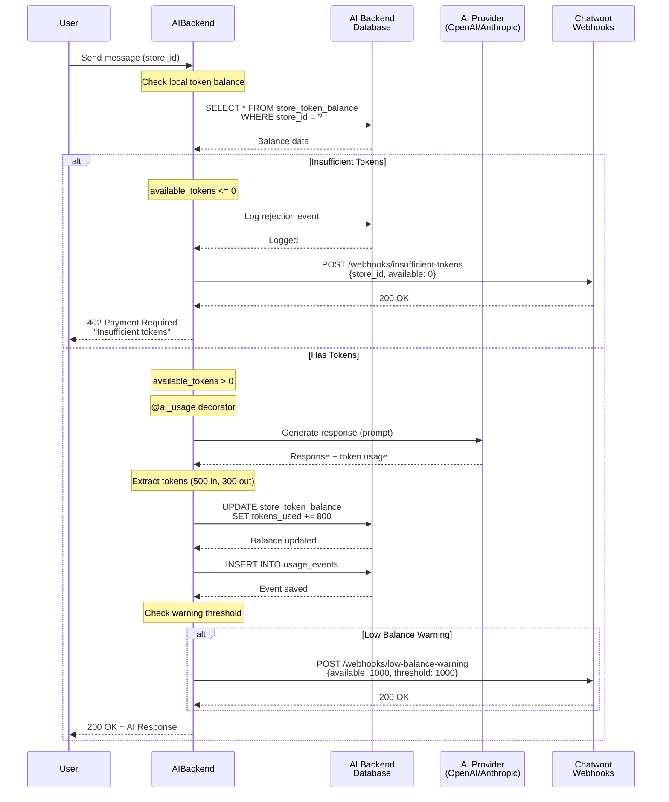
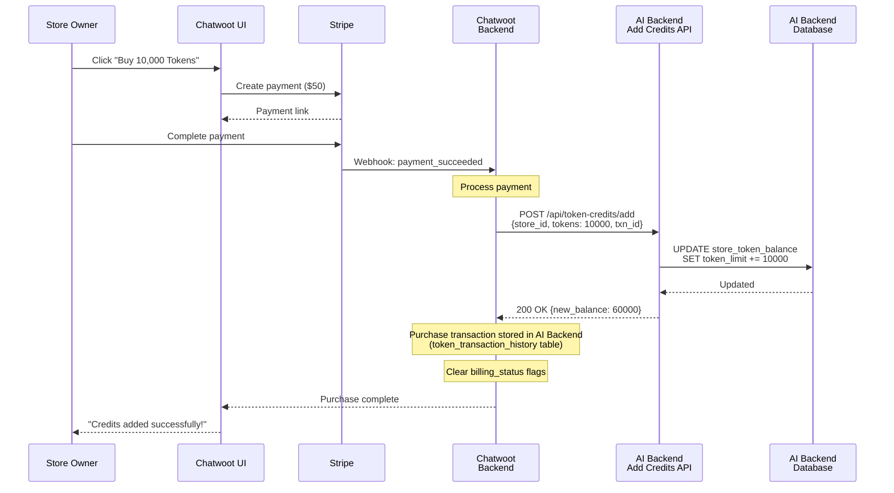
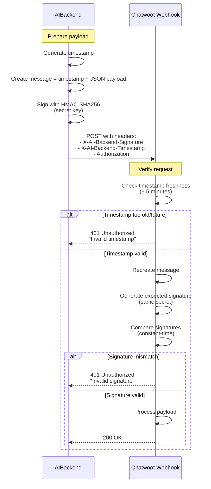
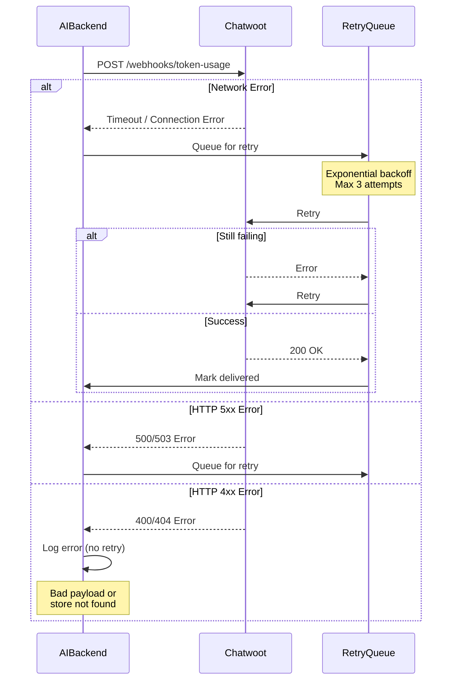

@ -0,0 +1,5432 @@

## 🏗️ **Architecture Overview**
### **Layer Structure:**

```
┌─────────────────────────────────────┐
│      Domain Layer (Core)            │  ← Entities, Interfaces, Business Rules
│  • StoreTokenBalanceEntity          │     (No dependencies)
│  • TokenBalanceRepository interface │
│  • TokenNotificationService interface│
│  • Use Case interfaces               │
│  • Domain exceptions                │
└─────────────────────────────────────┘
              ↓ depends on
┌─────────────────────────────────────┐
│    Application Layer (Use Cases)    │  ← Business Logic Implementation
│  • CheckBalanceUseCaseImpl          │     (Depends on Domain only)
│  • DeductTokensUseCaseImpl          │
│  • AddTokensUseCaseImpl             │
└─────────────────────────────────────┘
              ↓ depends on
┌─────────────────────────────────────┐
│   Infrastructure Layer (Details)    │  ← External Integrations
│  • SQLTokenBalanceRepositoryImpl    │     (Depends on Domain/Application)
│  • StoreTokenBalanceDBModel         │
│  • ChatwootNotificationService      │
└─────────────────────────────────────┘
              ↓ wired by
┌─────────────────────────────────────┐
│    Dependency Injection (Glue)      │  ← Wires Components Together
│  • TokenBalanceUseCasesModule       │
│  • RepositoriesModule updates       │
│  • ServicesModule updates           │
└─────────────────────────────────────┘
```


### Purpose

This document describes the **bi-directional integration** between the AI Backend and Chatwoot for real-time LLM token usage tracking and credit enforcement. The integration enables:

- ✅ **Proactive credit enforcement** before expensive AI operations
- ✅ **Real-time token usage tracking** 
- ✅ **Granular usage breakdown** by model, provider, and operation
- ✅ **Stripe billing integration** via token-based metering
- ✅ **Client-specific credit management** per `store_id`

### Key Concepts

| Concept | Description |
|---------|-------------|
| **store_id** | UUID identifying a client/tenant in both AI Backend and Chatwoot |
| **Token** | Unit of LLM consumption (input tokens + output tokens) |
| **Credit** | Billing unit in Chatwoot (can be mapped to tokens or dollars) |
| **Usage Event** | Single record of AI operation with token counts |
| **Real-time** | Updates delivered within seconds of AI operation completion |

### Integration Approach

```
┌─────────────┐    1. Check Local Balance        ┌──────────┐
│             │    2. Notify Insufficient         │          │
│ AI Backend  │ ──────────────────────────────► │ Chatwoot │
│             │    3. Notify Low Balance          │          │
│ (Source of  │                                   │          │
│  Truth for  │ ◄────────────────────────────── │          │
│  Balances)  │    4. Add Credits API            │          │
└─────────────┘                                   └──────────┘
```

**Communication flows:**
1. **AI Backend checks local database**: Before processing, check store's token balance in AI Backend's own database
2. **AI Backend → Chatwoot Webhook (POST)**: Notify when tokens insufficient (rejection notification)
3. **AI Backend → Chatwoot Webhook (POST)**: Notify when warning threshold reached (low balance alert)
4. **Chatwoot → AI Backend API (POST)**: Add credits when store purchases tokens
5. **Chatwoot → AI Backend API (GET)**: Query usage data for billing UI display (read-only endpoints)

---

## 🔧 Implementation Decisions & Clarifications

This section documents critical design decisions, clarifying questions, and rationale for implementation approaches. These decisions were made to ensure the simplest yet most effective solution.

---

### Decision 1: Negative Balance Handling

**Question:** Should we allow `tokens_used` to exceed `token_limit`, resulting in negative `available_tokens`?

**Decision:** ✅ **YES - Allow negative balances (overdraft)**

**Rationale:**

The critical issue is timing: We call the LLM provider and consume their credits BEFORE deducting from the user's balance.

```
Timeline of AI Operation:
1. Pre-check: Check if available_tokens >= 1 (passes with 50 tokens)
2. Call LLM provider: Send prompt to OpenAI/Anthropic (MONEY SPENT HERE)
3. Receive response: Response indicates 150 tokens used
4. Post-deduction: Try to deduct 150 tokens from balance

Problem: We already paid the provider, but user only had 50 tokens!
```

**Without Overdraft (Strict Rejection):**
- ❌ Financial loss: Provider charged us, but we can't charge the user
- ❌ User confusion: They got a response, but balance wasn't deducted
- ❌ Audit mismatch: `usage_events` shows operation, but balance doesn't reflect it

**With Overdraft (Allow Negative):**
- ✅ No financial loss: Every token consumed is recorded
- ✅ Accurate accounting: `tokens_used` always reflects reality
- ✅ Subsequent operations blocked: Next pre-check fails (available = -100 < 1)
- ✅ User must purchase: Can't use service until balance positive again

**Implementation:**

Remove the `tokens_used_not_exceed_limit` constraint from database schema:

```sql
-- Keep these
CONSTRAINT positive_token_limit CHECK (token_limit >= 0),
CONSTRAINT positive_tokens_used CHECK (tokens_used >= 0),

-- REMOVE this constraint to allow overdraft
-- CONSTRAINT tokens_used_not_exceed_limit CHECK (tokens_used <= token_limit),
```

**Model:**
- `token_limit = 1000` (purchased tokens) ✓
- `tokens_used = 1100` (consumed tokens, overdraft by 100) ✓
- `available_tokens = -100` (calculated via generated column) ✓

**Domain Entity Adjustment:**

The `is_insufficient` property handles negative balances:

```python
@property
def is_insufficient(self) -> bool:
    """Check if tokens are exhausted or in overdraft."""
    return self.available_tokens <= 0  # True for zero AND negative
```

---

### Decision 2: Generated Column for available_tokens

**Question:** Should `available_tokens` be calculated in Python or stored in the database?

**Decision:** ✅ **Add as GENERATED COLUMN in database**

**Rationale:**

**Without Generated Column (Calculation in Multiple Places):**
- ❌ Duplication: `available_tokens = token_limit - tokens_used` repeated in:
  - Domain entity (`@property`)
  - SQL queries (`WHERE (token_limit - tokens_used) >= tokens`)
  - Application code
- ❌ Inconsistency risk: Different calculations could diverge
- ❌ Performance: Recalculated on every query

**With Generated Column:**
- ✅ Single source of truth: Calculated once by database
- ✅ No duplication: Use column name everywhere
- ✅ Indexable: Can create index for fast queries
- ✅ Always consistent: Database guarantees accuracy

**Implementation:**

```sql
CREATE TABLE store_token_balance (
    id UUID PRIMARY KEY DEFAULT gen_random_uuid(),
    store_id UUID NOT NULL UNIQUE,
    token_limit INTEGER NOT NULL DEFAULT 0,
    tokens_used INTEGER NOT NULL DEFAULT 0,
    
    -- Generated column - automatically calculated, always consistent
    available_tokens INTEGER GENERATED ALWAYS AS (token_limit - tokens_used) STORED,
    
    warning_threshold INTEGER NOT NULL DEFAULT 1000,
    -- ... rest of columns
);

-- Can index the generated column
CREATE INDEX idx_store_token_balance_available ON store_token_balance(available_tokens);
```

**Usage in Queries:**

```sql
-- Before: Calculate in WHERE clause
WHERE (token_limit - tokens_used) >= ?

-- After: Use generated column directly
WHERE available_tokens >= ?
```

**Note:** The domain entity still exposes `available_tokens` as a property for API consistency, but the database is the source of truth.

---

### Decision 3: Session ID Requirement

**Question:** What should happen when `session_id` is missing during token deduction?

**Decision:** ✅ **Raise error, log it, continue AI operation without session tracking**

**Rationale:**

**Strict Requirement (Fail Entire Operation):**
- ❌ Breaks non-chat operations (batch processing, background tasks)
- ❌ Poor user experience: Operation fails for tracking issue
- ❌ Reduces system flexibility

**Graceful Degradation (Log and Continue):**
- ✅ AI operation succeeds (user experience not impacted)
- ✅ Token deduction still happens (financial accuracy maintained)
- ✅ Error logged for debugging/monitoring
- ✅ Flexible: Works with and without chat context

**Implementation:**

```python
# In domain exceptions
class MissingSessionIdError(Exception):
    """Raised when session_id is required but not provided."""
    pass

# In decorator
try:
    session_id = extract_session_id(chat_context)
    if not session_id:
        raise MissingSessionIdError("session_id required for impacted conversation tracking")
except MissingSessionIdError as e:
    logger.error(
        f"Token tracking failed: {e}. "
        f"Continuing AI operation without impacted conversation tracking. "
        f"Store: {store_id}"
    )
    session_id = None  # Continue without session tracking

# AI operation continues normally
# Token deduction proceeds, but impacted session tracking skipped
await deduct_tokens.execute(store_id, tokens, feature_key, session_id=None)
```

**Result:**
- Operation succeeds
- Tokens deducted correctly
- Impacted conversation count might be incomplete (logged as error)

---

### Decision 4: Concurrency Strategy for impacted_session_ids

**Question:** How to handle concurrent updates to the `impacted_session_ids` JSONB array?

**Decision:** ✅ **Use atomic JSONB operations with conditional append**

**The Concurrency Problem:**

Without atomicity, concurrent updates can overwrite each other:

```
T0: Session A hits insufficient → Read impacted_session_ids = []
T1: Session B hits insufficient → Read impacted_session_ids = []
T2: Session A writes: ["session_a"]
T3: Session B writes: ["session_b"]  ← OVERWRITES A!
Result: Lost session_a ❌
```

**Rejected Alternatives:**

❌ **Advisory Locks:** More complex, requires two DB round-trips, holds lock longer
❌ **Optimistic Locking:** Requires retry logic, extra version column
❌ **Application-Level Deduplication:** Race conditions persist

**Chosen Solution: Atomic JSONB Operations**

Single SQL statement that checks and appends atomically:

```sql
UPDATE store_token_balance 
SET 
    impacted_session_ids = 
        CASE 
            -- Check if session already in array using containment operator
            WHEN impacted_session_ids @> to_jsonb(ARRAY[?::text])
            THEN impacted_session_ids  -- Already exists, no change
            ELSE impacted_session_ids || to_jsonb(ARRAY[?::text])  -- Append new session
        END,
    -- Set timestamp on first occurrence (COALESCE = "if NULL, set to NOW()")
    insufficient_tokens_since = COALESCE(insufficient_tokens_since, NOW()),
    updated_at = NOW()
WHERE store_id = ? AND is_deleted = FALSE
RETURNING *;
```

**How It Works:**

1. **`@>` operator:** JSONB containment check (PostgreSQL native)
   - `'["a", "b"]'::jsonb @> '["a"]'::jsonb` → `true`
   - `'["a", "b"]'::jsonb @> '["c"]'::jsonb` → `false`

2. **`||` operator:** JSONB concatenation
   - `'["a"]'::jsonb || '["b"]'::jsonb` → `'["a", "b"]'`

3. **CASE statement:** Conditional logic in single transaction

**Concurrency with Atomic Operations:**

```
T0: Session A executes UPDATE → impacted_session_ids = ["session_a"]
T1: Session B executes UPDATE 
    → Reads current: ["session_a"]
    → Checks: "session_b" in array? No
    → Appends: ["session_a", "session_b"]
T2: Session A executes UPDATE again
    → Reads current: ["session_a", "session_b"]
    → Checks: "session_a" in array? Yes
    → No change: ["session_a", "session_b"]

Result: Both sessions recorded, no duplicates ✓
```

**Benefits:**
- ✅ Single database round-trip
- ✅ Database-level atomicity (PostgreSQL internal locking)
- ✅ No explicit application locks
- ✅ Idempotent (same session multiple times = no duplicates)
- ✅ Simpler code (no retry logic)

**Repository Implementation:**

```python
async def record_insufficient_token_event(
    self, store_id: UUID, session_id: Optional[UUID]
) -> StoreTokenBalanceEntity:
    """Record impacted session atomically."""
    if not session_id:
        return await self.get_balance(store_id)  # Skip tracking if no session
    
    async with self.__session_factory() as session:
        session_str = str(session_id)
        
        # Use SQLAlchemy text() for raw SQL with JSONB operators
        from sqlalchemy import text
        
        stmt = text("""
            UPDATE store_token_balance
            SET 
                impacted_session_ids = 
                    CASE 
                        WHEN impacted_session_ids @> to_jsonb(:session_array::text[])
                        THEN impacted_session_ids
                        ELSE impacted_session_ids || to_jsonb(:session_array::text[])
                    END,
                insufficient_tokens_since = COALESCE(insufficient_tokens_since, NOW()),
                updated_at = NOW()
            WHERE store_id = :store_id AND is_deleted = FALSE
            RETURNING *;
        """)
        
        result = await session.execute(
            stmt, 
            {"store_id": store_id, "session_array": [session_str]}
        )
        
        await session.commit()
        # Map result to StoreTokenBalanceDBModel and convert to entity
        # (Implementation details in actual code)
```

---

### Decision 5: Token Deduction Race Condition

**Question:** What happens when multiple concurrent requests pass the pre-check but collectively exceed available tokens?

**Scenario:**

```
Initial: available_tokens = 100

T0: Request A arrives → Pre-check: 100 >= 1? YES ✓
T1: Request B arrives → Pre-check: 100 >= 1? YES ✓ (reads same balance)
T2: Request A calls OpenAI → Uses 60 tokens
T3: Request B calls OpenAI → Uses 60 tokens
T4: Request A deducts 60 → available = 40
T5: Request B deducts 60 → available = -20 (overdraft!)

Result: Overdraft by 20 tokens
```

**Why Pre-Check Can't Prevent This:**

The pre-check is not inside a transaction lock, and there's a time gap:

```python
# T0: Pre-check
await check_balance(store_id)  # Reads: available = 100 ✓

# T0-T4: Several seconds pass (external API call)
result = await openai.complete(prompt)  # Slow network call

# T4: Deduction
await deduct_tokens(store_id, 60)  # But balance may have changed!
```

**Decision:** ✅ **Allow overdraft during race conditions**

**Rationale:**

We already spent money calling the LLM provider BEFORE deduction. Rejecting the deduction means:
- ❌ Financial loss (provider charged us, we can't charge user)
- ❌ User confusion (got response but not charged)

**Implementation:**

```python
# In repository - NO guard on available_tokens
async def deduct_tokens(
    self, store_id: UUID, tokens: int
) -> StoreTokenBalanceEntity:
    """Atomically deduct tokens. Allows overdraft."""
    async with self.__session_factory() as session:
        stmt = (
            update(StoreTokenBalanceDBModel)
            .where(
                StoreTokenBalanceDBModel.store_id == store_id,
                StoreTokenBalanceDBModel.is_deleted == False,
                # NO GUARD: Allow overdraft
            )
            .values(
                tokens_used=StoreTokenBalanceDBModel.tokens_used + tokens,
                last_usage_at=datetime.now(timezone.utc),
                updated_at=datetime.now(timezone.utc),
            )
            .returning(StoreTokenBalanceDBModel)
        )
        
        result = await session.execute(stmt)
        updated_model = result.scalar_one()
        
        await session.commit()
        return updated_model.to_entity()
```

**Result:**
- ✅ Both operations succeed
- ✅ No financial loss
- ✅ Balance accurately reflects usage: `tokens_used = 120`, `available = -20`
- ✅ Next request fails pre-check: `available = -20 < 1`
- ✅ User must purchase tokens to continue

**Logging:**

```python
# In use case
if updated_balance.is_insufficient:
    logger.warning(
        f"Store {store_id} is now in overdraft state. "
        f"Available: {updated_balance.available_tokens} tokens. "
        f"token_limit: {updated_balance.token_limit}, "
        f"tokens_used: {updated_balance.tokens_used}"
    )
```

---

### Decision 6: Database Constraints with Overdraft

**Question:** What constraints should exist on the token balance table?

**Decision:** ✅ **Keep non-negative constraints, remove limit constraint**

**Final Constraints:**

```sql
-- KEEP: Both values must be non-negative
CONSTRAINT positive_token_limit CHECK (token_limit >= 0),
CONSTRAINT positive_tokens_used CHECK (tokens_used >= 0),

-- REMOVE: This prevents overdraft
-- CONSTRAINT tokens_used_not_exceed_limit CHECK (tokens_used <= token_limit),
```

**Why This Works:**

- `token_limit`: Always non-negative (can't purchase negative tokens)
- `tokens_used`: Always non-negative (can't consume negative tokens)
- `available_tokens`: CAN be negative (generated as `token_limit - tokens_used`)

**Example States:**

| token_limit | tokens_used | available_tokens | State |
|-------------|-------------|------------------|-------|
| 1000 | 800 | 200 | ✅ Normal |
| 1000 | 1000 | 0 | ⚠️ Exhausted |
| 1000 | 1050 | -50 | ❌ Overdraft |
| 2000 | 1050 | 950 | ✅ Recovered (after purchase) |

**Domain Entity Adjustment:**

```python
class StoreTokenBalanceEntity(BaseEntity):
    @property
    def available_tokens(self) -> int:
        """Can be negative if overdraft occurred."""
        return self.token_limit - self.tokens_used
    
    @property
    def is_insufficient(self) -> bool:
        """True if tokens exhausted or in overdraft."""
        return self.available_tokens <= 0  # Handles negative case
    
    @property
    def is_low_balance(self) -> bool:
        """True if balance low but not exhausted."""
        return 0 < self.available_tokens <= self.warning_threshold
    
    def can_deduct(self, tokens: int) -> bool:
        """Check if sufficient tokens for operation."""
        return self.available_tokens >= tokens  # False for negative balance
```

---

### Decision 7: Token Balance Enforcement When Disabled

**Question:** When `TOKEN_BALANCE_ENABLED=False`, what should happen?

**Decision:** ✅ **Still record usage to `usage_events`, skip balance checks**

**Implementation:**

```python
# In decorator
if settings.TOKEN_BALANCE_ENABLED and store_id:
    # Check balance before operation
    await check_balance.execute(store_id, required_tokens=1)

# Execute AI operation (always happens)
result = await func(self, *args, **kwargs)

if settings.TOKEN_BALANCE_ENABLED and store_id and total_tokens > 0:
    # Deduct tokens after operation
    await deduct_tokens.execute(store_id, total_tokens, feature_key, session_id)

# Always record to usage_events (even if TOKEN_BALANCE_ENABLED=False)
if settings.USAGE_TRACKING_ENABLED:
    await record_usage.execute(...)
```

**Rationale:**
- Usage tracking is independent of billing enforcement
- Historical data valuable even during development/testing
- Can enable billing later with accurate historical usage

---

### Decision 8: Transaction Idempotency

**Question:** What happens if the same `transaction_id` is used multiple times?

**Decision:** ✅ **Return existing balance, don't duplicate**

**Assumption:** The same `transaction_id` will always have the same `tokens_to_add` value (guaranteed by payment processor).

**Implementation:**

```python
async def add_tokens(
    self, store_id: UUID, tokens: int, transaction_id: str
) -> StoreTokenBalanceEntity:
    """Add tokens (idempotent by transaction_id)."""
    
    # Check if transaction already processed
    existing = await session.execute(
        select(TokenTransactionHistoryDBModel)
        .where(TokenTransactionHistoryDBModel.transaction_id == transaction_id)
    )
    
    if existing.scalar_one_or_none():
        # Already processed - return current balance
        logger.info(f"Transaction {transaction_id} already processed (idempotent)")
        return await self.get_balance(store_id)
    
    # Process new transaction
    # ... update balance, record history
```

**No TTL on transaction records:** Keep them indefinitely for audit trail.

---

## 📋 Summary of Implementation Decisions

| Decision | Choice | Rationale |
|----------|--------|-----------|
| **Negative Balance** | ✅ Allow overdraft | Prevents financial loss, accurate accounting |
| **available_tokens** | ✅ Generated column | Single source of truth, no duplication |
| **Session ID Missing** | ⚠️ Log error, continue | Graceful degradation, maintains availability |
| **Concurrency (JSONB)** | ✅ Atomic operations | Simple, effective, no explicit locks |
| **Race Condition** | ✅ Allow overdraft | Already paid provider, must track usage |
| **Constraints** | ✅ Keep positive checks only | Allows overdraft, prevents invalid states |
| **Feature Flag Off** | ✅ Still record usage | Independent concerns, historical value |
| **Idempotency** | ✅ Check history table | Prevents duplicate charges, no TTL |

---

## 🔄 Complete Flow with Implementation Decisions

Here's how all the decisions work together in a complete operation:

```
1. USER sends AI request
   ↓
2. @ai_usage decorator: Extract store_id
   ↓
3. Pre-check: CheckBalanceUseCase.execute(store_id, required_tokens=1)
   - Query: SELECT available_tokens FROM store_token_balance WHERE store_id = ?
   - If available_tokens <= 0: Raise InsufficientTokensError (STOP HERE)
   - If available_tokens > 0: Continue ✓
   ↓
4. Call LLM Provider (OpenAI/Anthropic/Google)
   - MONEY SPENT HERE
   - Response: { input_tokens: 100, output_tokens: 80 }
   ↓
5. @ai_usage decorator: Extract session_id
   - Try: session_id = chat_context.chat_session.id
   - Catch MissingSessionIdError: Log error, set session_id = None, continue
   ↓
6. Post-deduction: DeductTokensUseCase.execute(store_id, 180, feature_key, session_id)
   ↓
7. Repository: deduct_tokens(store_id, 180)
   - UPDATE store_token_balance 
     SET tokens_used = tokens_used + 180
     WHERE store_id = ? AND is_deleted = FALSE
   - NO GUARD: Always succeeds, allows overdraft
   - available_tokens = token_limit - tokens_used (generated column recalculated)
   ↓
8. Check result:
   - If available_tokens < 0 (overdraft):
     ├─ Log warning
     ├─ Record impacted session (atomic JSONB operation)
     └─ Send insufficient_tokens webhook
   - Else if 0 < available_tokens <= warning_threshold:
     └─ Send low_balance_warning webhook
   - Else: No notification
   ↓
9. Return AI response to user
   ↓
10. Record to usage_events (analytics)

RESULT:
- User gets response (even if overdraft)
- Tokens accurately tracked
- Financial loss prevented
- Next request fails pre-check if balance insufficient
```

**Key Insight:** The pre-check acts as a gate (fails fast), but post-deduction always succeeds (preserves financial accuracy). This two-phase approach balances user experience with accounting integrity.

---

## System Architecture

### Component Overview

```
┌────────────────────────────────────────────────────────────────────┐
│                         AI Backend                                  │
│                     (Source of Truth for Balances)                  │
│                                                                     │
│  ┌────────────────────┐      ┌────────────────┐                   │
│  │ store_token_balance│◄─────│ Check Balance  │                   │
│  │    (DB Table)      │      │  Before Process│                   │
│  │  • store_id        │      └────────┬───────┘                   │
│  │  • token_limit     │               │                           │
│  │  • tokens_used     │               │ Sufficient?               │
│  │  • available_tokens│               │                           │
│  └────────┬───────────┘               │                           │
│           │                            ▼                           │
│           │              ┌──────────────────────────┐              │
│           │              │   YES: Process AI Request│              │
│           │              └──────────┬───────────────┘              │
│           │                         │                              │
│           │                         ▼                              │
│           │              ┌──────────────────────┐                  │
│           │              │  @ai_usage Decorator │                  │
│           │              │  • Extract tokens    │                  │
│           │              │  • Deduct from balance│                 │
│           │              └──────────┬───────────┘                  │
│           │                         │                              │
│           │                         ▼                              │
│           │              ┌──────────────────────┐                  │
│           └──────────────│  RecordUsageUseCase  │                  │
│                          │  • Save usage_events │                  │
│                          │  • Update aggregates │                  │
│                          └──────────┬───────────┘                  │
│                                     │                              │
│                                     ▼                              │
│  ┌──────────────────────────────────────────────────────┐         │
│  │          Chatwoot Integration Service                 │         │
│  │  • Notify Insufficient Tokens (rejection)             │         │
│  │  • Notify Warning Threshold (low balance)             │         │
│  │  • Receive Credit Purchase (add tokens API)           │         │
│  └───────────────────┬─────────────────┬────────────────┘         │
│                      │                 │                           │
└──────────────────────┼─────────────────┼───────────────────────────┘
                       │                 │
         Push Webhooks │                 │ Add Credits API
                       ▼                 ▼
┌────────────────────────────────────────────────────────────────────┐
│                         Chatwoot                                    │
│                  (Billing & User Interface)                         │
│                                                                     │
│  ┌──────────────────────┐         ┌────────────────────────┐      │
│  │ Add Credits API      │         │ Webhook Handlers       │      │
│  │ (Called by Chatwoot) │         │ • Insufficient tokens  │      │
│  │                      │         │ • Low balance warning   │      │
│  └──────────┬───────────┘         └────────┬───────────────┘      │
│             │                              │                       │
│             │  When store buys credits     │                       │
│             ▼                              ▼                       │
│  ┌────────────────────────────────────────────────────┐           │
│  │          Payment & Billing Database                 │           │
│  │  • store_id (UUID)                                  │           │
│  │  • billing_status_flags (for persistent banners)   │           │
│  │  • audit_logs (optional)                            │           │
│  │  Note: Purchase history queried from AI Backend API │           │
│  └────────────────────────────────────────────────────┘           │
│                                                                     │
│  ┌────────────────────────────────────────────────────┐           │
│  │          Chatwoot UI (Settings > Billing)            │           │
│  │  • Token limit display (query AI Backend)            │           │
│  │  • Add-ons: seats, conversations, agents, tokens    │           │
│  │  • Persistent banners: insufficient/low balance     │           │
│  └────────────────────────────────────────────────────┘           │
│                                                                     │
└─────────────────────────────────────────────────────────────────────┘
```

### Data Flow

1. **Request Initiation**: User/system triggers AI operation in AI Backend
2. **Local Credit Check**: AI Backend queries its own `store_token_balance` table for available tokens
3. **Enforcement**: 
   - If insufficient tokens → **reject request** AND **notify Chatwoot via webhook** about rejection
   - If sufficient tokens → proceed with processing
4. **AI Processing**: AI Backend executes LLM call (OpenAI, Anthropic, Google, etc.)
5. **Token Extraction**: `@ai_usage` decorator extracts input/output tokens from response
6. **Local Balance Update**: Deduct tokens from `store_token_balance` table
7. **Usage Recording**: Tokens saved to `usage_events` table in AI Backend database
8. **Warning Threshold Check**: If `available_tokens <= warning_threshold`, notify Chatwoot via webhook
9. **Credit Purchase Flow** (when store buys more tokens):
   - Store purchases credits via Chatwoot interface
   - Chatwoot calls AI Backend's **Add Credits API**
   - AI Backend updates `store_token_balance.token_limit` and `available_tokens`

---

## Integration Flow

### Token Check Flow (Before AI Processing)

```python
# Pseudocode - AI Backend
async def process_ai_request(store_id: UUID, prompt: str):
    # Step 1: Check local token balance
    token_balance = await get_store_token_balance(store_id)
    
    if token_balance.available_tokens <= 0:
        # Notify Chatwoot about rejection
        await notify_chatwoot_insufficient_tokens(
            store_id=store_id,
            requested_at=datetime.now(),
            reason="Token limit exceeded"
        )
        
        raise InsufficientTokensError(
            f"Store {store_id} has insufficient tokens. "
            f"Available: {token_balance.available_tokens}, "
            f"Limit: {token_balance.token_limit}"
        )
    
    # Step 2: Proceed with AI processing
    result = await llm.generate(prompt)
    
    # Step 3: Extract tokens and deduct from balance (done by @ai_usage decorator)
    # Step 4: Check warning threshold and notify if needed (done automatically)
    
    return result
```

### Usage Recording Flow (After AI Processing)

```python
# Pseudocode - AI Backend
@ai_usage()  # Decorator handles token extraction, balance update, and threshold checks
async def generate_response(chat_context: ChatContextEntity, prompt: str):
    response = await openai_client.chat.completions.create(
        model="gpt-4o",
        messages=[{"role": "user", "content": prompt}]
    )
    
    # Decorator automatically:
    # 1. Extracts tokens from response.usage
    # 2. Deducts tokens from store_token_balance table
    # 3. Records to usage_events table
    # 4. Updates usage_aggregates (for fast monthly queries)
    # 5. Checks if available_tokens <= warning_threshold, sends webhook if yes
    
    return response
```

### Credit Purchase Flow (When Store Buys Tokens)

```python
# Pseudocode - Chatwoot
async def handle_credit_purchase(store_id: UUID, tokens_purchased: int):
    # Step 1: Process payment via Stripe
    payment = await stripe.create_payment(amount=calculate_cost(tokens_purchased))
    
    if payment.status == "succeeded":
        # Step 2: Call AI Backend to add tokens
        response = await ai_backend_client.add_credits(
            store_id=store_id,
            tokens_to_add=tokens_purchased,
            transaction_id=payment.id
        )
        
        # Step 3: Clear billing status flags if tokens were added
        # Note: Purchase history is stored in AI Backend (token_transaction_history table)
        # Chatwoot queries AI Backend for purchase history via API endpoints
        
        return response
```

---

## Database Schema

### AI Backend: `store_token_balance` Table

**NEW TABLE TO BE CREATED** - Source of truth for token limits and balances.

Calculate `available_tokens` in the domain entity (`token_limit - tokens_used`)

1. **Real-time Balance Checks:** Before processing AI requests, we need instant access to `available_tokens`. Querying `usage_events` and summing tokens would be too slow and expensive.

2. **Token Limits:** `usage_events` tracks consumption, but doesn't track the **limit** (how many tokens purchased). Need a single row per store with `token_limit` and `tokens_used`.

3. **Atomic Updates:** Balance checks and deductions must be atomic. A single-row update in `store_token_balance` is faster and safer than aggregating `usage_events`.

4. **Warning Threshold:** Need to track per-store `warning_threshold` setting.

5. **Purchase Tracking:** When tokens are purchased, we increment `token_limit` in this table. `usage_events` only tracks consumption.

**Relationship with `usage_events`:**
- `usage_events`: Historical record of each AI operation (immutable audit log)
- `store_token_balance`: Current state snapshot (one row per store, updated on each deduction)
- `usage_aggregates`: Pre-computed summaries for fast queries (derived from `usage_events`)

**Data Flow:**
1. Token purchased → `store_token_balance.token_limit` increases
2. AI operation → `usage_events` row created, `store_token_balance.tokens_used` increases
3. Balance check → Query `store_token_balance` table (fast, single row)
4. Monthly summary → Query `usage_aggregates` table (fast, pre-computed)

**Table Structure:**

```sql
-- Migration: Create store_token_balance table
CREATE TABLE store_token_balance (
    id UUID PRIMARY KEY DEFAULT gen_random_uuid(),
    store_id UUID NOT NULL UNIQUE,              -- Client identifier (FK to store table)
    token_limit INTEGER NOT NULL DEFAULT 0,     -- Maximum tokens allocated to store
    tokens_used INTEGER NOT NULL DEFAULT 0,     -- Cumulative tokens consumed
    
    -- Generated column: always consistent, can be indexed, allows negative values (overdraft)
    available_tokens INTEGER GENERATED ALWAYS AS (token_limit - tokens_used) STORED,
    
    last_usage_at TIMESTAMP WITH TIME ZONE,     -- Last time tokens were used
    last_credit_purchase_at TIMESTAMP WITH TIME ZONE, -- Last time credits were added
    warning_threshold INTEGER NOT NULL DEFAULT 1000,     -- Warning when available_tokens < threshold
    insufficient_tokens_since TIMESTAMP WITH TIME ZONE, -- When insufficient state started
    impacted_session_ids JSONB DEFAULT '[]'::jsonb,    -- List of distinct session IDs that hit insufficient tokens
    created_at TIMESTAMP WITH TIME ZONE DEFAULT NOW(),
    updated_at TIMESTAMP WITH TIME ZONE DEFAULT NOW(),
    is_deleted BOOLEAN DEFAULT FALSE,           -- Soft delete support (follows existing pattern)
    
    -- Constraints (allows overdraft by not constraining tokens_used <= token_limit)
    CONSTRAINT positive_token_limit CHECK (token_limit >= 0),
    CONSTRAINT positive_tokens_used CHECK (tokens_used >= 0),
    -- REMOVED: tokens_used_not_exceed_limit - allows overdraft scenarios
    
    -- Foreign key
    CONSTRAINT fk_store FOREIGN KEY (store_id) REFERENCES store(id) ON DELETE CASCADE
);

-- Indexes for performance
CREATE INDEX idx_store_token_balance_store_id ON store_token_balance(store_id);
CREATE INDEX idx_store_token_balance_available ON store_token_balance(available_tokens); -- Index on generated column
CREATE INDEX idx_store_token_balance_low_balance ON store_token_balance(token_limit, tokens_used, warning_threshold);
CREATE INDEX idx_store_token_balance_impacted_sessions ON store_token_balance USING GIN (impacted_session_ids);
```

**Audit and Idempotency Table:**

```sql
-- Migration: Create token_transaction_history table for idempotency
CREATE TABLE token_transaction_history (
    id UUID PRIMARY KEY DEFAULT gen_random_uuid(),
    transaction_id TEXT NOT NULL UNIQUE,          -- External transaction ID (e.g., Stripe payment)
    store_id UUID NOT NULL,                       -- Client identifier (FK to store table)
    tokens_added INTEGER NOT NULL,                -- Number of tokens added in this transaction
    token_limit_before INTEGER NOT NULL,          -- token_limit before this transaction
    token_limit_after INTEGER NOT NULL,           -- token_limit after this transaction
    payment_method TEXT,                          -- Payment provider (e.g., "stripe")
    amount_paid_usd DECIMAL(10, 2),              -- Amount paid in USD
    purchased_at TIMESTAMP WITH TIME ZONE NOT NULL, -- Purchase timestamp
    created_at TIMESTAMP WITH TIME ZONE DEFAULT NOW(),
    
    -- Foreign key
    CONSTRAINT fk_store FOREIGN KEY (store_id) REFERENCES store(id) ON DELETE CASCADE
);

-- Indexes for performance
CREATE INDEX idx_token_transaction_store ON token_transaction_history(store_id);
CREATE INDEX idx_token_transaction_id ON token_transaction_history(transaction_id);
CREATE INDEX idx_token_transaction_purchased ON token_transaction_history(store_id, purchased_at);
```

**Key Fields:**
- `token_limit`: Total tokens purchased/allocated (increases when credits are added)
- `tokens_used`: Cumulative tokens consumed (increases with each AI operation)
- `available_tokens`: **GENERATED COLUMN** - calculated by database as `(token_limit - tokens_used)`, can be negative (overdraft)
- `warning_threshold`: Alert threshold for low balance notifications
- `insufficient_tokens_since`: Timestamp when the store first hit insufficient tokens state (used for tracking period)
- `impacted_session_ids`: JSONB array of distinct chat session IDs that encountered insufficient tokens

**Business Rules:**
- `available_tokens` is a generated column (stored, indexed, always consistent)
- When tokens are purchased: `token_limit` increases, `available_tokens` recalculated automatically
- When tokens are used: `tokens_used` increases, `available_tokens` recalculated automatically
- **Overdraft allowed**: `tokens_used` can exceed `token_limit`, resulting in negative `available_tokens`
- Request rejected when: `available_tokens <= 0` (pre-check phase)
- Tokens deducted without guard: Allows overdraft to prevent financial losses

**Impacted Conversations Tracking:**

**Problem:** The same chat session can trigger multiple insufficient token events when a user sends multiple messages. We need to count **distinct chat sessions** (conversations), not individual API calls.

**Solution:** Track unique `session_id` values in `impacted_session_ids` JSONB array. This provides accurate counts for billing UI notifications.

**How it works:**
1. **First insufficient token event:** Set `insufficient_tokens_since` timestamp and initialize `impacted_session_ids` with the session
2. **Subsequent events from same session:** Check if `session_id` already exists in array, skip if present (idempotent)
3. **Subsequent events from new session:** Append new `session_id` to array (distinct tracking)
4. **Count calculation:** `impacted_conversations_count = LENGTH(impacted_session_ids)`
5. **Reset on purchase:** Clear `impacted_session_ids` array and reset `insufficient_tokens_since` when tokens are added

**Example flow:**
```
Time 0: User A (session_123) triggers insufficient tokens
  → impacted_session_ids = ["session_123"]
  → impacted_conversations_count = 1

Time 1: User A (session_123) sends another message, triggers again
  → impacted_session_ids = ["session_123"] (no change, already tracked)
  → impacted_conversations_count = 1

Time 2: User B (session_456) triggers insufficient tokens
  → impacted_session_ids = ["session_123", "session_456"]
  → impacted_conversations_count = 2

Time 3: Store purchases tokens
  → impacted_session_ids = []
  → insufficient_tokens_since = NULL
  → impacted_conversations_count = 0
```

**Architectural Note:** AI Backend is the source of truth for this count. Chatwoot receives the pre-calculated `impacted_conversations_count` in webhook payloads and queries it via the balance API. Chatwoot does NOT store or calculate this value locally.

### AI Backend: `usage_events` Table

**ALREADY EXISTS** - Stores individual usage events for all AI operations.

**How it's filled:**
- Created automatically by `RecordUsageUseCase` when `@ai_usage` decorator executes
- One row per AI operation (not per customer, but per store)
- Filled by `store_id` - tracks usage at the store/tenant level
- Records token consumption even if operation fails

**What each row represents:**
- One AI operation call (e.g., one LLM completion request)
- Includes: input tokens, output tokens, latency, error status, model used
- Immutable event log for auditing and analytics

**Audit Logs:**

**What are audit logs?**
- `usage_events` table serves as the audit log - every AI operation is recorded

**Why audit logs are useful:**
- **Compliance:** Track all token usage for billing reconciliation
- **Debugging:** Investigate token discrepancies or billing issues
- **Analytics:** Understand usage patterns, identify top consumers
- **Security:** Detect anomalies or unauthorized usage

**Audit Log Contents:**
- AI Backend: `usage_events` table (already exists)

**Table Structure:**

```sql
CREATE TABLE usage_events (
    id UUID PRIMARY KEY DEFAULT gen_random_uuid(),
    occurred_at TIMESTAMP WITH TIME ZONE NOT NULL,
    store_id UUID NOT NULL,                    -- Client identifier (NOT customer-level)
    resource_type TEXT NOT NULL,                -- 'AI' for LLM operations
    feature_key TEXT NOT NULL,                  -- Business feature (e.g., 'chat', 'summarization')
    service TEXT NOT NULL,                      -- AI provider/model (e.g., 'gpt-4o', 'claude-3-sonnet')
    operation TEXT NOT NULL,                    -- Implementation class (e.g., 'LlamaIndexLLM', 'ClaudeSDKAgent')
    input_tokens INTEGER,                       -- Tokens in prompt/input
    output_tokens INTEGER,                      -- Tokens in completion/output
    error BOOLEAN NOT NULL DEFAULT FALSE,       -- Whether operation failed
    latency_ms INTEGER,                         -- Response time in milliseconds
    metadata JSONB,                             -- Additional context
    created_at TIMESTAMP WITH TIME ZONE DEFAULT NOW(),
    updated_at TIMESTAMP WITH TIME ZONE DEFAULT NOW()
);

-- Indexes for performance
CREATE INDEX idx_usage_events_store_id_occurred_at ON usage_events(store_id, occurred_at DESC);
CREATE INDEX idx_usage_events_service ON usage_events(service);
CREATE INDEX idx_usage_events_feature_key ON usage_events(feature_key);
```

**Note:** This table already exists in the codebase. Migration: `v1_1_4_add_usage_tracking_tables`

### AI Backend: `usage_aggregates` Table

**ALREADY EXISTS** - Pre-computed aggregates for performance optimization (hourly, daily, monthly).

**How it's filled:**
- Updated automatically by `RecordUsageUseCase` after each usage event
- Aggregates by `store_id` (not per customer)
- Multiple rows per store (one per time window)
- Used for fast monthly summaries in billing UI

**What each row represents:**
- One time window (hour/day/month) for one store
- Optional: one feature_key per window (NULL = overall aggregate)
- Contains: total requests, total input tokens, total output tokens for that window
- Example: Store X's daily aggregate for Oct 29, 2025 = all usage that day

**Table Structure:**

```sql
CREATE TABLE usage_aggregates (
    id UUID PRIMARY KEY DEFAULT gen_random_uuid(),
    store_id UUID NOT NULL,                     -- Client identifier (NOT customer-level)
    resource_type TEXT NOT NULL DEFAULT 'AI',
    feature_key TEXT,                           -- NULL = overall aggregate, or specific feature
    window TEXT NOT NULL,                       -- 'hourly', 'daily', 'monthly', 'per_minute'
    window_start TIMESTAMP WITH TIME ZONE NOT NULL, -- Start of window (e.g., 2025-10-29 00:00:00 UTC)
    used_count INTEGER NOT NULL DEFAULT 0,      -- Number of requests in this window
    input_tokens INTEGER NOT NULL DEFAULT 0,    -- Total input tokens in this window
    output_tokens INTEGER NOT NULL DEFAULT 0,    -- Total output tokens in this window
    last_updated_at TIMESTAMP WITH TIME ZONE NOT NULL,
    created_at TIMESTAMP WITH TIME ZONE DEFAULT NOW(),
    updated_at TIMESTAMP WITH TIME ZONE DEFAULT NOW(),
    
    UNIQUE(store_id, resource_type, feature_key, window, window_start)
);

CREATE INDEX idx_usage_aggregates_store_window ON usage_aggregates(store_id, window, window_start DESC);
```

**Note:** This table already exists in the codebase. Migration: `v1_1_4_add_usage_tracking_tables`

**Usage Example:**
- Query monthly aggregates for billing: `SELECT * FROM usage_aggregates WHERE store_id = ? AND window = 'monthly' AND window_start >= current_month_start`
- Much faster than summing all `usage_events` rows

### Metadata Field Structure

The `metadata` JSONB field contains execution context:

```json
{
  "execution": {
    "function_name": "run",
    "class_name": "LlamaIndexLLM",
    "timestamp": "2025-10-29T10:30:45.123Z"
  },
  "metrics": {},
  "context": {
    "user_id_hash": 1234,
    "session_id": "550e8400-e29b-41d4-a716-446655440000",
    "store_id": "660e8400-e29b-41d4-a716-446655440000"
  },
  "environment": {
    "decorator_version": "2.0",
    "tracking_enabled": true
  }
}
```

---

## API Specifications

### AI Backend Add Credits API

**Endpoint that AI Backend implements for Chatwoot to call when store purchases tokens.**

#### Request

```http
POST /api/token-credits/add
Host: ai-backend.yourdomain.com
Authorization: Bearer {AI_BACKEND_API_KEY}
Content-Type: application/json
X-Chatwoot-Signature: {HMAC_SHA256_SIGNATURE}
X-Chatwoot-Timestamp: {UNIX_TIMESTAMP}
```

**Body:**

```json
{
  "store_id": "660e8400-e29b-41d4-a716-446655440000",
  "tokens_to_add": 10000,
  "transaction_id": "txn_1234567890",
  "payment_method": "stripe",
  "amount_paid_usd": 50.00,
  "purchased_at": "2025-10-29T10:30:45.123Z",
  "metadata": {
    "plan": "pro",
    "invoice_id": "inv_abc123"
  }
}
```

**Request Schema:**

| Field | Type | Required | Description |
|-------|------|----------|-------------|
| `store_id` | UUID | Yes | Client identifier |
| `tokens_to_add` | integer | Yes | Number of tokens to add to limit |
| `transaction_id` | string | Yes | Payment transaction ID (for idempotency) |
| `payment_method` | string | No | Payment provider (e.g., "stripe") |
| `amount_paid_usd` | float | No | Amount paid in USD |
| `purchased_at` | datetime | Yes | ISO 8601 timestamp of purchase |
| `metadata` | object | No | Additional context |

#### Response

**Success (200 OK):**

```json
{
  "status": "success",
  "store_id": "660e8400-e29b-41d4-a716-446655440000",
  "transaction_id": "txn_1234567890",
  "updated_balance": {
    "token_limit": 60000,
    "tokens_used": 45000,
    "available_tokens": 15000,
    "tokens_added": 10000
  },
  "timestamp": "2025-10-29T10:30:45.500Z"
}
```

**Idempotent Response (200 OK - same transaction_id sent twice):**

```json
{
  "status": "already_processed",
  "message": "Transaction txn_1234567890 was already processed",
  "store_id": "660e8400-e29b-41d4-a716-446655440000",
  "transaction_id": "txn_1234567890",
  "current_balance": {
    "token_limit": 60000,
    "tokens_used": 45000,
    "available_tokens": 15000
  },
  "originally_processed_at": "2025-10-29T10:30:45.500Z"
}
```

**Error Responses:**

```json
// 400 Bad Request - Invalid payload
{
  "status": "error",
  "error": "invalid_payload",
  "message": "tokens_to_add must be a positive integer",
  "transaction_id": "txn_1234567890"
}

// 401 Unauthorized - Invalid API key or signature
{
  "status": "error",
  "error": "unauthorized",
  "message": "Invalid or missing API key, or invalid signature"
}

// 404 Not Found - Store not found
{
  "status": "error",
  "error": "store_not_found",
  "message": "Store with ID 660e8400-e29b-41d4-a716-446655440000 not found",
  "transaction_id": "txn_1234567890"
}

// 500 Internal Server Error
{
  "status": "error",
  "error": "internal_error",
  "message": "Failed to update token balance",
  "transaction_id": "txn_1234567890"
}
```

#### Response Schema

```typescript
interface AddCreditsResponse {
  status: "success" | "already_processed" | "error";
  store_id: string;                    // UUID
  transaction_id: string;              // For idempotency tracking
  updated_balance?: {                  // Present on success
    token_limit: number;               // New total limit
    tokens_used: number;               // Cumulative used
    available_tokens: number;          // Remaining (limit - used)
    tokens_added: number;              // Amount just added
  };
  timestamp: string;                   // ISO 8601
  message?: string;                    // Present on errors or idempotent calls
  error?: string;                      // Error code
}
```

**Implementation Notes:**
- Use `transaction_id` for idempotency (prevent duplicate credit additions)
- Track idempotency by checking `token_transaction_history` table for duplicate `transaction_id`
- If transaction already exists, return 200 OK with `status: "already_processed"` and current balance
- Update `store_token_balance.token_limit` by adding `tokens_to_add`
- Update `store_token_balance.last_credit_purchase_at`
- Log transaction to `token_transaction_history` table for idempotency and auditing

---

### Chatwoot Insufficient Tokens Webhook

**Endpoint that Chatwoot must implement to receive notifications when AI Backend rejects requests due to insufficient tokens.**

#### Request

```http
POST /api/v1/webhooks/ai-backend/insufficient-tokens
Host: chatwoot.yourdomain.com
Authorization: Bearer {CHATWOOT_API_KEY}
Content-Type: application/json
X-AI-Backend-Signature: {HMAC_SHA256_SIGNATURE}
X-AI-Backend-Timestamp: 1698581445
```

**Body:**

```json
{
  "event_type": "insufficient_tokens",
  "store_id": "660e8400-e29b-41d4-a716-446655440000",
  "rejected_at": "2025-10-29T10:30:45.123Z",
  "balance_info": {
    "token_limit": 50000,
    "tokens_used": 50000,
    "available_tokens": 0
  },
  "requested_operation": {
    "feature_key": "chat",
    "estimated_tokens": 800
  },
  "impacted_conversations_count": 3,
  "metadata": {
    "user_id": "user_123",
    "session_id": "session_456"
  }
}
```

#### Response

**Success (200 OK):**

```json
{
  "status": "received",
  "store_id": "660e8400-e29b-41d4-a716-446655440000",
  "notification_sent": true,
  "timestamp": "2025-10-29T10:30:45.500Z"
}
```

**Purpose:**
- Alert store owner/admin that requests are being rejected
- Trigger persistent notification banner in Chatwoot UI
- Track rejection events for analytics
- Show count of impacted conversations (multiple rejections can occur simultaneously)

**Notification Rate Limiting:**
- Chatwoot webhook handler checks if `billing_status` already equals `'insufficient_tokens'`
- If yes: Increment `impacted_conversations_count`, update timestamp, but DO NOT send duplicate notification. There is a logic added so that only distinct conversations are taken into account as impacted conversations.
- If no: Set `billing_status = 'insufficient_tokens'`, initialize count, send notification
- Banner persists until tokens purchased and `billing_status` cleared

---

### Chatwoot Low Balance Warning Webhook

**Endpoint that Chatwoot must implement to receive notifications when store's token balance reaches warning threshold.**

#### Request

```http
POST /api/v1/webhooks/ai-backend/low-balance-warning
Host: chatwoot.yourdomain.com
Authorization: Bearer {CHATWOOT_API_KEY}
Content-Type: application/json
X-AI-Backend-Signature: {HMAC_SHA256_SIGNATURE}
X-AI-Backend-Timestamp: 1698581445
```

**Headers:**

| Header | Required | Description |
|--------|----------|-------------|
| `Authorization` | Yes | Bearer token for authentication |
| `Content-Type` | Yes | Must be `application/json` |
| `X-AI-Backend-Signature` | Yes | HMAC-SHA256 signature for verification |
| `X-AI-Backend-Timestamp` | Yes | Unix timestamp to prevent replay attacks |

**Chatwoot → AI Backend API Request Headers:**

| Header | Required | Description |
|--------|----------|-------------|
| `Authorization` | Yes | Bearer token for authentication |
| `Content-Type` | Yes | Must be `application/json` |
| `X-Chatwoot-Signature` | Yes | HMAC-SHA256 signature for verification |
| `X-Chatwoot-Timestamp` | Yes | Unix timestamp to prevent replay attacks |

**Body:**

```json
{
  "event_type": "low_balance_warning",
  "store_id": "660e8400-e29b-41d4-a716-446655440000",
  "occurred_at": "2025-10-29T10:30:45.123Z",
  "balance_info": {
    "token_limit": 50000,
    "tokens_used": 49000,
    "available_tokens": 1000,
    "warning_threshold": 1000
  },
  "message": "Token balance is running low. Consider purchasing more credits.",
  "metadata": {
    "last_usage_at": "2025-10-29T10:30:00Z"
  }
}
```

#### Response

**Success (200 OK):**

```json
{
  "status": "received",
  "store_id": "660e8400-e29b-41d4-a716-446655440000",
  "notification_sent": true,
  "timestamp": "2025-10-29T10:30:45.500Z"
}
```

**Purpose:**
- Alert store owner/admin that balance is running low
- Trigger persistent notification banner in Chatwoot UI until balance increases above threshold
- Help prevent unexpected service interruptions
- Can be stored in Chatwoot as a `billing_status_flag` for persistent display

**Note:** This webhook is sent when `available_tokens <= warning_threshold` AND `available_tokens > 0`. Once tokens are exhausted, the "insufficient tokens" webhook is sent instead.

---

### AI Backend Query API (For Billing UI)

**Read-only endpoints for Chatwoot to query usage data for billing UI display.**

**How these endpoints are used:**
- **GET /api/token-credits/balance**: Used to display current token balance and limit
- **GET /api/token-credits/transactions**: Used to display token purchase history
- **GET /api/usage/events**: Used for detailed billing history or reconciliation (optional)
- **GET /api/usage/trends**: Used for usage charts/graphs in billing dashboard (optional)
- **All endpoints**: Called by Chatwoot UI on page load (no storage needed in Chatwoot)

**Note:** Usage endpoints are **already implemented** in AI Backend (`services/ecs/chatscomm_api/app/gateways/apis/usage_api.py`). The token-credits endpoints need to be implemented. Chatwoot can call them directly to display billing information without storing any usage data or purchase history locally.

#### How Each Endpoint Works:

**1. List Usage Events (`GET /api/usage/events`)**

**What it does:**
- Queries `usage_events` table directly
- Filters by `store_id`, date range, feature, provider, model
- Returns paginated list of individual usage events

**Implementation:**
- Uses `ListUsageEventsUseCase` → `SQLUsageRepository.list_usage_events()`
- SQL query: `SELECT * FROM usage_events WHERE store_id = ? AND occurred_at BETWEEN ? AND ? ORDER BY occurred_at DESC LIMIT ? OFFSET ?`
- Returns: Array of event objects with `input_tokens`, `output_tokens`, `service`, `feature_key`, etc.

**Use case:** Detailed billing history, reconciliation, debugging specific operations

**2. Get Usage Summary (`GET /api/usage/summary`)**

**What it does:**
- Aggregates token counts from `usage_events` table
- Groups by feature (optional)
- Returns total `input_tokens`, `output_tokens`, `used_count` for date range

**Implementation:**
- Uses `GetUsageSummaryUseCase` → `SQLUsageRepository.get_usage_summary()`
- SQL query: `SELECT SUM(input_tokens), SUM(output_tokens), COUNT(*) FROM usage_events WHERE store_id = ? AND occurred_at BETWEEN ? AND ? GROUP BY feature_key`
- Returns: 
  - `overall`: Total across all features
  - `by_feature`: Breakdown per feature (e.g., chat, summarization)

**Use case:** Display current month usage in billing UI, monthly summaries

**Performance Note:** 
- For **real-time or recent data** (current month, last 7 days): Query `usage_events` directly for accuracy
- For **historical summaries** (last month, quarterly): Query `usage_aggregates` table for performance (data is pre-computed during event recording)
- Current implementation queries `usage_events` by default; `usage_aggregates` can be used as an optimization for older data ranges

**3. Get Usage Trends (`GET /api/usage/trends`)**

**What it does:**
- Aggregates `usage_events` grouped by time dimension (hour/day/week/month) or feature/provider
- Returns time-series data points for charts

**Implementation:**
- Uses `GetUsageTrendsUseCase` → `SQLUsageRepository.get_usage_trends()`
- SQL query: `SELECT DATE_TRUNC('day', occurred_at) as date, SUM(input_tokens), SUM(output_tokens), COUNT(*) FROM usage_events WHERE store_id = ? AND occurred_at BETWEEN ? AND ? GROUP BY DATE_TRUNC('day', occurred_at) ORDER BY date`
- Supports `group_by`: `'hour'`, `'day'`, `'week'`, `'month'`, `'feature'`, `'provider'`
- Returns: Array of data points with date/group and token counts

**Use case:** Display usage charts/graphs in billing dashboard, trend analysis

#### 0. Get Token Balance

```http
GET /api/token-credits/balance?store_id={store_id}
Host: ai-backend.yourdomain.com
Authorization: Bearer {AI_BACKEND_API_KEY}
X-Chatwoot-Signature: {HMAC_SHA256_SIGNATURE}
X-Chatwoot-Timestamp: {UNIX_TIMESTAMP}
```

**Query Parameters:**

| Parameter | Type | Required | Description |
|-----------|------|----------|-------------|
| `store_id` | UUID | Yes | Client identifier |

**Response:**

```json
{
  "store_id": "660e8400-e29b-41d4-a716-446655440000",
  "token_limit": 1000000,
  "tokens_used": 450000,
  "available_tokens": 550000,
  "warning_threshold": 100000,
  "impacted_conversations_count": 0,
  "insufficient_tokens_since": null,
  "last_updated": "2025-10-29T10:30:45.123Z",
  "last_credit_purchase_at": "2025-09-15T08:00:00.000Z"
}
```

**Use case:** Display current token balance in billing UI. This endpoint queries the `store_token_balance` table for real-time balance information.

**Error Response:**

```json
{
  "error": "store_not_found",
  "message": "No token balance found for store_id"
}
```

**Implementation:**
- Uses `CheckBalanceUseCase` → `SQLTokenBalanceRepository.get_balance()`
- SQL query: `SELECT * FROM store_token_balance WHERE store_id = ? AND is_deleted = FALSE`
- Returns: Current balance snapshot with all relevant fields

#### 0.1 Get Token Purchase Transactions

```http
GET /api/token-credits/transactions?store_id={store_id}&page=1&limit=50
Host: ai-backend.yourdomain.com
Authorization: Bearer {AI_BACKEND_API_KEY}
X-Chatwoot-Signature: {HMAC_SHA256_SIGNATURE}
X-Chatwoot-Timestamp: {UNIX_TIMESTAMP}
```

**Query Parameters:**

| Parameter | Type | Required | Description |
|-----------|------|----------|-------------|
| `store_id` | UUID | Yes | Client identifier |
| `page` | integer | No | Page number (default: 1) |
| `limit` | integer | No | Results per page (1-500, default: 50) |
| `start_date` | datetime | No | Filter from date (ISO 8601) |
| `end_date` | datetime | No | Filter to date (ISO 8601) |
| `transaction_id` | string | No | Filter by specific transaction ID |

**Response:**

```json
{
  "data": [
    {
      "id": "a1b2c3d4-e5f6-4789-a012-3456789abcde",
      "transaction_id": "pi_1234567890",
      "store_id": "660e8400-e29b-41d4-a716-446655440000",
      "tokens_added": 10000,
      "token_limit_before": 50000,
      "token_limit_after": 60000,
      "payment_method": "stripe",
      "amount_paid_usd": 50.00,
      "purchased_at": "2025-10-29T10:30:45.123Z",
      "created_at": "2025-10-29T10:30:45.500Z"
    }
  ],
  "pagination": {
    "page": 1,
    "limit": 50,
    "total_pages": 3,
    "total_count": 125,
    "has_next": true,
    "has_previous": false
  }
}
```

**Use case:** Display token purchase history in billing UI. Chatwoot queries this endpoint to show transaction history without storing data locally.

**Implementation:**
- Queries `token_transaction_history` table
- SQL query: `SELECT * FROM token_transaction_history WHERE store_id = ? AND purchased_at BETWEEN ? AND ? ORDER BY purchased_at DESC LIMIT ? OFFSET ?`
- Returns: Paginated list of purchase transactions

**Error Response:**

```json
{
  "error": "store_not_found",
  "message": "No token transaction history found for store_id"
}
```

#### 1. List Usage Events

```http
GET /api/usage/events?store_id={store_id}&page=1&limit=50
Host: ai-backend.yourdomain.com
Authorization: Bearer {AI_BACKEND_API_KEY}
X-Chatwoot-Signature: {HMAC_SHA256_SIGNATURE}
X-Chatwoot-Timestamp: {UNIX_TIMESTAMP}
```

**Query Parameters:**

| Parameter | Type | Required | Description |
|-----------|------|----------|-------------|
| `store_id` | UUID | Yes | Client identifier |
| `page` | integer | No | Page number (default: 1) |
| `limit` | integer | No | Results per page (1-500, default: 50) |
| `feature_key` | string | No | Filter by feature |
| `provider` | string | No | Filter by AI provider (e.g., 'gpt-4o') |
| `model` | string | No | Filter by model |
| `start_date` | datetime | No | Filter from date (ISO 8601) |
| `end_date` | datetime | No | Filter to date (ISO 8601) |

**Response:**

```json
{
  "data": [
    {
      "id": "a1b2c3d4-e5f6-4789-a012-3456789abcde",
      "occurred_at": "2025-10-29T10:30:45.123Z",
      "store_id": "660e8400-e29b-41d4-a716-446655440000",
      "feature_key": "chat",
      "provider": "openai",
      "model": "gpt-4o",
      "input_tokens": 500,
      "output_tokens": 300,
      "error": false,
      "latency_ms": 1250,
      "metadata": {...}
    }
  ],
  "pagination": {
    "page": 1,
    "limit": 50,
    "total_pages": 3,
    "total_count": 125,
    "has_next": true,
    "has_previous": false
  }
}
```

#### 2. Get Usage Summary

```http
GET /api/usage/summary?store_id={store_id}&start_date=2025-10-01&end_date=2025-10-31
Host: ai-backend.yourdomain.com
Authorization: Bearer {AI_BACKEND_API_KEY}
X-Chatwoot-Signature: {HMAC_SHA256_SIGNATURE}
X-Chatwoot-Timestamp: {UNIX_TIMESTAMP}
```

**Response:**

```json
{
  "store_id": "660e8400-e29b-41d4-a716-446655440000",
  "start_date": "2025-10-01",
  "end_date": "2025-10-31",
  "date_range_days": 31,
  "overall": {
    "used_count": 1250,
    "input_tokens": 125000,
    "output_tokens": 87500
  },
  "by_feature": {
    "chat": {
      "used_count": 800,
      "input_tokens": 80000,
      "output_tokens": 56000
    },
    "summarization": {
      "used_count": 450,
      "input_tokens": 45000,
      "output_tokens": 31500
    }
  }
}
```

#### 3. Get Usage Trends

```http
GET /api/usage/trends?store_id={store_id}&start_date=2025-10-01&end_date=2025-10-31&group_by=day
Host: ai-backend.yourdomain.com
Authorization: Bearer {AI_BACKEND_API_KEY}
X-Chatwoot-Signature: {HMAC_SHA256_SIGNATURE}
X-Chatwoot-Timestamp: {UNIX_TIMESTAMP}
```

**Query Parameters:**

| Parameter | Type | Required | Description |
|-----------|------|----------|-------------|
| `store_id` | UUID | Yes | Client identifier |
| `start_date` | date | Yes | Start date (YYYY-MM-DD) |
| `end_date` | date | Yes | End date (YYYY-MM-DD) |
| `group_by` | string | Yes | Grouping: 'day', 'week', 'month', 'feature', 'provider' |
| `feature_key` | string | No | Filter by specific feature |

**Response:**

```json
{
  "store_id": "660e8400-e29b-41d4-a716-446655440000",
  "start_date": "2025-10-01",
  "end_date": "2025-10-31",
  "group_by": "day",
  "trends": [
    {
      "date": "2025-10-29",
      "used_count": 45,
      "input_tokens": 4500,
      "output_tokens": 3150
    },
    {
      "date": "2025-10-30",
      "used_count": 52,
      "input_tokens": 5200,
      "output_tokens": 3640
    }
  ]
}
```

---

### Chatwoot UI Billing Section

**Location:** Chatwoot Settings > Billing

**What to Display:**

1. **Token Limit**
   - Query AI Backend: `GET /api/token-credits/balance?store_id={store_id}`
   - Display: Current `token_limit`, `tokens_used`, `available_tokens`

2. **Add-ons Purchased**
   - Display: Extra seats, extra conversations, extra agents, extra tokens
   - Source: AI Backend purchase history (queried via API)
   - Token add-ons: Tracked via AI Backend `token_transaction_history` table
   
   Details:
   - **AI Backend is the source of truth for token purchases.** All token purchase transactions are stored in AI Backend's `token_transaction_history` table when Chatwoot calls `POST /api/token-credits/add`.
   - For token add-ons: After Stripe payment succeeds, Chatwoot calls AI Backend `POST /api/token-credits/add` (idempotent by `transaction_id`) to increase `token_limit`. AI Backend records the transaction in `token_transaction_history` table.
   - The Billing UI queries AI Backend for purchase history: `GET /api/token-credits/transactions?store_id={store_id}` (see API specifications below).
   - For non-token add-ons (seats, conversations, agents): Chatwoot store these in its own system if needed for billing purposes, but token purchases are always stored in AI Backend.
   
   **Note:** Chatwoot does NOT store token purchase history locally. All purchase data is queried from AI Backend on-demand via API endpoints.

3. **Persistent Banners**
   - **Insufficient Tokens**: Display persistent banner when webhook received or when querying balance shows `available_tokens <= 0`
   - **Low Balance Warning**: Display persistent banner when `available_tokens <= warning_threshold`
   - Banners persist until condition clears (tokens purchased or balance increases)
   - Visibility: The billing banner MUST be shown globally across Chatwoot (all windows/pages), not only in the Billing section.
   
   **Banner Display Trigger:**
   - **Initiated by AI Backend**: AI Backend sends webhooks when thresholds are crossed
   - **Displayed by Chatwoot**: Chatwoot receives webhooks and displays banners
   - **Validation**: Chatwoot SHOULD validate balance on page/session load by calling `GET /api/token-credits/balance` to ensure banners reflect current state
   - **Persistence**: Chatwoot stores `billing_status` flag in database to persist banner state across sessions

**Implementation Notes:**
- Chatwoot does NOT need to store usage data or purchase history
- Query AI Backend endpoints on page load/mount (no caching)
- Use webhooks to trigger real-time banner updates
- Store only minimal `billing_status_flags` in Chatwoot database for persistent banners across sessions
- All token purchase transactions are stored in AI Backend's `token_transaction_history` table

**How Chatwoot Gets Data:**

1. **On Page Load (Settings > Billing):**
   - Chatwoot UI calls: `GET /api/token-credits/balance?store_id={store_id}`
   - AI Backend queries `store_token_balance` table
   - Returns current token limit, tokens used, and available tokens
   - Chatwoot displays this data directly (no storage)

2. **For Purchase History:**
   - Chatwoot UI calls: `GET /api/token-credits/transactions?store_id={store_id}&page={page}&limit={limit}`
   - AI Backend queries `token_transaction_history` table
   - Returns paginated list of token purchase transactions
   - Chatwoot displays purchase history directly (no storage)
   - Optional filters: `start_date`, `end_date`, `transaction_id`

**Billing Status Flags (For Persistent Banners):**

**What they are:**
- Minimal state stored in Chatwoot database (e.g., `stores.billing_status` column)
- NOT usage data - just a simple flag indicating current billing status
- Values: `'insufficient_tokens'`, `'low_balance'`, or `NULL` (no issues)

Ownership and scope:
- AI Backend is the source of truth for balances; Chatwoot is the source of truth for the UI banner state (`billing_status`).
- The banner is GLOBAL across Chatwoot (all windows/pages). Chatwoot SHOULD validate current balance with AI Backend on page/session load to avoid stale banners.

**How persistence works:**
1. When webhook received: Chatwoot updates `billing_status` flag in database
2. When user navigates to Settings > Billing: Chatwoot checks `billing_status` flag AND queries AI Backend balance
3. Banner displays if: `billing_status == 'insufficient_tokens'` OR balance query shows `available_tokens <= 0`
4. Banner clears when: Tokens purchased → `billing_status` set to `NULL` → Banner disappears
5. Banner persists across sessions because flag is stored in database

**Notification Rate Limiting:**

**Problem:** Multiple conversations may trigger insufficient tokens webhooks simultaneously, causing notification spam.

**Solution (Implemented in AI Backend with Distinct Session Tracking):**
- AI Backend tracks distinct `session_id` values in `store_token_balance.impacted_session_ids` JSONB array
- When insufficient tokens error occurs:
  1. AI Backend records the `session_id` in the array (idempotent - checks for duplicates)
  2. Calculates `impacted_conversations_count = LENGTH(impacted_session_ids)`
  3. Sends webhook to Chatwoot with pre-calculated count
- Chatwoot receives webhook with accurate count and displays it
- Same session triggering multiple times: Count stays the same (idempotent tracking)
- Different session triggering: Count increases by 1
- When tokens purchased: AI Backend clears `impacted_session_ids` array

**Example Flow:**
1. Session A triggers insufficient tokens: 
   - AI Backend: `impacted_session_ids = ["session_a"]`, count = 1
   - Webhook sent → Chatwoot: `billing_status = 'insufficient_tokens'` → Send notification
2. Session A triggers again (user sends another message):
   - AI Backend: `impacted_session_ids = ["session_a"]` (no change, already tracked), count = 1
   - Webhook sent → Chatwoot: No new notification (already in state)
3. Session B triggers insufficient tokens:
   - AI Backend: `impacted_session_ids = ["session_a", "session_b"]`, count = 2
   - Webhook sent → Chatwoot: No new notification (already in state)
4. Banner shows: "Insufficient tokens. 2 conversations impacted."
5. User purchases tokens: 
   - AI Backend: `impacted_session_ids = []`, count = 0
   - Chatwoot: `billing_status = NULL` → Banner clears

**Example UI Flow:**
```
1. User navigates to Settings > Billing
2. Chatwoot queries: GET /api/token-credits/balance?store_id={id}
3. Display: Token Limit: 50,000 | Tokens Used: 45,000 | Available: 5,000
4. If available <= threshold: Show warning banner
5. If available <= 0: Show insufficient tokens banner
```

---

## Authentication

### Overview

Both directions of communication use **API Key authentication** with Bearer tokens and **HMAC-SHA256 signatures** for request verification.

### Configuration in AI Backend

Add to `/services/core/app/base_config.py`:

```python
class CoreSettings(BaseSettings):
    # ... existing settings ...
    
    # CHATWOOT INTEGRATION CONFIG
    CHATWOOT_API_BASE_URL: str = "https://chatwoot.yourdomain.com"
    CHATWOOT_API_KEY: str = "chatwoot-api-key"  # For AI Backend to authenticate with Chatwoot webhooks
    CHATWOOT_WEBHOOK_SECRET: str = "webhook-signing-secret"  # For HMAC signatures
    CHATWOOT_INSUFFICIENT_TOKENS_WEBHOOK_ENDPOINT: str = "/api/v1/webhooks/ai-backend/insufficient-tokens"
    CHATWOOT_LOW_BALANCE_WEBHOOK_ENDPOINT: str = "/api/v1/webhooks/ai-backend/low-balance-warning"
    
    # TOKEN BALANCE CONFIG
    TOKEN_BALANCE_ENABLED: bool = True  # Feature flag: Enable/disable token balance enforcement
    # When False: AI Backend processes all requests without checking balance (useful for dev/test)
    # When True: AI Backend checks balance before processing and rejects if insufficient
    
    TOKEN_BALANCE_WARNING_THRESHOLD: int = 1000  # Default warning threshold in tokens
    # When available_tokens <= this value, AI Backend sends low balance webhook to Chatwoot
    # Can be overridden per-store in store_token_balance.warning_threshold
    
    # USAGE TRACKING CONFIG (already exists)
    USAGE_TRACKING_ENABLED: bool = True  # Enable/disable recording to usage_events table
    # When False: No usage events recorded (useful for testing/performance)
    # When True: All AI operations are logged to usage_events and usage_aggregates
    
    CHATWOOT_INTEGRATION_ENABLED: bool = True  # Enable/disable Chatwoot webhook notifications
    # When False: AI Backend still enforces balance but doesn't send webhooks to Chatwoot
    # When True: AI Backend sends webhooks for insufficient tokens and low balance warnings
    # Safe to disable in environments without Chatwoot connectivity
```

### Authentication Headers

**AI Backend → Chatwoot (webhooks):**

```http
Authorization: Bearer {CHATWOOT_API_KEY}
Content-Type: application/json
X-AI-Backend-Signature: {HMAC_SHA256_SIGNATURE}
X-AI-Backend-Timestamp: {UNIX_TIMESTAMP}
```

**Chatwoot → AI Backend (API endpoints):**

```http
Authorization: Bearer {AI_BACKEND_API_KEY}
Content-Type: application/json
X-Chatwoot-Signature: {HMAC_SHA256_SIGNATURE}
X-Chatwoot-Timestamp: {UNIX_TIMESTAMP}
```

### Signature Verification

Both directions of communication use HMAC-SHA256 signatures for security.

#### Webhook Signature Verification (AI Backend → Chatwoot)

For security, AI Backend signs webhook payloads using HMAC-SHA256.

**Signature Generation (AI Backend side):**

```python
import hmac
import hashlib
import json
import time

def generate_webhook_signature(payload: dict, secret: str, timestamp: int) -> str:
    """
    Generate HMAC-SHA256 signature for webhook payload.
    
    Args:
        payload: Webhook payload dictionary
        secret: Shared secret key
        timestamp: Unix timestamp
        
    Returns:
        Hex-encoded signature
    """
    # Create message: timestamp + JSON payload
    message = f"{timestamp}.{json.dumps(payload, sort_keys=True)}"
    
    # Generate HMAC signature
    signature = hmac.new(
        key=secret.encode(),
        msg=message.encode(),
        digestmod=hashlib.sha256
    ).hexdigest()
    
    return signature

# Usage
payload = {
    "event_id": "...",
    "store_id": "...",
    "input_tokens": 500,
    # ... rest of payload
}
timestamp = int(time.time())
signature = generate_webhook_signature(
    payload=payload,
    secret=settings.CHATWOOT_WEBHOOK_SECRET,
    timestamp=timestamp
)

# Include in headers
headers = {
    "Authorization": f"Bearer {settings.CHATWOOT_API_KEY}",
    "Content-Type": "application/json",
    "X-AI-Backend-Signature": signature,
    "X-AI-Backend-Timestamp": str(timestamp)
}
```

**Signature Verification (Chatwoot side):**

```python
import hmac
import hashlib
import json
import time
from fastapi import HTTPException, Header, Request

async def verify_webhook_signature(
    request: Request,
    x_ai_backend_signature: str = Header(...),
    x_ai_backend_timestamp: str = Header(...)
):
    """
    Verify webhook signature from AI Backend.
    
    Raises:
        HTTPException: If signature is invalid or timestamp is too old
    """
    # Read payload
    payload_bytes = await request.body()
    payload = json.loads(payload_bytes)
    
    # Check timestamp freshness (prevent replay attacks)
    current_time = int(time.time())
    request_time = int(x_ai_backend_timestamp)
    
    if abs(current_time - request_time) > 300:  # 5 minute tolerance
        raise HTTPException(
            status_code=401,
            detail="Webhook timestamp too old or from future"
        )
    
    # Recreate signature
    message = f"{x_ai_backend_timestamp}.{json.dumps(payload, sort_keys=True)}"
    expected_signature = hmac.new(
        key=WEBHOOK_SECRET.encode(),
        msg=message.encode(),
        digestmod=hashlib.sha256
    ).hexdigest()
    
    # Compare signatures (constant-time comparison)
    if not hmac.compare_digest(expected_signature, x_ai_backend_signature):
        raise HTTPException(
            status_code=401,
            detail="Invalid webhook signature"
        )
    
    return payload

# Use as dependency
@app.post("/api/v1/webhooks/ai-backend/token-usage")
async def receive_token_usage(
    payload: dict = Depends(verify_webhook_signature)
):
    # Process validated payload
    pass
```

#### API Request Signature Verification (Chatwoot → AI Backend)

**Note:** For GET requests (no request body), sign an empty JSON object `{}`. For POST requests, sign the JSON payload.

**Signature Generation (Chatwoot side):**

```ruby
require 'openssl'
require 'json'
require 'time'

def generate_api_signature(payload, secret, timestamp)
  # Deep sort keys recursively to match Python's json.dumps(..., sort_keys=True)
  def deep_sort_keys(obj)
    case obj
    when Hash
      obj.sort.to_h.transform_values { |v| deep_sort_keys(v) }
    when Array
      obj.map { |v| deep_sort_keys(v) }
    else
      obj
    end
  end
  
  sorted_payload = deep_sort_keys(payload)
  message = "#{timestamp}.#{JSON.generate(sorted_payload)}"
  
  OpenSSL::HMAC.hexdigest(
    'SHA256',
    secret,
    message
  )
end

# Usage - POST request (with body)
payload = {
  store_id: "660e8400-e29b-41d4-a716-446655440000",
  tokens_to_add: 10000,
  transaction_id: "txn_1234567890",
  # ... rest of payload
}
timestamp = Time.current.to_i
signature = generate_api_signature(
  payload,
  ENV['AI_BACKEND_WEBHOOK_SECRET'],
  timestamp
)

# Usage - GET request (no body)
payload = {}  # Empty object for GET requests
timestamp = Time.current.to_i
signature = generate_api_signature(
  payload,
  ENV['AI_BACKEND_WEBHOOK_SECRET'],
  timestamp
)

# Include in headers
headers = {
  'Authorization' => "Bearer #{ENV['AI_BACKEND_API_KEY']}",
  'Content-Type' => 'application/json',
  'X-Chatwoot-Signature' => signature,
  'X-Chatwoot-Timestamp' => timestamp.to_s
}
```

**Signature Verification (AI Backend side):**

```python
import hmac
import hashlib
import json
import time
from fastapi import HTTPException, Header, Request

async def verify_api_request_signature(
    request: Request,
    x_chatwoot_signature: str = Header(...),
    x_chatwoot_timestamp: str = Header(...)
):
    """
    Verify API request signature from Chatwoot.
    
    Raises:
        HTTPException: If signature is invalid or timestamp is too old
    """
    # Read payload (empty object {} for GET requests)
    payload_bytes = await request.body()
    payload = json.loads(payload_bytes) if payload_bytes else {}
    
    # Check timestamp freshness (prevent replay attacks)
    current_time = int(time.time())
    request_time = int(x_chatwoot_timestamp)
    
    if abs(current_time - request_time) > 300:  # 5 minute tolerance
        raise HTTPException(
            status_code=401,
            detail="Request timestamp too old or from future"
        )
    
    # Recreate signature
    message = f"{x_chatwoot_timestamp}.{json.dumps(payload, sort_keys=True)}"
    expected_signature = hmac.new(
        key=settings.CHATWOOT_WEBHOOK_SECRET.encode(),
        msg=message.encode(),
        digestmod=hashlib.sha256
    ).hexdigest()
    
    # Compare signatures (constant-time comparison)
    if not hmac.compare_digest(expected_signature, x_chatwoot_signature):
        raise HTTPException(
            status_code=401,
            detail="Invalid request signature"
        )
    
    return payload

# Use as dependency
@router.post("/token-credits/add")
async def add_credits(
    request: AddCreditsRequest,
    verified_payload: dict = Depends(verify_api_request_signature)
):
    # Process validated payload
    pass
```

---

## Implementation Examples

### AI Backend Implementation

**⚠️ IMPORTANT: Implementation Order**

Follow Clean Architecture principles - implement layers from inside out:
1. **Domain Layer** (entities, interfaces) - No dependencies
2. **Application Layer** (use case implementations) - Depends on domain only
3. **Infrastructure Layer** (repositories, services) - Depends on application/domain
4. **Dependency Injection** (wiring) - Wires everything together

---

### 1. Domain Layer

#### 1.1 Domain Entities

Create `/services/core/app/domain/entities/token_balance_entities.py`:

```python
"""
Token balance domain entities following Clean Architecture patterns.
"""

from datetime import datetime
from typing import List, Optional
from uuid import UUID

from pydantic import Field

from app.domain.entities.base_entities import BaseEntity


class StoreTokenBalanceEntity(BaseEntity):
    """
    Domain entity representing a store's token balance.
    Contains business logic for balance calculations and state checks.
    """

    id: Optional[UUID] = None
    store_id: UUID
    token_limit: int  # Maximum tokens allocated
    tokens_used: int  # Cumulative tokens consumed
    warning_threshold: int  # Alert when available <= threshold
    last_usage_at: Optional[datetime] = None
    last_credit_purchase_at: Optional[datetime] = None
    insufficient_tokens_since: Optional[datetime] = None  # When insufficient state started
    impacted_session_ids: List[str] = Field(default_factory=list)  # Distinct session IDs that hit insufficient tokens

    @property
    def available_tokens(self) -> int:
        """
        Calculate available tokens.
        
        Note: This is also stored as a GENERATED COLUMN in the database for
        consistency and performance. The database is the source of truth,
        but this property provides API-level consistency.
        
        Can be negative when tokens_used exceeds token_limit (overdraft).
        """
        return self.token_limit - self.tokens_used

    @property
    def is_low_balance(self) -> bool:
        """Check if balance is low but not exhausted."""
        return 0 < self.available_tokens <= self.warning_threshold

    @property
    def is_insufficient(self) -> bool:
        """Check if tokens are exhausted."""
        return self.available_tokens <= 0

    @property
    def impacted_conversations_count(self) -> int:
        """Get count of distinct impacted sessions."""
        return len(self.impacted_session_ids)

    def can_deduct(self, tokens: int) -> bool:
        """Check if sufficient tokens available for deduction."""
        return self.available_tokens >= tokens

    def record_impacted_session(self, session_id: Optional[UUID]) -> bool:
        """
        Record a session as impacted by insufficient tokens.
        
        Args:
            session_id: Chat session UUID to record
            
        Returns:
            True if this is a new session, False if already recorded
        """
        if not session_id:
            return False
        
        session_str = str(session_id)
        if session_str not in self.impacted_session_ids:
            self.impacted_session_ids.append(session_str)
            return True
        return False

    def clear_impacted_sessions(self) -> None:
        """Clear all impacted session records (called when tokens are purchased)."""
        self.impacted_session_ids = []
        self.insufficient_tokens_since = None
```

#### 1.2 Repository Interfaces

Create `/services/core/app/domain/abstract_classes/repositories/token_balance_repository.py`:

```python
"""
Token balance repository interface (domain layer).
"""

from abc import ABC, abstractmethod
from typing import Optional
from uuid import UUID

from app.domain.entities.token_balance_entities import StoreTokenBalanceEntity


class TokenBalanceRepository(ABC):
    """Repository interface for token balance operations."""

    @abstractmethod
    async def get_balance(
        self, store_id: UUID
    ) -> Optional[StoreTokenBalanceEntity]:
        """
        Get store's current token balance.
        
        Returns:
            StoreTokenBalanceEntity if found, None otherwise
        """
        pass

    @abstractmethod
    async def create_balance(
        self, store_id: UUID, initial_limit: int = 0
    ) -> StoreTokenBalanceEntity:
        """
        Create initial balance record for new store.
        
        Args:
            store_id: Store identifier
            initial_limit: Initial token allocation (default: 0)
        """
        pass

    @abstractmethod
    async def deduct_tokens(
        self, store_id: UUID, tokens: int
    ) -> StoreTokenBalanceEntity:
        """
        Atomically deduct tokens. Allows overdraft (no guard on available_tokens).
        
        Args:
            store_id: Store identifier
            tokens: Number of tokens to deduct
            
        Returns:
            Updated balance entity
            
        Note:
            Does NOT raise InsufficientTokensError. Allows tokens_used to exceed 
            token_limit, resulting in negative available_tokens (overdraft).
            This prevents financial losses when LLM provider already charged us.
        """
        pass

    @abstractmethod
    async def add_tokens(
        self, store_id: UUID, tokens: int, transaction_id: str
    ) -> StoreTokenBalanceEntity:
        """
        Add purchased tokens to balance (idempotent by transaction_id).
        
        Args:
            store_id: Store identifier
            tokens: Number of tokens to add
            transaction_id: Payment transaction ID (for idempotency)
            
        Returns:
            Updated balance entity
        """
        pass

    @abstractmethod
    async def record_insufficient_token_event(
        self, store_id: UUID, session_id: Optional[UUID]
    ) -> StoreTokenBalanceEntity:
        """
        Record that a session was impacted by insufficient tokens.
        Idempotent - only adds session if not already in list.
        
        Args:
            store_id: Store identifier
            session_id: Chat session ID that encountered insufficient tokens
            
        Returns:
            Updated balance entity with session added to impacted list
        """
        pass
```

#### 1.3 Use Case Interfaces

Create `/services/core/app/domain/abstract_classes/use_cases/token_balance/check_balance_use_case.py`:

```python
"""
Check balance use case interface (domain layer).
"""

from abc import abstractmethod
from uuid import UUID

from app.domain.abstract_classes.use_cases.base_use_case import BaseUseCase
from app.domain.entities.token_balance_entities import StoreTokenBalanceEntity


class CheckBalanceUseCase(BaseUseCase):
    """Use case for checking if store has sufficient tokens."""

    @abstractmethod
    async def execute(
        self, store_id: UUID, required_tokens: int = 1
    ) -> StoreTokenBalanceEntity:
        """
        Check if store has sufficient tokens.
        
        Args:
            store_id: Store identifier
            required_tokens: Minimum tokens required
            
        Returns:
            Current balance entity
            
        Raises:
            InsufficientTokensError: If available_tokens < required_tokens
            StoreTokenBalanceNotFoundError: If no balance record exists
        """
        pass
```

Create `/services/core/app/domain/abstract_classes/use_cases/token_balance/deduct_tokens_use_case.py`:

```python
"""
Deduct tokens use case interface (domain layer).
"""

from abc import abstractmethod
from uuid import UUID

from app.domain.abstract_classes.use_cases.base_use_case import BaseUseCase
from app.domain.entities.token_balance_entities import StoreTokenBalanceEntity


class DeductTokensUseCase(BaseUseCase):
    """Use case for deducting tokens after AI operation."""

    @abstractmethod
    async def execute(
        self, 
        store_id: UUID, 
        tokens: int, 
        feature_key: str,
        session_id: Optional[UUID] = None
    ) -> StoreTokenBalanceEntity:
        """
        Atomically deduct tokens and check warning thresholds.
        
        Args:
            store_id: Store identifier
            tokens: Number of tokens to deduct
            feature_key: Feature that consumed tokens
            session_id: Chat session ID (for tracking impacted conversations)
            
        Returns:
            Updated balance entity
            
        Raises:
            InsufficientTokensError: If insufficient tokens (notifies Chatwoot)
        """
        pass
```

Create `/services/core/app/domain/abstract_classes/use_cases/token_balance/add_tokens_use_case.py`:

```python
"""
Add tokens use case interface (domain layer).
"""

from abc import abstractmethod
from typing import Any, Dict, Optional
from uuid import UUID

from app.domain.abstract_classes.use_cases.base_use_case import BaseUseCase
from app.domain.entities.token_balance_entities import StoreTokenBalanceEntity


class AddTokensUseCase(BaseUseCase):
    """Use case for adding purchased tokens."""

    @abstractmethod
    async def execute(
        self,
        store_id: UUID,
        tokens: int,
        transaction_id: str,
        metadata: Optional[Dict[str, Any]] = None,
    ) -> StoreTokenBalanceEntity:
        """
        Add tokens to store balance (idempotent by transaction_id).
        
        Args:
            store_id: Store identifier
            tokens: Number of tokens to add
            transaction_id: Payment transaction ID (for idempotency)
            metadata: Additional transaction metadata
            
        Returns:
            Updated balance entity
            
        Raises:
            DuplicateTransactionError: If transaction already processed
        """
        pass
```

#### 1.3 Token Notification Service Interface

Create `/services/core/app/domain/abstract_classes/services/token_notification_service.py`:

```python
"""
Token notification service interface (domain layer).
"""

from abc import ABC, abstractmethod
from typing import Any, Dict, Optional
from uuid import UUID


class TokenNotificationService(ABC):
    """
    Abstract service for sending token-related notifications to external systems.
    """

    @abstractmethod
    async def send_insufficient_tokens(
        self,
        store_id: UUID,
        rejected_at: str,
        token_limit: int,
        tokens_used: int,
        available_tokens: int,
        feature_key: str,
        estimated_tokens: Optional[int] = None,
        impacted_conversations_count: int = 0,
        session_id: Optional[UUID] = None,
        metadata: Optional[Dict[str, Any]] = None,
    ) -> Dict[str, Any]:
        """
        Notify external system that request was rejected due to insufficient tokens.
        
        Args:
            store_id: Client identifier
            rejected_at: ISO 8601 timestamp of rejection
            token_limit: Store's token limit
            tokens_used: Tokens already consumed
            available_tokens: Remaining tokens
            feature_key: Feature that was attempted
            estimated_tokens: Estimated tokens required for operation
            impacted_conversations_count: Number of distinct sessions impacted by insufficient tokens
            session_id: Chat session ID that was impacted (for tracking distinct conversations)
            metadata: Additional metadata
            
        Returns:
            Response from notification service
        """
        pass

    @abstractmethod
    async def send_low_balance_warning(
        self,
        store_id: UUID,
        occurred_at: str,
        token_limit: int,
        tokens_used: int,
        available_tokens: int,
        warning_threshold: int,
        metadata: Optional[Dict[str, Any]] = None,
    ) -> Dict[str, Any]:
        """
        Notify external system that balance is running low.
        
        Args:
            store_id: Client identifier
            occurred_at: ISO 8601 timestamp of warning
            token_limit: Store's token limit
            tokens_used: Tokens already consumed
            available_tokens: Remaining tokens
            warning_threshold: Threshold that triggered warning
            metadata: Additional metadata
            
        Returns:
            Response from notification service
        """
        pass
```

#### 1.4 Domain Exceptions

Create `/services/core/app/domain/exceptions/token_balance_errors.py`:

```python
"""
Token balance domain exceptions.
"""

from uuid import UUID


class InsufficientTokensError(Exception):
    """Raised when store has insufficient tokens to proceed."""

    def __init__(self, store_id: UUID, available: int, required: int):
        self.store_id = store_id
        self.available = available
        self.required = required
        super().__init__(
            f"Store {store_id} has insufficient tokens. "
            f"Available: {available}, Required: {required}"
        )


class StoreTokenBalanceNotFoundError(Exception):
    """Raised when store balance record doesn't exist."""

    def __init__(self, store_id: UUID):
        self.store_id = store_id
        super().__init__(f"Token balance not found for store {store_id}")


class DuplicateTransactionError(Exception):
    """Raised when transaction_id already processed (idempotency check)."""

    def __init__(self, transaction_id: str):
        self.transaction_id = transaction_id
        super().__init__(f"Transaction {transaction_id} already processed")


class MissingSessionIdError(Exception):
    """Raised when session_id is required but not provided for impacted conversation tracking."""

    def __init__(self, message: str = "session_id required for impacted conversation tracking"):
        super().__init__(message)
```

---

### 2. Application Layer

#### 2.1 Check Balance Use Case Implementation

Create `/services/core/app/application/use_cases/token_balance/check_balance_use_case_impl.py`:

```python
"""
Check balance use case implementation (application layer).
"""

from uuid import UUID

from injector import inject, singleton

from app.domain.abstract_classes.repositories.token_balance_repository import (
    TokenBalanceRepository,
)
from app.domain.abstract_classes.use_cases.token_balance.check_balance_use_case import (
    CheckBalanceUseCase,
)
from app.domain.entities.token_balance_entities import StoreTokenBalanceEntity
from app.domain.exceptions.token_balance_errors import (
    InsufficientTokensError,
    StoreTokenBalanceNotFoundError,
)
from app.utils.log_utils import logger


@singleton
class CheckBalanceUseCaseImpl(CheckBalanceUseCase):
    """Check if store has sufficient tokens before AI processing."""

    @inject
    def __init__(self, token_balance_repository: TokenBalanceRepository):
        self._repository = token_balance_repository

    async def execute(
        self, store_id: UUID, required_tokens: int = 1
    ) -> StoreTokenBalanceEntity:
        """
        Check if store has sufficient tokens.
        
        Raises:
            StoreTokenBalanceNotFoundError: If no balance record exists
            InsufficientTokensError: If insufficient tokens available
        """
        # Get current balance
        balance = await self._repository.get_balance(store_id)

        if not balance:
            logger.error(f"Token balance not found for store {store_id}")
            raise StoreTokenBalanceNotFoundError(store_id)

        # Check sufficiency
        if not balance.can_deduct(required_tokens):
            logger.warning(
                f"Insufficient tokens for store {store_id}. "
                f"Available: {balance.available_tokens}, Required: {required_tokens}"
            )
            raise InsufficientTokensError(
                store_id=store_id,
                available=balance.available_tokens,
                required=required_tokens,
            )

        return balance
```

#### 2.2 Deduct Tokens Use Case Implementation

Create `/services/core/app/application/use_cases/token_balance/deduct_tokens_use_case_impl.py`:

```python
"""
Deduct tokens use case implementation (application layer).
"""

from datetime import datetime, timezone
from uuid import UUID

from injector import inject, singleton

from app.domain.abstract_classes.repositories.token_balance_repository import (
    TokenBalanceRepository,
)
from app.domain.abstract_classes.use_cases.token_balance.deduct_tokens_use_case import (
    DeductTokensUseCase,
)
from app.domain.entities.token_balance_entities import StoreTokenBalanceEntity
from app.domain.exceptions.token_balance_errors import InsufficientTokensError
from app.domain.abstract_classes.services.token_notification_service import (
    TokenNotificationService,
)
from app.settings_factory import SettingsFactory
from app.utils.log_utils import logger


@singleton
class DeductTokensUseCaseImpl(DeductTokensUseCase):
    """Deduct tokens after AI operation and handle notifications."""

    @inject
    def __init__(
        self,
        token_balance_repository: TokenBalanceRepository,
        notification_service: TokenNotificationService,
    ):
        self._repository = token_balance_repository
        self._notification_service = notification_service

    async def execute(
        self, 
        store_id: UUID, 
        tokens: int, 
        feature_key: str,
        session_id: Optional[UUID] = None
    ) -> StoreTokenBalanceEntity:
        """
        Deduct tokens and check warning thresholds.
        
        Args:
            store_id: Store identifier
            tokens: Number of tokens to deduct
            feature_key: Feature that consumed tokens
            session_id: Chat session ID (for tracking impacted conversations)
        
        Returns:
            Updated balance entity
        
        Note:
            Does NOT raise InsufficientTokensError. Allows overdraft.
            The pre-check (CheckBalanceUseCase) is responsible for rejecting
            operations before they start. This method handles post-operation
            deduction and notifications.
        """
        settings = SettingsFactory.get_settings()

        # Deduct tokens (allows overdraft, never raises InsufficientTokensError)
        updated_balance = await self._repository.deduct_tokens(
            store_id=store_id, tokens=tokens
        )

        logger.info(
            f"Deducted {tokens} tokens from store {store_id}. "
            f"Available: {updated_balance.available_tokens}"
        )

        # Check if now in overdraft state
        if updated_balance.is_insufficient:
            logger.warning(
                f"Store {store_id} is now in insufficient/overdraft state after deduction. "
                f"Available: {updated_balance.available_tokens}"
            )
            
            # Record impacted session if insufficient
            if session_id:
                try:
                    await self._repository.record_insufficient_token_event(
                        store_id=store_id,
                        session_id=session_id
                    )
                except Exception as e:
                    logger.error(f"Failed to record impacted session: {e}")
            
            # Notify Chatwoot about insufficient state
            if settings.CHATWOOT_INTEGRATION_ENABLED:
                try:
                    await self._notification_service.send_insufficient_tokens(
                        store_id=store_id,
                        rejected_at=datetime.now(timezone.utc).isoformat(),
                        token_limit=updated_balance.token_limit,
                        tokens_used=updated_balance.tokens_used,
                        available_tokens=updated_balance.available_tokens,
                        feature_key=feature_key,
                        estimated_tokens=tokens,
                        impacted_conversations_count=updated_balance.impacted_conversations_count,
                        session_id=session_id,
                    )
                except Exception as e:
                    logger.error(f"Failed to send insufficient tokens notification: {e}")
        
        # Check warning threshold (only if not already insufficient)
        elif (
            settings.CHATWOOT_INTEGRATION_ENABLED
            and updated_balance.is_low_balance
        ):
            try:
                await self._notification_service.send_low_balance_warning(
                    store_id=store_id,
                    occurred_at=datetime.now(timezone.utc).isoformat(),
                    token_limit=updated_balance.token_limit,
                    tokens_used=updated_balance.tokens_used,
                    available_tokens=updated_balance.available_tokens,
                    warning_threshold=updated_balance.warning_threshold,
                )
            except Exception as e:
                # Don't fail deduction if notification fails
                logger.error(f"Failed to send low balance warning: {e}")

        return updated_balance
```

#### 2.3 Add Tokens Use Case Implementation

Create `/services/core/app/application/use_cases/token_balance/add_tokens_use_case_impl.py`:

```python
"""
Add tokens use case implementation (application layer).
"""

from typing import Any, Dict, Optional
from uuid import UUID

from injector import inject, singleton

from app.domain.abstract_classes.repositories.token_balance_repository import (
    TokenBalanceRepository,
)
from app.domain.abstract_classes.use_cases.token_balance.add_tokens_use_case import (
    AddTokensUseCase,
)
from app.domain.entities.token_balance_entities import StoreTokenBalanceEntity
from app.utils.log_utils import logger


@singleton
class AddTokensUseCaseImpl(AddTokensUseCase):
    """Add purchased tokens to store balance."""

    @inject
    def __init__(self, token_balance_repository: TokenBalanceRepository):
        self._repository = token_balance_repository

    async def execute(
        self,
        store_id: UUID,
        tokens: int,
        transaction_id: str,
        metadata: Optional[Dict[str, Any]] = None,
    ) -> StoreTokenBalanceEntity:
        """
        Add tokens (idempotent by transaction_id).
        
        Returns:
            Updated balance entity
        """
        # Add tokens (repository handles idempotency)
        updated_balance = await self._repository.add_tokens(
            store_id=store_id, tokens=tokens, transaction_id=transaction_id
        )

        logger.info(
            f"Added {tokens} tokens to store {store_id} (transaction: {transaction_id}). "
            f"New limit: {updated_balance.token_limit}"
        )

        return updated_balance
```

---

### 3. Infrastructure Layer

#### 3.1 Database Models

Create `/services/core/app/infrastructure/models/db/token_balance_db_models.py`:

```python
"""
Token balance database models.
"""

from datetime import datetime
from typing import Optional

from sqlalchemy import UUID, DateTime, Index, Integer
from sqlalchemy.dialects.postgresql import JSONB
from sqlalchemy.orm import Mapped, mapped_column

from app.domain.entities.token_balance_entities import StoreTokenBalanceEntity
from app.infrastructure.models.db.db_model import DBModel


class StoreTokenBalanceDBModel(DBModel):
    """
    Database model for store token balances.
    """

    __tablename__ = "store_token_balance"

    store_id: Mapped[UUID] = mapped_column(
        UUID(as_uuid=True), nullable=False, unique=True
    )
    token_limit: Mapped[int] = mapped_column(Integer, nullable=False, default=0)
    tokens_used: Mapped[int] = mapped_column(Integer, nullable=False, default=0)
    
    # Generated column - calculated by database, read-only in ORM
    # Computed as: token_limit - tokens_used (can be negative for overdraft)
    available_tokens: Mapped[int] = mapped_column(Integer, nullable=False)
    
    warning_threshold: Mapped[int] = mapped_column(
        Integer, nullable=False, default=1000
    )
    last_usage_at: Mapped[Optional[datetime]] = mapped_column(
        DateTime(timezone=True), nullable=True
    )
    last_credit_purchase_at: Mapped[Optional[datetime]] = mapped_column(
        DateTime(timezone=True), nullable=True
    )
    insufficient_tokens_since: Mapped[Optional[datetime]] = mapped_column(
        DateTime(timezone=True), nullable=True
    )
    impacted_session_ids: Mapped[list] = mapped_column(
        JSONB, nullable=False, default=list
    )

    # Indexes for performance
    __table_args__ = (
        Index("idx_store_token_balance_store_id", "store_id"),
        Index(
            "idx_store_token_balance_low_balance",
            "token_limit",
            "tokens_used",
            "warning_threshold",
        ),
        Index("idx_store_token_balance_impacted_sessions", "impacted_session_ids", postgresql_using="gin"),
    )

    def to_entity(self) -> StoreTokenBalanceEntity:
        """Convert database model to domain entity."""
        return StoreTokenBalanceEntity(
            id=self.id,
            store_id=self.store_id,
            token_limit=self.token_limit,
            tokens_used=self.tokens_used,
            warning_threshold=self.warning_threshold,
            last_usage_at=self.last_usage_at,
            last_credit_purchase_at=self.last_credit_purchase_at,
            insufficient_tokens_since=self.insufficient_tokens_since,
            impacted_session_ids=self.impacted_session_ids or [],
        )

    @classmethod
    def from_entity(
        cls, entity: StoreTokenBalanceEntity
    ) -> "StoreTokenBalanceDBModel":
        """Create database model from domain entity."""
        return cls(
            id=entity.id,
            store_id=entity.store_id,
            token_limit=entity.token_limit,
            tokens_used=entity.tokens_used,
            warning_threshold=entity.warning_threshold,
            last_usage_at=entity.last_usage_at,
            last_credit_purchase_at=entity.last_credit_purchase_at,
            insufficient_tokens_since=entity.insufficient_tokens_since,
            impacted_session_ids=entity.impacted_session_ids,
        )
```

#### 3.2 Repository Implementation

Create `/services/core/app/infrastructure/repositories/sql/sql_token_balance_repository.py`:

```python
"""
SQL implementation of token balance repository (infrastructure layer).
"""

from datetime import datetime, timezone
from typing import Final, Optional
from uuid import UUID, uuid4

from injector import inject, singleton
from sqlalchemy import select, update
from sqlalchemy.ext.asyncio import AsyncSession, async_sessionmaker

from app.domain.abstract_classes.repositories.token_balance_repository import (
    TokenBalanceRepository,
)
from app.domain.entities.token_balance_entities import StoreTokenBalanceEntity
from app.domain.exceptions.token_balance_errors import InsufficientTokensError
from app.infrastructure.models.db.token_balance_db_models import (
    StoreTokenBalanceDBModel,
)
from app.utils.log_utils import logger


@singleton
class SQLTokenBalanceRepositoryImpl(TokenBalanceRepository):
    """SQL implementation of token balance repository."""

    __session_factory: Final[async_sessionmaker[AsyncSession]]

    @inject
    def __init__(self, session_factory: async_sessionmaker[AsyncSession]):
        self.__session_factory = session_factory

    async def get_balance(
        self, store_id: UUID
    ) -> Optional[StoreTokenBalanceEntity]:
        """Get store's current token balance."""
        async with self.__session_factory() as session:
            stmt = select(StoreTokenBalanceDBModel).where(
                StoreTokenBalanceDBModel.store_id == store_id,
                StoreTokenBalanceDBModel.is_deleted == False,
            )
            result = await session.execute(stmt)
            db_model = result.scalar_one_or_none()
            return db_model.to_entity() if db_model else None

    async def create_balance(
        self, store_id: UUID, initial_limit: int = 0
    ) -> StoreTokenBalanceEntity:
        """Create initial balance record for new store."""
        async with self.__session_factory() as session:
            try:
                db_model = StoreTokenBalanceDBModel(
                    id=uuid4(),
                    store_id=store_id,
                    token_limit=initial_limit,
                    tokens_used=0,
                    warning_threshold=1000,
                )
                session.add(db_model)
                await session.commit()
                await session.refresh(db_model)

                logger.info(f"Created token balance for store {store_id}")
                return db_model.to_entity()

            except Exception as e:
                await session.rollback()
                logger.error(f"Failed to create token balance: {e}")
                raise

    async def deduct_tokens(
        self, store_id: UUID, tokens: int
    ) -> StoreTokenBalanceEntity:
        """
        Atomically deduct tokens. Allows overdraft (no guard).
        
        Note:
            Does not raise InsufficientTokensError. Allows tokens_used to exceed
            token_limit to prevent financial losses after LLM provider charged us.
        """
        async with self.__session_factory() as session:
            try:
                # NO GUARD: Allow overdraft by not checking available_tokens
                stmt = (
                    update(StoreTokenBalanceDBModel)
                    .where(
                        StoreTokenBalanceDBModel.store_id == store_id,
                        StoreTokenBalanceDBModel.is_deleted == False,
                        # NO GUARD on available_tokens - allows overdraft
                    )
                    .values(
                        tokens_used=StoreTokenBalanceDBModel.tokens_used + tokens,
                        last_usage_at=datetime.now(timezone.utc),
                        updated_at=datetime.now(timezone.utc),
                    )
                    .returning(StoreTokenBalanceDBModel)
                )

                result = await session.execute(stmt)
                updated_model = result.scalar_one()

                await session.commit()
                await session.refresh(updated_model)

                # Log if overdraft occurred
                available = updated_model.token_limit - updated_model.tokens_used
                if available < 0:
                    logger.warning(
                        f"Store {store_id} in overdraft. "
                        f"Available: {available} tokens "
                        f"(limit: {updated_model.token_limit}, used: {updated_model.tokens_used})"
                    )
                else:
                    logger.debug(
                        f"Deducted {tokens} tokens from store {store_id}. "
                        f"Available: {available}"
                    )

                return updated_model.to_entity()

            except Exception as e:
                await session.rollback()
                logger.error(f"Failed to deduct tokens: {e}")
                raise

    async def add_tokens(
        self, store_id: UUID, tokens: int, transaction_id: str
    ) -> StoreTokenBalanceEntity:
        """
        Add tokens to balance (idempotent by transaction_id).
        Clears impacted sessions when tokens are added.
        
        Raises:
            DuplicateTransactionError: If transaction_id was already processed
        """
        async with self.__session_factory() as session:
            try:
                # Step 1: Check if this transaction_id was already processed
                from app.infrastructure.models.db.token_transaction_history_db_model import (
                    TokenTransactionHistoryDBModel,
                )
                
                existing_transaction = await session.execute(
                    select(TokenTransactionHistoryDBModel)
                    .where(
                        TokenTransactionHistoryDBModel.transaction_id == transaction_id
                    )
                )
                transaction_record = existing_transaction.scalar_one_or_none()
                
                if transaction_record:
                    # Transaction already processed - return existing result
                    logger.info(
                        f"Transaction {transaction_id} already processed. "
                        f"Returning existing balance."
                    )
                    balance = await self.get_balance(store_id)
                    if not balance:
                        # Edge case: transaction exists but no balance found
                        raise Exception(
                            f"Transaction {transaction_id} exists but no balance found"
                        )
                    return balance
                
                # Step 2: Get current balance before update
                current_balance = await session.execute(
                    select(StoreTokenBalanceDBModel)
                    .where(
                        StoreTokenBalanceDBModel.store_id == store_id,
                        StoreTokenBalanceDBModel.is_deleted == False,
                    )
                )
                balance_model = current_balance.scalar_one_or_none()
                
                if not balance_model:
                    raise ValueError(f"No balance found for store {store_id}")
                
                token_limit_before = balance_model.token_limit
                token_limit_after = token_limit_before + tokens
                
                # Step 3: Update balance and clear impacted sessions
                update_stmt = (
                    update(StoreTokenBalanceDBModel)
                    .where(
                        StoreTokenBalanceDBModel.store_id == store_id,
                        StoreTokenBalanceDBModel.is_deleted == False,
                    )
                    .values(
                        token_limit=token_limit_after,
                        last_credit_purchase_at=datetime.now(timezone.utc),
                        updated_at=datetime.now(timezone.utc),
                        # Clear impacted sessions when tokens are added
                        impacted_session_ids=[],
                        insufficient_tokens_since=None,
                    )
                    .returning(StoreTokenBalanceDBModel)
                )
                
                result = await session.execute(update_stmt)
                updated_model = result.scalar_one()
                
                # Step 4: Record transaction in history for idempotency
                history_record = TokenTransactionHistoryDBModel(
                    transaction_id=transaction_id,
                    store_id=store_id,
                    tokens_added=tokens,
                    token_limit_before=token_limit_before,
                    token_limit_after=token_limit_after,
                    purchased_at=datetime.now(timezone.utc),
                )
                session.add(history_record)
                
                await session.commit()
                await session.refresh(updated_model)

                logger.info(
                    f"Added {tokens} tokens to store {store_id} "
                    f"(transaction: {transaction_id}). "
                    f"Cleared {len(balance_model.impacted_session_ids or [])} impacted sessions."
                )

                return updated_model.to_entity()

            except Exception as e:
                await session.rollback()
                logger.error(f"Failed to add tokens: {e}")
                raise

    async def record_insufficient_token_event(
        self, store_id: UUID, session_id: Optional[UUID]
    ) -> StoreTokenBalanceEntity:
        """
        Record that a session was impacted by insufficient tokens.
        Uses atomic JSONB operations for concurrency safety.
        Idempotent - only adds session if not already in array.
        Sets insufficient_tokens_since on first occurrence.
        """
        if not session_id:
            # Skip tracking if no session_id provided
            return await self.get_balance(store_id)
        
        async with self.__session_factory() as session:
            try:
                from sqlalchemy import text
                
                session_str = str(session_id)
                
                # Atomic JSONB operation: check and append in single UPDATE
                stmt = text("""
                    UPDATE store_token_balance
                    SET 
                        impacted_session_ids = 
                            CASE 
                                -- Check if session already in array using containment operator
                                WHEN impacted_session_ids @> to_jsonb(:session_array::text[])
                                THEN impacted_session_ids  -- Already exists, no change
                                ELSE impacted_session_ids || to_jsonb(:session_array::text[])  -- Append
                            END,
                        -- Set timestamp on first occurrence (COALESCE = "if NULL, set to NOW()")
                        insufficient_tokens_since = COALESCE(insufficient_tokens_since, NOW()),
                        updated_at = NOW()
                    WHERE store_id = :store_id AND is_deleted = FALSE
                    RETURNING 
                        id, store_id, token_limit, tokens_used, available_tokens,
                        warning_threshold, last_usage_at, last_credit_purchase_at,
                        insufficient_tokens_since, impacted_session_ids,
                        created_at, updated_at, is_deleted;
                """)
                
                result = await session.execute(
                    stmt, 
                    {"store_id": store_id, "session_array": [session_str]}
                )
                
                row = result.fetchone()
                await session.commit()
                
                if not row:
                    raise ValueError(f"No balance found for store {store_id}")
                
                # Map result to entity
                impacted_count = len(row.impacted_session_ids) if row.impacted_session_ids else 0
                logger.info(
                    f"Recorded impacted session for store {store_id}. "
                    f"Total impacted conversations: {impacted_count}"
                )
                
                # Construct entity from row
                entity = StoreTokenBalanceEntity(
                    id=row.id,
                    store_id=row.store_id,
                    token_limit=row.token_limit,
                    tokens_used=row.tokens_used,
                    warning_threshold=row.warning_threshold,
                    last_usage_at=row.last_usage_at,
                    last_credit_purchase_at=row.last_credit_purchase_at,
                    insufficient_tokens_since=row.insufficient_tokens_since,
                    impacted_session_ids=row.impacted_session_ids or [],
                )
                
                return entity
                
            except Exception as e:
                await session.rollback()
                logger.error(f"Failed to record impacted session: {e}")
                raise
```

#### 3.3 Chatwoot Notification Service

Create `/services/core/app/infrastructure/services/chatwoot_notification_service.py`:

```python
"""
HTTP client for Chatwoot webhook integration (infrastructure layer).
Follows existing service patterns - uses HttpClient singleton and proper DI.
"""

import hashlib
import hmac
import json
import time
from typing import Any, Dict, Optional
from uuid import UUID

import aiohttp
from injector import inject, singleton

from app.domain.abstract_classes.services.token_notification_service import (
    TokenNotificationService,
)
from app.infrastructure.http.http_client import HttpClient
from app.infrastructure.models.enums.external_service_enum import ExternalService
from app.settings_factory import SettingsFactory
from app.utils.log_utils import logger


class ChatwootAPIError(Exception):
    """Raised when Chatwoot API call fails."""
    pass


@singleton
class ChatwootNotificationService(TokenNotificationService):
    """Service for sending notifications to Chatwoot webhooks."""

    @inject
    def __init__(self, http_client: HttpClient):
        self._http_client = http_client
        self._settings = SettingsFactory.get_settings()

    def _generate_signature(self, payload: Dict[str, Any], timestamp: int) -> str:
        """Generate HMAC-SHA256 signature for webhook payload."""
        message = f"{timestamp}.{json.dumps(payload, sort_keys=True)}"
        signature = hmac.new(
            key=self._settings.CHATWOOT_WEBHOOK_SECRET.encode(),
            msg=message.encode(),
            digestmod=hashlib.sha256,
        ).hexdigest()
        return signature

    def _get_headers(self, signature: str, timestamp: int) -> Dict[str, str]:
        """Get headers for Chatwoot webhook request."""
        return {
            "Authorization": f"Bearer {self._settings.CHATWOOT_API_KEY}",
            "Content-Type": "application/json",
            "X-AI-Backend-Signature": signature,
            "X-AI-Backend-Timestamp": str(timestamp),
        }

    async def send_insufficient_tokens(
        self,
        store_id: UUID,
        rejected_at: str,
        token_limit: int,
        tokens_used: int,
        available_tokens: int,
        feature_key: str,
        estimated_tokens: Optional[int] = None,
        impacted_conversations_count: int = 0,
        session_id: Optional[UUID] = None,
        metadata: Optional[Dict[str, Any]] = None,
    ) -> Dict[str, Any]:
        """
        Notify Chatwoot that request was rejected due to insufficient tokens.

        Args:
            store_id: Client identifier
            rejected_at: ISO 8601 timestamp of rejection
            token_limit: Store's token limit
            tokens_used: Tokens already consumed
            available_tokens: Remaining tokens
            feature_key: Feature that was attempted
            estimated_tokens: Estimated tokens needed
            impacted_conversations_count: Number of distinct sessions impacted
            session_id: Chat session ID that was impacted
            metadata: Additional context

        Returns:
            Response from Chatwoot webhook

        Raises:
            ChatwootAPIError: If webhook delivery fails
        """
        url = (
            f"{self._settings.CHATWOOT_API_BASE_URL}"
            f"{self._settings.CHATWOOT_INSUFFICIENT_TOKENS_WEBHOOK_ENDPOINT}"
        )

        payload = {
            "event_type": "insufficient_tokens",
            "store_id": str(store_id),
            "rejected_at": rejected_at,
            "balance_info": {
                "token_limit": token_limit,
                "tokens_used": tokens_used,
                "available_tokens": available_tokens,
            },
            "requested_operation": {
                "feature_key": feature_key,
                "estimated_tokens": estimated_tokens,
            },
            "impacted_conversations_count": impacted_conversations_count,
            "metadata": {
                **(metadata or {}),
                "session_id": str(session_id) if session_id else None,
            },
        }

        timestamp = int(time.time())
        signature = self._generate_signature(payload, timestamp)
        headers = self._get_headers(signature, timestamp)

        try:
            async with self._http_client.session.post(
                url,
                headers=headers,
                json=payload,
                timeout=aiohttp.ClientTimeout(
                    total=self._settings.get_service_timeout(
                        ExternalService.CHATWOOT
                    )
                ),
            ) as response:
                response.raise_for_status()
                result = await response.json()

                logger.info(
                    f"Notified Chatwoot about insufficient tokens for store {store_id}"
                )

                return result

        except aiohttp.ClientResponseError as e:
            logger.error(
                f"HTTP error notifying insufficient tokens: {e.status} - {e.message}"
            )
            raise ChatwootAPIError(
                f"Failed to notify insufficient tokens: {e.status}"
            )
        except aiohttp.ClientError as e:
            logger.error(f"Request error notifying insufficient tokens: {e}")
            raise ChatwootAPIError(f"Network error: {e}")

    async def send_low_balance_warning(
        self,
        store_id: UUID,
        occurred_at: str,
        token_limit: int,
        tokens_used: int,
        available_tokens: int,
        warning_threshold: int,
        metadata: Optional[Dict[str, Any]] = None,
    ) -> Dict[str, Any]:
        """
        Notify Chatwoot that store's token balance has reached warning threshold.

        Args:
            store_id: Client identifier
            occurred_at: ISO 8601 timestamp
            token_limit: Store's token limit
            tokens_used: Tokens already consumed
            available_tokens: Remaining tokens
            warning_threshold: Threshold that was crossed
            metadata: Additional context

        Returns:
            Response from Chatwoot webhook

        Raises:
            ChatwootAPIError: If webhook delivery fails
        """
        url = (
            f"{self._settings.CHATWOOT_API_BASE_URL}"
            f"{self._settings.CHATWOOT_LOW_BALANCE_WEBHOOK_ENDPOINT}"
        )

        payload = {
            "event_type": "low_balance_warning",
            "store_id": str(store_id),
            "occurred_at": occurred_at,
            "balance_info": {
                "token_limit": token_limit,
                "tokens_used": tokens_used,
                "available_tokens": available_tokens,
                "warning_threshold": warning_threshold,
            },
            "message": f"Token balance is running low ({available_tokens} tokens remaining). Consider purchasing more credits.",
            "metadata": metadata or {},
        }

        timestamp = int(time.time())
        signature = self._generate_signature(payload, timestamp)
        headers = self._get_headers(signature, timestamp)

        try:
            async with self._http_client.session.post(
                url,
                headers=headers,
                json=payload,
                timeout=aiohttp.ClientTimeout(
                    total=self._settings.get_service_timeout(
                        ExternalService.CHATWOOT
                    )
                ),
            ) as response:
                response.raise_for_status()
                result = await response.json()

                logger.info(
                    f"Notified Chatwoot about low balance for store {store_id}"
                )

                return result

        except aiohttp.ClientResponseError as e:
            logger.error(
                f"HTTP error notifying low balance: {e.status} - {e.message}"
            )
            raise ChatwootAPIError(f"Failed to notify low balance: {e.status}")
        except aiohttp.ClientError as e:
            logger.error(f"Request error notifying low balance: {e}")
            raise ChatwootAPIError(f"Network error: {e}")
```

---

### 4. Dependency Injection Configuration

#### 4.1 Update External Service Enum

Update `/services/core/app/infrastructure/models/enums/external_service_enum.py`:

```python
class ExternalService(StrEnum):
    MANYCHAT = "manychat"
    INSTAGRAM = "instagram"
    # ... existing services ...
    CHATWOOT = "chatwoot"  # ADD THIS
```

#### 4.2 Token Balance Use Cases Module

Create `/services/core/app/dependency_injection/modules/application/use_cases/token_balance_use_cases_module.py`:

```python
"""
Dependency injection module for token balance use cases.
"""

from injector import Module, provider, singleton

from app.application.use_cases.token_balance.add_tokens_use_case_impl import (
    AddTokensUseCaseImpl,
)
from app.application.use_cases.token_balance.check_balance_use_case_impl import (
    CheckBalanceUseCaseImpl,
)
from app.application.use_cases.token_balance.deduct_tokens_use_case_impl import (
    DeductTokensUseCaseImpl,
)
from app.domain.abstract_classes.repositories.token_balance_repository import (
    TokenBalanceRepository,
)
from app.domain.abstract_classes.use_cases.token_balance.add_tokens_use_case import (
    AddTokensUseCase,
)
from app.domain.abstract_classes.use_cases.token_balance.check_balance_use_case import (
    CheckBalanceUseCase,
)
from app.domain.abstract_classes.use_cases.token_balance.deduct_tokens_use_case import (
    DeductTokensUseCase,
)
from app.domain.abstract_classes.services.token_notification_service import (
    TokenNotificationService,
)


class TokenBalanceUseCasesModule(Module):
    """Dependency injection module for token balance use cases."""

    @provider
    @singleton
    def provide_check_balance_use_case(
        self, repository: TokenBalanceRepository
    ) -> CheckBalanceUseCase:
        return CheckBalanceUseCaseImpl(repository)

    @provider
    @singleton
    def provide_deduct_tokens_use_case(
        self,
        repository: TokenBalanceRepository,
        notification_service: TokenNotificationService,
    ) -> DeductTokensUseCase:
        return DeductTokensUseCaseImpl(repository, notification_service)

    @provider
    @singleton
    def provide_add_tokens_use_case(
        self, repository: TokenBalanceRepository
    ) -> AddTokensUseCase:
        return AddTokensUseCaseImpl(repository)
```

#### 4.3 Update Repositories Module

Update `/services/core/app/dependency_injection/modules/infrastructure/repositories_module.py`:

```python
from app.domain.abstract_classes.repositories.token_balance_repository import (
    TokenBalanceRepository,
)
from app.infrastructure.repositories.sql.sql_token_balance_repository import (
    SQLTokenBalanceRepositoryImpl,
)

class RepositoriesModule(Module):
    # ... existing providers ...
    
    @provider
    @singleton
    def provide_token_balance_repository(
        self, session_factory: async_sessionmaker[AsyncSession]
    ) -> TokenBalanceRepository:
        """Provide token balance repository."""
        return SQLTokenBalanceRepositoryImpl(session_factory)
```

#### 4.4 Update Services Module

Update `/services/core/app/dependency_injection/modules/infrastructure/services_module.py`:

```python
from app.domain.abstract_classes.services.token_notification_service import (
    TokenNotificationService,
)
from app.infrastructure.services.chatwoot_notification_service import (
    ChatwootNotificationService,
)
from app.infrastructure.http.http_client import HttpClient

class InfrastructureServicesModule(Module):
    # ... existing providers ...
    
    @provider
    @singleton
    def provide_token_notification_service(
        self, http_client: HttpClient
    ) -> TokenNotificationService:
        """
        Provide token notification service implementation.
        Binds TokenNotificationService interface to ChatwootNotificationService.
        """
        return ChatwootNotificationService(http_client)
```

#### 4.5 Update Main Injector Config

Update `/services/core/app/dependency_injection/modules/injector_config.py`:

```python
from app.dependency_injection.modules.application.use_cases.token_balance_use_cases_module import (
    TokenBalanceUseCasesModule,
)

# Initialize the Injector with all necessary modules
injector = Injector(
    [
        # Root Modules
        AppModule(),
        # Infrastructure Modules
        RepositoriesModule(),
        InfrastructureServicesModule(),
        # Application Modules
        ApplicationServicesModule(),
        FactoriesModule(),
        UseCasesModule(),
        TokenBalanceUseCasesModule(),  # ADD THIS
        UtilitiesModule(),
        # AI Modules
        AIModule(),
    ]
)
```

---

### 5. Configuration Updates

#### 5.1 Update Core Settings

Update `/services/core/app/base_config.py`:

```python
class CoreSettings(BaseSettings):
    # ... existing settings ...
    
    # CHATWOOT INTEGRATION CONFIG
    CHATWOOT_API_BASE_URL: str = "https://chatwoot.yourdomain.com"
    CHATWOOT_API_KEY: str = "chatwoot-api-key"
    CHATWOOT_WEBHOOK_SECRET: str = "webhook-signing-secret"
    CHATWOOT_INSUFFICIENT_TOKENS_WEBHOOK_ENDPOINT: str = (
        "/api/v1/webhooks/ai-backend/insufficient-tokens"
    )
    CHATWOOT_LOW_BALANCE_WEBHOOK_ENDPOINT: str = (
        "/api/v1/webhooks/ai-backend/low-balance-warning"
    )
    CHATWOOT_INTEGRATION_ENABLED: bool = True
    
    # TOKEN BALANCE CONFIG
    TOKEN_BALANCE_ENABLED: bool = True  # Feature flag for balance enforcement
    TOKEN_BALANCE_WARNING_THRESHOLD: int = 1000  # Default warning threshold
    
    # Update SERVICE_TIMEOUTS dict
    SERVICE_TIMEOUTS: dict[ExternalService, int] = {
        # ... existing services ...
        ExternalService.CHATWOOT: 30,  # ADD THIS
    }
```

---

### 6. Decorator Integration

#### 6.1 Enhanced @ai_usage Decorator

The existing `@ai_usage` decorator needs enhancement to integrate with token balance checks.

**Current Location:** `/services/core/app/infrastructure/decorators/usage_decorator.py`

**Enhancement Strategy:**

```python
# Pseudocode showing integration points
def ai_usage(feature_key: str = "auto", require_store_id: bool = False, **kwargs):
    def decorator(func):
        @wraps(func)
        async def wrapper(self, *args, **kwargs):
            settings = SettingsFactory.get_settings()
            
            # Extract store_id and session_id from args/kwargs
            store_id = extract_store_id(*args, **kwargs)
            session_id = extract_session_id(*args, **kwargs)  # NEW: Extract session_id from chat_context
            
            # NEW: Check token balance BEFORE AI processing
            if settings.TOKEN_BALANCE_ENABLED and store_id:
                from app.dependency_injection.modules.injector_config import injector
                from app.domain.abstract_classes.use_cases.token_balance.check_balance_use_case import CheckBalanceUseCase
                
                check_balance = injector.get(CheckBalanceUseCase)
                try:
                    await check_balance.execute(
                        store_id=store_id,
                        required_tokens=1  # Or estimate from prompt
                    )
                except InsufficientTokensError:
                    # Already notified Chatwoot in use case
                    raise
            
            # Execute AI operation
            result = await func(self, *args, **kwargs)
            
            # Extract tokens from response
            input_tokens, output_tokens = extract_tokens(result)
            total_tokens = (input_tokens or 0) + (output_tokens or 0)
            
            # NEW: Deduct tokens AFTER successful processing
            if settings.TOKEN_BALANCE_ENABLED and store_id and total_tokens > 0:
                from app.domain.abstract_classes.use_cases.token_balance.deduct_tokens_use_case import DeductTokensUseCase
                
                deduct_tokens = injector.get(DeductTokensUseCase)
                await deduct_tokens.execute(
                    store_id=store_id,
                    tokens=total_tokens,
                    feature_key=actual_feature_key,
                    session_id=session_id  # NEW: Pass session_id for impacted conversation tracking
                )
            
            # EXISTING: Record usage event (unchanged)
            if record:
                await injector.get(RecordUsageUseCase).execute(...)
            
            return result
        return wrapper
    return decorator
```

**Key Points:**
- Check balance BEFORE processing (fail fast)
- Deduct tokens AFTER successful processing (only charge for completed operations)
- Extract `session_id` from `chat_context` parameter (available in most AI operation methods)
- Pass `session_id` to deduct use case for impacted conversation tracking
- Handle missing `session_id` gracefully (log error, continue without tracking)
- Maintain existing usage recording (for analytics)
- Use feature flags for gradual rollout

**Session ID Extraction with Error Handling:**
- `session_id` is accessed via `ChatContextEntity.chat_session.id` (UUID of the ChatSessionEntity)
- Most AI methods receive `chat_context` as a parameter
- Extract with error handling:

```python
from app.domain.exceptions.token_balance_errors import MissingSessionIdError

def extract_session_id(chat_context) -> Optional[UUID]:
    """Extract session_id from chat_context with validation."""
    try:
        if not chat_context:
            raise MissingSessionIdError("chat_context is None")
        if not hasattr(chat_context, 'chat_session'):
            raise MissingSessionIdError("chat_context has no chat_session attribute")
        if not chat_context.chat_session:
            raise MissingSessionIdError("chat_context.chat_session is None")
        if not hasattr(chat_context.chat_session, 'id'):
            raise MissingSessionIdError("chat_session has no id attribute")
        
        session_id = chat_context.chat_session.id
        if not session_id:
            raise MissingSessionIdError("chat_session.id is None")
        
        return session_id
    except MissingSessionIdError:
        raise  # Re-raise to be caught by decorator
    except Exception as e:
        raise MissingSessionIdError(f"Unexpected error extracting session_id: {e}")

# In decorator
try:
    session_id = extract_session_id(chat_context)
except MissingSessionIdError as e:
    logger.error(
        f"Session ID extraction failed: {e}. "
        f"Continuing AI operation without impacted conversation tracking. "
        f"Store: {store_id}"
    )
    session_id = None  # Continue without tracking
```

- If extraction fails: Log error, set `session_id = None`, continue operation
- Token deduction still happens (financial accuracy preserved)
- Impacted conversation tracking skipped for that operation

---

## Chatwoot-Side Implementation (**This implementation is based on A LOT OF ASSUMPTIONS THAT NEED TO BE CORROBORATED WITH THE ACTUAL CODE**)

The sections below cover Chatwoot-side implementation details.

### Chatwoot Implementation

#### 1. Insufficient Tokens Webhook Handler

```ruby
# app/controllers/api/v1/webhooks/ai_backend_controller.rb

class Api::V1::Webhooks::AiBackendController < ApplicationController
  skip_before_action :verify_authenticity_token
  before_action :verify_webhook_signature!

  # POST /api/v1/webhooks/ai-backend/insufficient-tokens
  def insufficient_tokens
    payload = webhook_params
    
    # Find store
    store = Store.find_by!(external_id: payload[:store_id])
    
    # Get impacted count from AI Backend (source of truth)
    impacted_count = payload[:impacted_conversations_count] || 1
    
    # Rate limiting: Check if already in insufficient_tokens state
    was_already_insufficient = store.billing_status == 'insufficient_tokens'
    
    if was_already_insufficient
      # Update timestamp only (no duplicate notification)
      store.update!(billing_status_updated_at: Time.current)
      
      Rails.logger.info(
        "Insufficient tokens webhook received (already in state). " \
        "Impacted conversations: #{impacted_count}"
      )
    else
      # First time entering insufficient_tokens state
      store.update!(
        billing_status: 'insufficient_tokens',
        billing_status_updated_at: Time.current
      )
      
      # Replace low balance warning if it exists
      if store.billing_status_was == 'low_balance'
        Rails.logger.info("Replacing low balance warning with insufficient tokens notification")
      end
      
      # Send notification to store owner/admin
      NotificationService.send_insufficient_tokens_alert(
        store,
        impacted_conversations_count: impacted_count
      )
    end
    
    render json: {
      status: 'received',
      store_id: store.external_id,
      notification_sent: !was_already_insufficient,
      impacted_conversations_count: impacted_count,
      timestamp: Time.current.iso8601
    }, status: :ok
    
  rescue ActiveRecord::RecordNotFound
    render json: {
      status: 'error',
      error: 'store_not_found',
      message: "Store with ID #{payload[:store_id]} not found"
    }, status: :not_found
  rescue => e
    Rails.logger.error("Webhook processing error: #{e.message}")
    render json: {
      status: 'error',
      error: 'processing_failed',
      message: 'Failed to process insufficient tokens notification'
    }, status: :internal_server_error
  end

  # POST /api/v1/webhooks/ai-backend/low-balance-warning
  def low_balance_warning
    payload = webhook_params
    
    # Find store
    store = Store.find_by!(external_id: payload[:store_id])
    
    # Rate limiting: Check if already in low_balance state
    was_already_low_balance = store.billing_status == 'low_balance'
    
    # Only update if not already insufficient_tokens (insufficient takes priority)
    if store.billing_status == 'insufficient_tokens'
      Rails.logger.info(
        "Low balance webhook received but store already has insufficient tokens. " \
        "Skipping update."
      )
      render json: {
        status: 'skipped',
        reason: 'insufficient_tokens_takes_priority',
        store_id: store.external_id,
        timestamp: Time.current.iso8601
      }, status: :ok
      return
    end
    
    if was_already_low_balance
      # Already in low balance state, just update timestamp (no duplicate notification)
      store.update!(billing_status_updated_at: Time.current)
      
      Rails.logger.info(
        "Low balance webhook received (already in state). " \
        "No duplicate notification sent."
      )
    else
      # First time entering low_balance state
      store.update!(
        billing_status: 'low_balance',
        billing_status_updated_at: Time.current
      )
      
      # Send notification to store owner/admin
      NotificationService.send_low_balance_alert(store, payload[:balance_info])
    end
    
    render json: {
      status: 'received',
      store_id: store.external_id,
      notification_sent: !was_already_low_balance,
      timestamp: Time.current.iso8601
    }, status: :ok
    
  rescue ActiveRecord::RecordNotFound
    render json: {
      status: 'error',
      error: 'store_not_found',
      message: "Store with ID #{payload[:store_id]} not found"
    }, status: :not_found
  rescue => e
    Rails.logger.error("Webhook processing error: #{e.message}")
    render json: {
      status: 'error',
      error: 'processing_failed',
      message: 'Failed to process low balance warning'
    }, status: :internal_server_error
  end

  private

  def webhook_params
    params.permit(
      :event_type,
      :store_id,
      :rejected_at,
      :occurred_at,
      :message,
      balance_info: {},
      requested_operation: {},
      metadata: {}
    )
  end

  def verify_webhook_signature!
    signature = request.headers['X-AI-Backend-Signature']
    timestamp = request.headers['X-AI-Backend-Timestamp']
    
    unless signature && timestamp
      render json: {
        status: 'error',
        error: 'missing_signature',
        message: 'Missing required headers'
      }, status: :unauthorized
      return
    end
    
    # Check timestamp freshness (5 minute window)
    request_time = timestamp.to_i
    current_time = Time.current.to_i
    
    if (current_time - request_time).abs > 300
      render json: {
        status: 'error',
        error: 'invalid_timestamp',
        message: 'Webhook timestamp too old or from future'
      }, status: :unauthorized
      return
    end
    
    # Verify signature
    payload_body = request.raw_post
    payload_json = JSON.parse(payload_body)
    
    # Deep sort recursively to match Python's json.dumps(..., sort_keys=True)
    def deep_sort_keys(obj)
      case obj
      when Hash
        obj.sort.to_h.transform_values { |v| deep_sort_keys(v) }
      when Array
        obj.map { |v| deep_sort_keys(v) }
      else
        obj
      end
    end
    
    sorted_payload = deep_sort_keys(payload_json)
    message = "#{timestamp}.#{JSON.generate(sorted_payload)}"
    expected_signature = OpenSSL::HMAC.hexdigest(
      'SHA256',
      ENV['AI_BACKEND_WEBHOOK_SECRET'],
      message
    )
    
    unless ActiveSupport::SecurityUtils.secure_compare(expected_signature, signature)
      render json: {
        status: 'error',
        error: 'signature_verification_failed',
        message: 'Invalid webhook signature'
      }, status: :unauthorized
      return
    end
  end
end
```

#### 2. Add Credits API Call (From Chatwoot)

```ruby
# app/services/ai_backend_client.rb

class AiBackendClient
  BASE_URL = ENV['AI_BACKEND_BASE_URL']
  API_KEY = ENV['AI_BACKEND_API_KEY']
  WEBHOOK_SECRET = ENV['AI_BACKEND_WEBHOOK_SECRET']
  
  def self.generate_signature(payload, timestamp)
    # Deep sort keys recursively to match Python's json.dumps(..., sort_keys=True)
    def deep_sort_keys(obj)
      case obj
      when Hash
        obj.sort.to_h.transform_values { |v| deep_sort_keys(v) }
      when Array
        obj.map { |v| deep_sort_keys(v) }
      else
        obj
      end
    end
    
    sorted_payload = deep_sort_keys(payload)
    message = "#{timestamp}.#{JSON.generate(sorted_payload)}"
    
    OpenSSL::HMAC.hexdigest('SHA256', WEBHOOK_SECRET, message)
  end
  
  def self.add_credits(store_id:, tokens_to_add:, transaction_id:, payment_method: 'stripe', amount_paid_usd: nil, purchased_at: nil)
    url = "#{BASE_URL}/api/token-credits/add"
    
    payload = {
      store_id: store_id,
      tokens_to_add: tokens_to_add,
      transaction_id: transaction_id,
      payment_method: payment_method,
      amount_paid_usd: amount_paid_usd,
      purchased_at: purchased_at || Time.current.iso8601,
      metadata: {}
    }
    
    timestamp = Time.current.to_i
    signature = generate_signature(payload, timestamp)
    
    response = HTTParty.post(
      url,
      headers: {
        'Authorization' => "Bearer #{API_KEY}",
        'Content-Type' => 'application/json',
        'X-Chatwoot-Signature' => signature,
        'X-Chatwoot-Timestamp' => timestamp.to_s
      },
      body: payload.to_json
    )
    
    if response.success?
      JSON.parse(response.body)
    else
      Rails.logger.error("Failed to add credits: #{response.body}")
      raise "Failed to add credits: #{response.body}"
    end
  end
end

# Usage in payment handler
# app/controllers/stripe_webhooks_controller.rb

class StripeWebhooksController < ApplicationController
  def payment_succeeded
    # Process Stripe payment
    payment_intent = params[:data][:object]
    store_id = payment_intent[:metadata][:store_id]
    tokens_purchased = payment_intent[:metadata][:tokens]
    
    # Call AI Backend to add tokens
    # Note: AI Backend stores the purchase transaction in token_transaction_history table
    result = AiBackendClient.add_credits(
      store_id: store_id,
      tokens_to_add: tokens_purchased,
      transaction_id: payment_intent[:id],
      payment_method: 'stripe',
      amount_paid_usd: payment_intent[:amount] / 100.0,
      purchased_at: Time.at(payment_intent[:created]).iso8601
    )
    
    # Clear billing status flags if tokens were added
    store = Store.find_by(external_id: store_id)
    if store
      store.update!(
        billing_status: nil,
        billing_status_updated_at: nil,
        impacted_conversations_count: 0  # Reset count
      )
    end
    
    render json: { status: 'success' }, status: :ok
  end
end
```

#### 3. Database Migration (For billing_status_flags - Optional)

```ruby
# db/migrate/20251029_add_billing_status_to_stores.rb

class AddBillingStatusToStores < ActiveRecord::Migration[7.0]
  def change
    add_column :stores, :billing_status, :string # 'insufficient_tokens', 'low_balance', or nil
    add_column :stores, :billing_status_updated_at, :datetime
    
    add_index :stores, :billing_status
  end
end
```

**Note:** These fields are ONLY for persistent banner state (UI flag). Chatwoot does NOT store usage data or impacted conversation counts. The `impacted_conversations_count` is provided by AI Backend in webhook payloads and balance API responses.

#### 4. Model Updates

```ruby
# app/models/store.rb

class Store < ApplicationRecord
  # Billing status fields (for persistent banners only - UI state)
  # billing_status: 'insufficient_tokens', 'low_balance', or nil
  # billing_status_updated_at: timestamp of last status change
  # 
  # Note: impacted_conversations_count is NOT stored here.
  # It's provided by AI Backend in webhooks and API responses.
  
  # Methods for billing UI
  def has_insufficient_tokens?
    billing_status == 'insufficient_tokens'
  end
  
  def has_low_balance_warning?
    billing_status == 'low_balance'
  end
  
  def clear_billing_status!
    update!(
      billing_status: nil,
      billing_status_updated_at: nil
    )
  end
  
  # Get current impacted count from AI Backend
  def impacted_conversations_count
    return 0 unless has_insufficient_tokens?
    
    # Query AI Backend balance API for current count
    response = AiBackendClient.get_balance(store_id: external_id)
    response['impacted_conversations_count'] || 0
  rescue => e
    Rails.logger.error("Failed to get impacted count: #{e}")
    0
  end
end
```

---

## Sequence Diagrams

### Token Check & Usage Flow



### Credit Purchase Flow



### Webhook Signature Verification Flow



### Error Recovery Flow



---

## Error Handling

### Error Categories

| Category | HTTP Code | Action | Example |
|----------|-----------|--------|---------|
| **Client Errors** | 4xx | Log, don't retry | Invalid payload, store not found |
| **Server Errors** | 5xx | Retry with backoff | Database timeout, internal error |
| **Network Errors** | N/A | Retry with backoff | Connection timeout, DNS failure |
| **Rate Limiting** | 429 | Retry after delay | Too many requests |

### Retry Strategy

```python
import asyncio
from typing import Optional

class WebhookRetryHandler:
    """Minimal, bounded retries for webhook delivery."""
    MAX_RETRIES = 2
    BASE_DELAY = 3  # seconds
    async def send_with_retry(self, send: callable, attempt: int = 1) -> Optional[dict]:
        try:
            return await send()
        except httpx.HTTPStatusError as e:
            if 400 <= e.response.status_code < 500:
                logger.error(f"Client error pushing webhook (no retry): {e.response.status_code}")
                return None
            if attempt < self.MAX_RETRIES:
                await asyncio.sleep(self.BASE_DELAY * attempt)
                return await self.send_with_retry(send, attempt + 1)
            logger.error("Max retries exceeded for webhook delivery")
            return None
        except httpx.RequestError:
            if attempt < self.MAX_RETRIES:
                await asyncio.sleep(self.BASE_DELAY * attempt)
                return await self.send_with_retry(send, attempt + 1)
            logger.error("Max retries exceeded for webhook delivery")
            return None
```
---

## Best Practices

### Performance Optimization

1. **Async Operations**: All HTTP calls should be non-blocking
2. **Connection Pooling**: Reuse HTTP connections
3. **Timeouts**: Set reasonable timeouts (5-10s for credit checks, 15s for webhooks)

### Security Hardening

1. **Rate Limiting**: Implement rate limits on both sides
2. **IP Whitelisting**: Restrict webhook endpoints to known AI Backend IPs
3. **TLS 1.3**: Use latest TLS version for all communications
4. **Secret Management**: Store secrets in AWS Secrets Manager / Parameter Store


### Data Consistency

1. **Idempotency**: Use `transaction_id` to prevent duplicate credit additions
2. **Audit Logging**: All token purchase transactions are logged in AI Backend's `token_transaction_history` table

### Concurrency Handling
- Use a single guarded atomic UPDATE for token deduction with a WHERE clause ensuring `(token_limit - tokens_used) >= tokens_to_deduct`.

---
## Appendix

### A. Configuration Reference

#### AI Backend Environment Variables

```bash
# Chatwoot Integration
CHATWOOT_API_BASE_URL=https://chatwoot.yourdomain.com
CHATWOOT_API_KEY=your-api-key-here
CHATWOOT_WEBHOOK_SECRET=your-webhook-secret-here
CHATWOOT_INSUFFICIENT_TOKENS_WEBHOOK_ENDPOINT=/api/v1/webhooks/ai-backend/insufficient-tokens
CHATWOOT_LOW_BALANCE_WEBHOOK_ENDPOINT=/api/v1/webhooks/ai-backend/low-balance-warning
CHATWOOT_INTEGRATION_ENABLED=true

# Token Balance
TOKEN_BALANCE_ENABLED=true
TOKEN_BALANCE_WARNING_THRESHOLD=1000

# Usage Tracking
USAGE_TRACKING_ENABLED=true
```

#### Chatwoot Environment Variables

```bash
# AI Backend Integration
AI_BACKEND_API_KEY=your-api-key-here
AI_BACKEND_WEBHOOK_SECRET=your-webhook-secret-here
AI_BACKEND_BASE_URL=https://ai-backend.yourdomain.com
```

---

## Impacted Conversations Tracking - Complete Solution

### Overview

This section provides a comprehensive explanation of how distinct conversations (chat sessions) are tracked when insufficient tokens occur, ensuring accurate counts displayed in billing notifications.

### The Problem

When a store runs out of tokens, multiple insufficient token events can be triggered:
- **Same conversation**: A user sends multiple messages in the same session, each triggering an insufficient token error
- **Different conversations**: Multiple users across different sessions trigger insufficient token errors

**Challenge**: Count **distinct conversations** (unique chat sessions), not total API call rejections.

**Bad approach**: Increment a counter on every insufficient token webhook → Overcounts (same conversation counted multiple times).

### The Solution: Session-Based Tracking in AI Backend

**Architecture Principle**: AI Backend is the source of truth for all token-related state, including impacted conversation counts.

**Implementation**: Track unique `session_id` values in a JSONB array in the `store_token_balance` table.

### How It Works

#### 1. Database Schema

```sql
-- store_token_balance table includes:
impacted_session_ids JSONB DEFAULT '[]'::jsonb,  -- Array of distinct session ID strings
insufficient_tokens_since TIMESTAMP WITH TIME ZONE  -- When insufficient state started
```

#### 2. Domain Entity

```python
class StoreTokenBalanceEntity:
    impacted_session_ids: List[str] = Field(default_factory=list)
    
    @property
    def impacted_conversations_count(self) -> int:
        """Count of distinct impacted sessions."""
        return len(self.impacted_session_ids)
    
    def record_impacted_session(self, session_id: Optional[UUID]) -> bool:
        """Record session (idempotent). Returns True if new, False if duplicate."""
        if not session_id:
            return False
        session_str = str(session_id)
        if session_str not in self.impacted_session_ids:
            self.impacted_session_ids.append(session_str)
            return True
        return False
```

#### 3. Flow When Insufficient Tokens Occurs

```
1. AI operation fails due to insufficient tokens
2. Repository.record_insufficient_token_event(store_id, session_id) called
3. Session ID added to impacted_session_ids array (if not already present)
4. Count calculated: LENGTH(impacted_session_ids)
5. Webhook sent to Chatwoot with pre-calculated count
6. Chatwoot displays: "Insufficient tokens. X conversations impacted."
```

#### 4. Idempotency Guarantees

- **Database level**: JSONB array naturally prevents duplicates when using domain entity logic
- **Domain level**: `record_impacted_session()` checks for existence before adding
- **Result**: Same session triggering 10 times = count increases by 1, not 10

#### 5. Reset Mechanism

**When are impacted conversations reset?**

Impacted conversations are automatically reset when the store purchases tokens.

**How does the reset happen?**

When tokens are purchased (via `add_tokens` repository method):
1. AI Backend receives `POST /api/token-credits/add` from Chatwoot
2. Repository atomically updates `store_token_balance`:
   - Increases `token_limit` by purchased amount
   - Clears `impacted_session_ids` array to `[]`
   - Sets `insufficient_tokens_since` to `NULL`
3. Response includes updated balance with `impacted_conversations_count = 0`
4. Chatwoot clears `billing_status` flag → Banner disappears

**SQL Implementation:**
```sql
UPDATE store_token_balance 
SET token_limit = token_limit + purchased_tokens,
    impacted_session_ids = '[]'::jsonb,
    insufficient_tokens_since = NULL,
    last_credit_purchase_at = NOW(),
    updated_at = NOW()
WHERE store_id = ? AND is_deleted = FALSE
```

**Result:** Fresh start with zero impacted conversations after token purchase.

### Data Flow Diagram

```
Time 0: Session A (user_123) sends message
  ↓
AI Backend checks balance → 0 tokens available
  ↓
record_insufficient_token_event(session_id=session_a)
  ↓
impacted_session_ids = ["session_a"]
impacted_conversations_count = 1
  ↓
Webhook → Chatwoot: {"impacted_conversations_count": 1}
  ↓
Chatwoot: First insufficient event → Send notification
  ↓
Banner: "Insufficient tokens. 1 conversation impacted."

---

Time 1: Session A (user_123) sends another message (same session!)
  ↓
AI Backend checks balance → 0 tokens available
  ↓
record_insufficient_token_event(session_id=session_a)
  ↓
impacted_session_ids = ["session_a"] (NO CHANGE - already exists)
impacted_conversations_count = 1 (STAYS 1)
  ↓
Webhook → Chatwoot: {"impacted_conversations_count": 1}
  ↓
Chatwoot: Already in insufficient state → No new notification
  ↓
Banner: "Insufficient tokens. 1 conversation impacted." (unchanged)

---

Time 2: Session B (user_456) sends message (NEW session!)
  ↓
AI Backend checks balance → 0 tokens available
  ↓
record_insufficient_token_event(session_id=session_b)
  ↓
impacted_session_ids = ["session_a", "session_b"] (NEW session added)
impacted_conversations_count = 2 (INCREASES)
  ↓
Webhook → Chatwoot: {"impacted_conversations_count": 2}
  ↓
Chatwoot: Already in insufficient state → No new notification
  ↓
Banner: "Insufficient tokens. 2 conversations impacted." (updated count)

---

Time 3: Store purchases 10,000 tokens
  ↓
AI Backend: add_tokens(transaction_id=txn_123)
  ↓
impacted_session_ids = [] (CLEARED)
insufficient_tokens_since = NULL
token_limit += 10000
  ↓
Chatwoot: Clear billing_status flag
  ↓
Banner: Hidden (no longer insufficient)
```

### Session ID Source

**Where it comes from:**
- `ChatContextEntity.chat_session.id` (UUID of the ChatSessionEntity)
- `ChatSessionEntity` is a first-class entity representing a chat session (conversation)
- Available in most AI operation methods via `chat_context` parameter
- Extracted by `@ai_usage` decorator: `session_id = chat_context.chat_session.id if chat_context.chat_session else None`

**Note:** The session_id refers to `chat_session.id` (the UUID of the conversation), NOT `chat_session_id` (which is a foreign key field in ChatMessageEntity).

**What if session_id is None?**
- Tracking still works (error is recorded, webhook sent)
- That specific session just won't be counted in impacted_conversations_count
- Graceful degradation (doesn't break the flow)
---

---

## 📋 Implementation Plan

This section breaks down the implementation into phases and tasks. Each phase must be completed and verified before moving to the next phase. Do NOT add fallbacks or backwards compatibility between phases.

⚠️ **IMPORTANT:** Before starting implementation, review the **[🔧 Implementation Decisions & Clarifications](#-implementation-decisions--clarifications)** section above. It contains critical design decisions that must be followed:
- Negative balance handling (allow overdraft)
- Generated column for `available_tokens`
- Session ID error handling (graceful degradation)
- Atomic JSONB operations for concurrency
- Token deduction without guards
- Database constraints (removed limit check)

These decisions directly impact the implementation in multiple phases below.

### Phase 1: Database Foundation

**Objective:** Establish the database schema for token balance tracking.

**Tasks:**

1.1. **Create Migration for `store_token_balance` Table**
   - File: `services/core/migrations/versions/vX_X_X_create_store_token_balance.py`
   - Create table with all columns as specified in Database Schema section
   - **IMPORTANT:** Add `available_tokens` as GENERATED COLUMN: `GENERATED ALWAYS AS (token_limit - tokens_used) STORED`
   - Add indexes: `idx_store_token_balance_store_id`, `idx_store_token_balance_available`, `idx_store_token_balance_low_balance`, `idx_store_token_balance_impacted_sessions`
   - Add constraints: `positive_token_limit`, `positive_tokens_used` (DO NOT add `tokens_used_not_exceed_limit` - allow overdraft)
   - Add foreign key to `store` table

1.2. **Create Migration for `token_transaction_history` Table**
   - File: `services/core/migrations/versions/vX_X_X_create_token_transaction_history.py`
   - Create table with all columns as specified in Database Schema section
   - Add indexes: `idx_token_transaction_store`, `idx_token_transaction_id`, `idx_token_transaction_purchased`
   - Add foreign key to `store` table

1.3. **Run Migrations**
   - Execute migrations in development environment
   - Verify tables created with correct schema
   - Verify indexes created
   - Verify constraints work as expected

1.4. **Create Initial Balance Records**
   - Write data migration script to create initial `store_token_balance` records for existing stores
   - Set `token_limit = 0`, `tokens_used = 0` for all existing stores
   - Verify all stores have balance records

**Verification:**
- Query `store_token_balance` table and verify structure
- Query `token_transaction_history` table and verify structure
- Test constraint violations (e.g., negative tokens) fail as expected
- Verify foreign key cascades work

---

### Phase 2: Domain Layer (Core Business Logic)

**Objective:** Implement domain entities, interfaces, and exceptions. Zero external dependencies.

**Tasks:**

2.1. **Create Domain Entities**
   - File: `services/core/app/domain/entities/token_balance_entities.py`
   - Implement `StoreTokenBalanceEntity` with all properties and methods
   - Implement `available_tokens` property (calculated: `token_limit - tokens_used`)
   - Implement `is_low_balance` property
   - Implement `is_insufficient` property
   - Implement `impacted_conversations_count` property
   - Implement `can_deduct()` method
   - Implement `record_impacted_session()` method
   - Implement `clear_impacted_sessions()` method

2.2. **Create Repository Interface**
   - File: `services/core/app/domain/abstract_classes/repositories/token_balance_repository.py`
   - Define `TokenBalanceRepository` abstract class
   - Define `get_balance()` method signature
   - Define `create_balance()` method signature
   - Define `deduct_tokens()` method signature
   - Define `add_tokens()` method signature
   - Define `record_insufficient_token_event()` method signature

2.3. **Create Use Case Interfaces**
   - File: `services/core/app/domain/abstract_classes/use_cases/token_balance/check_balance_use_case.py`
   - Define `CheckBalanceUseCase` abstract class
   - File: `services/core/app/domain/abstract_classes/use_cases/token_balance/deduct_tokens_use_case.py`
   - Define `DeductTokensUseCase` abstract class
   - File: `services/core/app/domain/abstract_classes/use_cases/token_balance/add_tokens_use_case.py`
   - Define `AddTokensUseCase` abstract class

2.4. **Create Service Interface**
   - File: `services/core/app/domain/abstract_classes/services/token_notification_service.py`
   - Define `TokenNotificationService` abstract class
   - Define `send_insufficient_tokens()` method signature
   - Define `send_low_balance_warning()` method signature

2.5. **Create Domain Exceptions**
   - File: `services/core/app/domain/exceptions/token_balance_errors.py`
   - Implement `InsufficientTokensError` exception
   - Implement `StoreTokenBalanceNotFoundError` exception
   - Implement `DuplicateTransactionError` exception
   - Implement `MissingSessionIdError` exception (for session tracking failures)

**Verification:**
- Import all domain entities and verify no dependency on outer layers
- Create entity instances and test all properties and methods
- Verify interfaces are properly defined (no implementation)
- Verify exceptions can be raised and caught

---

### Phase 3: Application Layer (Use Case Implementations)

**Objective:** Implement business logic use cases. Depends only on Domain layer.

**Tasks:**

3.1. **Implement Check Balance Use Case**
   - File: `services/core/app/application/use_cases/token_balance/check_balance_use_case_impl.py`
   - Implement `CheckBalanceUseCaseImpl` class
   - Implement `execute()` method
   - Get balance from repository
   - Check if balance exists (raise `StoreTokenBalanceNotFoundError` if not)
   - Check if sufficient tokens (raise `InsufficientTokensError` if not)
   - Return balance entity

3.2. **Implement Deduct Tokens Use Case**
   - File: `services/core/app/application/use_cases/token_balance/deduct_tokens_use_case_impl.py`
   - Implement `DeductTokensUseCaseImpl` class
   - Inject `TokenBalanceRepository` and `TokenNotificationService`
   - Implement `execute()` method
   - Call repository `deduct_tokens()` (atomic operation, allows overdraft)
   - **IMPORTANT:** Repository does NOT raise `InsufficientTokensError` - allows negative balance
   - Check if balance is now insufficient/overdraft after deduction
   - If insufficient: record impacted session, send insufficient tokens webhook
   - Else if low balance warning threshold crossed: send low balance webhook
   - Don't fail on webhook errors (log only)
   - Return updated balance

3.3. **Implement Add Tokens Use Case**
   - File: `services/core/app/application/use_cases/token_balance/add_tokens_use_case_impl.py`
   - Implement `AddTokensUseCaseImpl` class
   - Inject `TokenBalanceRepository`
   - Implement `execute()` method
   - Call repository `add_tokens()` (handles idempotency internally)
   - Return updated balance

**Verification:**
- Create mock repositories and test each use case in isolation
- Test check balance with sufficient/insufficient tokens
- Test deduct tokens with various scenarios (sufficient, insufficient, warning threshold)
- Test add tokens with valid transaction_id
- Verify exceptions are raised correctly
- Verify logging works

---

### Phase 4: Infrastructure Layer (External Integrations)

**Objective:** Implement database models, repository implementations, and external service integrations.

**Tasks:**

4.1. **Create Database Models**
   - File: `services/core/app/infrastructure/models/db/token_balance_db_models.py`
   - Implement `StoreTokenBalanceDBModel` class
   - Map all fields to SQLAlchemy columns
   - Define table name: `store_token_balance`
   - Define indexes using `__table_args__`
   - Implement `to_entity()` method (DB → Domain)
   - Implement `from_entity()` class method (Domain → DB)

4.2. **Create Token Transaction History Database Model**
   - File: `services/core/app/infrastructure/models/db/token_transaction_history_db_model.py`
   - Implement `TokenTransactionHistoryDBModel` class
   - Map all fields to SQLAlchemy columns
   - Define table name: `token_transaction_history`
   - Define indexes

4.3. **Implement SQL Repository**
   - File: `services/core/app/infrastructure/repositories/sql/sql_token_balance_repository.py`
   - Implement `SQLTokenBalanceRepositoryImpl` class
   - Implement `get_balance()`: SELECT query with `is_deleted = FALSE`
   - Implement `create_balance()`: INSERT new record
   - Implement `deduct_tokens()`: UPDATE without guard (allows overdraft) - no WHERE clause on available_tokens
   - **IMPORTANT:** Log warning if overdraft occurs after deduction
   - Implement `add_tokens()`: Check transaction history for idempotency, UPDATE balance, INSERT history record, clear impacted_session_ids
   - Implement `record_insufficient_token_event()`: Use **atomic JSONB operations** with CASE statement (see Implementation Decisions section)
   - **IMPORTANT:** Use `@>` containment operator and `||` concatenation in single UPDATE statement
   - Use transactions for all write operations

4.4. **Update External Service Enum**
   - File: `services/core/app/infrastructure/models/enums/external_service_enum.py`
   - Add `CHATWOOT = "chatwoot"` to `ExternalService` enum

4.5. **Implement Chatwoot Notification Service**
   - File: `services/core/app/infrastructure/services/chatwoot_notification_service.py`
   - Implement `ChatwootNotificationService` class
   - Inject `HttpClient` (reuse existing singleton)
   - Implement `_generate_signature()` helper (HMAC-SHA256)
   - Implement `_get_headers()` helper (Authorization, signature, timestamp)
   - Implement `send_insufficient_tokens()`: POST to insufficient tokens webhook endpoint
   - Implement `send_low_balance_warning()`: POST to low balance webhook endpoint
   - Handle HTTP errors gracefully (log but don't raise)
   - Use proper timeouts from settings

**Verification:**
- Test DB models can be persisted and retrieved
- Test `to_entity()` and `from_entity()` conversions
- Test repository methods with actual database (integration tests)
- Test guarded UPDATE in `deduct_tokens()` prevents negative balances
- Test idempotency in `add_tokens()` (same transaction_id twice)
- Test impacted sessions tracking (add session, check duplicates)
- Mock Chatwoot API and test notification service sends correct payloads

---

### Phase 5: Dependency Injection (Wiring)

**Objective:** Wire all components together using dependency injection.

**Tasks:**

5.1. **Create Token Balance Use Cases Module**
   - File: `services/core/app/dependency_injection/modules/application/use_cases/token_balance_use_cases_module.py`
   - Implement `TokenBalanceUseCasesModule` class
   - Provider: `provide_check_balance_use_case()` → binds interface to implementation
   - Provider: `provide_deduct_tokens_use_case()` → binds interface to implementation
   - Provider: `provide_add_tokens_use_case()` → binds interface to implementation
   - All providers decorated with `@singleton`

5.2. **Update Repositories Module**
   - File: `services/core/app/dependency_injection/modules/infrastructure/repositories_module.py`
   - Add import for `TokenBalanceRepository` interface
   - Add import for `SQLTokenBalanceRepositoryImpl` implementation
   - Add provider: `provide_token_balance_repository()` → returns `SQLTokenBalanceRepositoryImpl`

5.3. **Update Services Module**
   - File: `services/core/app/dependency_injection/modules/infrastructure/services_module.py`
   - Add import for `TokenNotificationService` interface
   - Add import for `ChatwootNotificationService` implementation
   - Add provider: `provide_token_notification_service()` → returns `ChatwootNotificationService` with `HttpClient` injected

5.4. **Update Main Injector Config**
   - File: `services/core/app/dependency_injection/modules/injector_config.py`
   - Add import for `TokenBalanceUseCasesModule`
   - Add `TokenBalanceUseCasesModule()` to injector initialization list

**Verification:**
- Import injector and resolve `CheckBalanceUseCase` → verify returns implementation
- Import injector and resolve `DeductTokensUseCase` → verify returns implementation
- Import injector and resolve `AddTokensUseCase` → verify returns implementation
- Import injector and resolve `TokenBalanceRepository` → verify returns SQL implementation
- Import injector and resolve `TokenNotificationService` → verify returns Chatwoot implementation
- Verify all dependencies are properly injected (check constructor parameters)

---

### Phase 6: Configuration

**Objective:** Add configuration settings and environment variables.

**Tasks:**

6.1. **Update Core Settings**
   - File: `services/core/app/base_config.py`
   - Add Chatwoot integration settings:
     - `CHATWOOT_API_BASE_URL: str`
     - `CHATWOOT_API_KEY: str`
     - `CHATWOOT_WEBHOOK_SECRET: str`
     - `CHATWOOT_INSUFFICIENT_TOKENS_WEBHOOK_ENDPOINT: str`
     - `CHATWOOT_LOW_BALANCE_WEBHOOK_ENDPOINT: str`
     - `CHATWOOT_INTEGRATION_ENABLED: bool`
   - Add token balance settings:
     - `TOKEN_BALANCE_ENABLED: bool`
     - `TOKEN_BALANCE_WARNING_THRESHOLD: int`
   - Update `SERVICE_TIMEOUTS` dict:
     - Add `ExternalService.CHATWOOT: 30`

6.2. **Update Environment Files**
   - File: `services/core/app/pytest.env` (for tests)
   - Add test values for all new settings
   - File: `.env.template` or `.env.example` (if exists)
   - Add template entries for all new settings with placeholder values

6.3. **Update AWS Parameter Store** (if using)
   - Add parameters for production/staging environments:
     - `/ai-backend/chatwoot/api_base_url`
     - `/ai-backend/chatwoot/api_key`
     - `/ai-backend/chatwoot/webhook_secret`
     - `/ai-backend/token_balance/enabled`
     - `/ai-backend/token_balance/warning_threshold`

**Verification:**
- Import `SettingsFactory.get_settings()` and verify all new settings are accessible
- Verify default values are set correctly
- Verify settings can be overridden by environment variables
- Test with `TOKEN_BALANCE_ENABLED=False` and verify feature flag works

---

### Phase 7: Decorator Integration

**Objective:** Enhance `@ai_usage` decorator to integrate balance checks and token deduction.

**Tasks:**

7.1. **Analyze Current Decorator**
   - File: `services/core/app/infrastructure/decorators/usage_decorator.py`
   - Review current implementation
   - Identify where to inject balance checks (before AI call)
   - Identify where to inject token deduction (after AI call)
   - Identify how to extract `store_id` from function arguments
   - Identify how to extract `session_id` from `chat_context` parameter

7.2. **Add Helper Functions**
   - Implement `extract_store_id()` helper function
   - Implement `extract_session_id()` helper function with error handling (see Implementation Decisions section)
   - **IMPORTANT:** Raise `MissingSessionIdError` if extraction fails, catch in decorator, log and continue
   - Extract from: `chat_context.chat_session.id`
   - Implement `extract_tokens()` helper function (from AI response)

7.3. **Integrate Pre-Processing Balance Check**
   - Before AI operation:
     - Check if `TOKEN_BALANCE_ENABLED` feature flag is enabled
     - Extract `store_id` from function arguments
     - If `store_id` exists, inject `CheckBalanceUseCase` from injector
     - Call `check_balance.execute(store_id=store_id, required_tokens=1)`
     - If `InsufficientTokensError` raised, let it propagate (operation will fail)

7.4. **Integrate Post-Processing Token Deduction**
   - After successful AI operation:
     - Extract `input_tokens` and `output_tokens` from response
     - Calculate `total_tokens = (input_tokens or 0) + (output_tokens or 0)`
     - Check if `TOKEN_BALANCE_ENABLED` and `total_tokens > 0`
     - If yes, inject `DeductTokensUseCase` from injector
     - Extract `session_id` from `chat_context`
     - Call `deduct_tokens.execute(store_id, total_tokens, feature_key, session_id)`
     - Don't fail the operation if deduction fails (log error only)

7.5. **Handle Error Cases**
   - If balance check fails (`InsufficientTokensError`): propagate error, don't execute AI operation
   - If session_id extraction fails (`MissingSessionIdError`): log error, set session_id=None, continue AI operation
   - Token deduction never fails (allows overdraft) - always succeeds
   - If notification webhook fails: log error but continue (handled in use case, doesn't affect operation)

**Verification:**
- Test decorator with `TOKEN_BALANCE_ENABLED=True` and sufficient tokens → operation succeeds, tokens deducted
- Test decorator with `TOKEN_BALANCE_ENABLED=True` and insufficient tokens → operation fails with `InsufficientTokensError`
- Test decorator with `TOKEN_BALANCE_ENABLED=False` → operation proceeds without balance checks
- Test decorator with missing `store_id` → operation proceeds without balance checks
- Test decorator with missing `session_id` → operation proceeds, session not tracked in impacted list
- Verify tokens are deducted after successful AI call
- Verify webhook is sent when threshold crossed

---

### Phase 8: API Endpoints (AI Backend)

**Objective:** Implement HTTP API endpoints for Chatwoot to query and modify token balances.

**Tasks:**

8.1. **Create Request/Response DTOs**
   - File: `services/ecs/chatscomm_api/app/application/dto/token_credits_dto.py`
   - Implement `AddCreditsRequestDTO` (Pydantic model)
   - Implement `AddCreditsResponseDTO` (Pydantic model)
   - Implement `GetBalanceResponseDTO` (Pydantic model)
   - Implement `GetTransactionsResponseDTO` (Pydantic model)
   - Implement `TransactionDTO` (Pydantic model for individual transaction)

8.2. **Implement Signature Verification Dependency**
   - File: `services/ecs/chatscomm_api/app/application/dependencies/chatwoot_auth.py`
   - Implement `verify_chatwoot_signature()` async function
   - Check `X-Chatwoot-Signature` header
   - Check `X-Chatwoot-Timestamp` header
   - Verify timestamp freshness (± 5 minutes)
   - Recreate signature using HMAC-SHA256
   - Compare signatures using constant-time comparison
   - Raise `HTTPException(401)` if invalid
   - Return verified payload

8.3. **Create Token Credits Router**
   - File: `services/ecs/chatscomm_api/app/application/routers/token_credits_router.py`
   - Create FastAPI router: `router = APIRouter(prefix="/api/token-credits", tags=["Token Credits"])`
   - Implement `POST /add` endpoint (Add credits when store purchases tokens)
   - Implement `GET /balance` endpoint (Get current balance for store)
   - Implement `GET /transactions` endpoint (Get purchase transaction history)
   - All endpoints use `verify_chatwoot_signature` dependency
   - All endpoints inject use cases from DI container

8.4. **Implement Add Credits Endpoint**
   - Route: `POST /api/token-credits/add`
   - Request body: `AddCreditsRequestDTO`
   - Inject `AddTokensUseCase` from DI
   - Call `add_tokens.execute(store_id, tokens_to_add, transaction_id, metadata)`
   - Handle `DuplicateTransactionError`: Return 200 OK with `status: "already_processed"`
   - Handle `StoreTokenBalanceNotFoundError`: Return 404 Not Found
   - Handle validation errors: Return 400 Bad Request
   - Return `AddCreditsResponseDTO` with updated balance

8.5. **Implement Get Balance Endpoint**
   - Route: `GET /api/token-credits/balance`
   - Query param: `store_id` (UUID)
   - Inject `CheckBalanceUseCase` from DI (use repository directly for read-only)
   - Get balance from repository: `repository.get_balance(store_id)`
   - Handle `StoreTokenBalanceNotFoundError`: Return 404 Not Found
   - Return `GetBalanceResponseDTO` with balance info

8.6. **Implement Get Transactions Endpoint**
   - Route: `GET /api/token-credits/transactions`
   - Query params: `store_id`, `page`, `limit`, `start_date`, `end_date`, `transaction_id`
   - Query `token_transaction_history` table
   - Implement pagination
   - Return `GetTransactionsResponseDTO` with paginated results

8.7. **Register Router in Main Application**
   - File: `services/ecs/chatscomm_api/app/main.py`
   - Import token credits router
   - Register router: `app.include_router(token_credits_router)`

**Verification:**
- Test `POST /add` with valid payload → returns 200 OK with updated balance
- Test `POST /add` with duplicate transaction_id → returns 200 OK with `already_processed`
- Test `POST /add` with invalid signature → returns 401 Unauthorized
- Test `POST /add` with old timestamp → returns 401 Unauthorized
- Test `GET /balance` with valid store_id → returns balance info
- Test `GET /balance` with non-existent store_id → returns 404 Not Found
- Test `GET /transactions` with valid store_id → returns paginated transaction history
- Use Postman/curl to test all endpoints manually

---

### Phase 9: Testing & Validation

**Objective:** Comprehensive testing of all components and flows.

**Tasks:**

9.1. **Unit Tests - Domain Layer**
   - File: `services/core/tests/domain/test_token_balance_entities.py`
   - Test `StoreTokenBalanceEntity` properties: `available_tokens`, `is_low_balance`, `is_insufficient`
   - Test `can_deduct()` method with various scenarios
   - Test `record_impacted_session()` idempotency
   - Test `impacted_conversations_count` calculation

9.2. **Unit Tests - Application Layer**
   - File: `services/core/tests/application/use_cases/token_balance/test_check_balance_use_case.py`
   - Test with sufficient tokens → returns balance
   - Test with insufficient tokens → raises `InsufficientTokensError`
   - Test with non-existent store → raises `StoreTokenBalanceNotFoundError`
   - File: `services/core/tests/application/use_cases/token_balance/test_deduct_tokens_use_case.py`
   - Test successful deduction → balance updated
   - Test deduction triggering low balance warning → webhook sent
   - Test deduction with insufficient tokens → error raised, webhook sent
   - Mock `TokenNotificationService` to verify webhook calls
   - File: `services/core/tests/application/use_cases/token_balance/test_add_tokens_use_case.py`
   - Test adding tokens → balance updated
   - Test adding tokens clears impacted sessions

9.3. **Integration Tests - Repository**
   - File: `services/core/tests/infrastructure/repositories/test_sql_token_balance_repository.py`
   - Test `get_balance()` with real database
   - Test `create_balance()` inserts record
   - Test `deduct_tokens()` atomic UPDATE with guard
   - Test `deduct_tokens()` with insufficient tokens raises error
   - Test `add_tokens()` idempotency (same transaction_id twice)
   - Test `record_insufficient_token_event()` adds unique session_ids
   - Use test database with fixtures

9.4. **Integration Tests - API Endpoints**
   - File: `services/ecs/chatscomm_api/tests/test_token_credits_api.py`
   - Test `POST /add` with valid request
   - Test `POST /add` with invalid signature
   - Test `POST /add` idempotency
   - Test `GET /balance` returns correct data
   - Test `GET /transactions` pagination
   - Use FastAPI test client

9.5. **End-to-End Tests**
   - File: `services/core/tests/e2e/test_token_balance_flow.py`
   - Test complete flow: Check balance → Execute AI operation → Deduct tokens → Verify balance updated
   - Test insufficient tokens flow: Check balance → Insufficient → Webhook sent → Operation rejected
   - Test purchase flow: Add tokens → Balance increased → Impacted sessions cleared
   - Use real database, mock external AI providers

9.6. **Decorator Tests**
   - File: `services/core/tests/infrastructure/decorators/test_usage_decorator_with_token_balance.py`
   - Test decorator with balance checks enabled
   - Test decorator with balance checks disabled
   - Test decorator with insufficient tokens
   - Test decorator deducts tokens after successful AI call
   - Mock AI provider responses

**Verification:**
- All unit tests pass (100% coverage for new code)
- All integration tests pass
- All end-to-end tests pass
- Run tests with `pytest -v` and verify no failures
- Check test coverage report: `pytest --cov=app --cov-report=html`

---

### Phase 10: Monitoring, Documentation & Deployment

**Objective:** Add monitoring, finalize documentation, and prepare for deployment.

**Tasks:**

10.1. **Add Structured Logging**
   - Review all new code and ensure proper logging at appropriate levels:
     - `INFO`: Balance checks, token deductions, token additions, webhook sends
     - `WARNING`: Low balance warnings, approaching limits
     - `ERROR`: Insufficient tokens, webhook failures, repository errors
   - Include relevant context: `store_id`, `available_tokens`, `tokens_used`
   - Use existing logger from `app.utils.log_utils`

---

### Phase 11: Chatwoot Integration (External Team)

**Objective:** Implement Chatwoot-side components. This phase is implemented by Chatwoot team using the specifications in this document.

**Tasks:**

11.1. **Implement Webhook Handlers** (Chatwoot side)
   - Endpoint: `POST /api/v1/webhooks/ai-backend/insufficient-tokens`
   - Endpoint: `POST /api/v1/webhooks/ai-backend/low-balance-warning`
   - Verify webhook signatures from AI Backend
   - Update `billing_status` flags in Chatwoot database
   - Rate limiting: Don't send duplicate notifications
   - Reference: Section "Chatwoot Implementation" in this document

11.2. **Implement AI Backend Client** (Chatwoot side)
   - Client method: `add_credits()` → calls AI Backend `POST /api/token-credits/add`
   - Client method: `get_balance()` → calls AI Backend `GET /api/token-credits/balance`
   - Client method: `get_transactions()` → calls AI Backend `GET /api/token-credits/transactions`
   - Implement signature generation for requests to AI Backend
   - Reference: Section "Add Credits API Call (From Chatwoot)" in this document

11.3. **Update Payment Flow** (Chatwoot side)
   - When Stripe payment succeeds for token purchase:
     - Call AI Backend `add_credits()` with transaction details
     - Clear `billing_status` flags if successful
     - Display success message to user
   - Reference: Section "Credit Purchase Flow" in this document

11.4. **Implement Billing UI** (Chatwoot side)
   - Display current token balance (query AI Backend on page load)
   - Display token purchase history (query AI Backend on page load)
   - Display persistent banners for insufficient/low balance states
   - Banner should be global (visible across all pages, not just billing section)
   - Reference: Section "Chatwoot UI Billing Section" in this document

11.5. **Database Migration** (Chatwoot side)
   - Add `billing_status` column to stores table
   - Add `billing_status_updated_at` column to stores table
   - Reference: Section "Database Migration (For billing_status_flags - Optional)" in this document

**Verification:**
- Test insufficient tokens webhook handler receives and processes payload
- Test low balance webhook handler receives and processes payload
- Test signature verification rejects invalid signatures
- Test AI Backend client can add credits successfully
- Test payment flow calls AI Backend and clears flags
- Test billing UI displays correct balance and history
- Test banners appear/disappear based on balance state

---

### Phase 12: End-to-End Integration Testing

**Objective:** Test complete integration between AI Backend and Chatwoot.

**Tasks:**

12.1. **Setup Test Environment**
   - Deploy AI Backend to staging with token balance feature enabled
   - Deploy Chatwoot to staging with webhook handlers and billing UI
   - Configure webhook URLs and secrets
   - Create test stores with known balances

12.2. **Test Insufficient Tokens Flow**
   - Set store token balance to 0
   - Trigger AI operation from Chatwoot
   - Verify operation rejected with 402 error
   - Verify webhook sent to Chatwoot
   - Verify banner appears in Chatwoot UI
   - Verify impacted conversation count increases
   - Trigger another AI operation from same session
   - Verify impacted count doesn't increase (idempotency)
   - Trigger AI operation from different session
   - Verify impacted count increases

12.3. **Test Low Balance Warning Flow**
   - Set store balance to warning threshold level
   - Trigger AI operation that crosses threshold
   - Verify operation succeeds
   - Verify webhook sent to Chatwoot
   - Verify warning banner appears in Chatwoot UI

12.4. **Test Token Purchase Flow**
   - Create test Stripe payment for token purchase
   - Verify Chatwoot calls AI Backend add credits API
   - Verify balance updated in AI Backend
   - Verify transaction recorded in history
   - Verify impacted sessions cleared
   - Verify banners cleared in Chatwoot UI
   - Test idempotency: Send same transaction_id twice
   - Verify second call returns "already_processed"

12.5. **Test Balance Query Flow**
   - From Chatwoot UI, navigate to billing page
   - Verify correct balance displayed
   - Verify transaction history displayed
   - Verify pagination works

12.6. **Test Error Scenarios**
   - Test with invalid webhook signature → verify rejected
   - Test with old webhook timestamp → verify rejected
   - Test with non-existent store_id → verify 404 error
   - Test with network failure between systems → verify graceful handling
   - Test with Chatwoot down → verify AI Backend logs error but continues

**Verification:**
- All integration test scenarios pass
- No errors in AI Backend logs
- No errors in Chatwoot logs
- Webhooks delivered successfully
- Banners display correctly
- Token purchases work end-to-end
- Document any issues found and resolve before production deployment

---

### Phase 13: Production Deployment

**Objective:** Deploy to production safely with gradual rollout.

**Tasks:**

13.1. **Pre-Deployment Checklist**
   - [ ] All Phase 1-12 tasks completed and verified
   - [ ] All tests passing (unit, integration, e2e)
   - [ ] Code review completed and approved
   - [ ] Database migration scripts reviewed
   - [ ] Rollback plan documented
   - [ ] Feature flags configured (`TOKEN_BALANCE_ENABLED=false` initially)
   - [ ] Monitoring dashboards configured
   - [ ] Alert rules configured (insufficient tokens spike, webhook failures)
   - [ ] Chatwoot team ready with their deployment
   - [ ] Backup production database

13.2. **Deploy AI Backend**
   - Run database migrations in production
   - Deploy new AI Backend code
   - Verify service healthy (health check endpoints)
   - Verify migrations successful
   - Keep `TOKEN_BALANCE_ENABLED=false` (feature off)

13.3. **Deploy Chatwoot** (Coordinated with Chatwoot team)
   - Run Chatwoot database migrations
   - Deploy new Chatwoot code
   - Verify service healthy
   - Verify webhook endpoints accessible

13.4. **Gradual Feature Rollout**
   - Select 1-2 test stores for pilot
   - Enable token balance feature for pilot stores only:
     - Set `token_limit` to appropriate value
     - Enable `TOKEN_BALANCE_ENABLED=true` for pilot stores only (conditional check by `store_id`)
   - Monitor pilot stores for 24-48 hours:
     - Check logs for errors
     - Check metrics for anomalies
     - Verify webhooks being sent
     - Verify Chatwoot displays correct info
     - Get feedback from pilot store users
   - If successful, gradually roll out to more stores:
     - 10% of stores → monitor 24 hours
     - 50% of stores → monitor 24 hours
     - 100% of stores
   - Enable `TOKEN_BALANCE_ENABLED=true` globally once validated

13.5. **Monitor Production**
   - Monitor key metrics:
     - Token balance checks per minute
     - Insufficient token errors per minute
     - Token deductions per minute
     - Webhook success/failure rates
     - API endpoint latency
   - Set up alerts:
     - Alert if insufficient tokens errors spike
     - Alert if webhook failure rate > 5%
     - Alert if API endpoint latency > 2s
     - Alert if database query errors increase
   - Monitor logs for errors

13.6. **Post-Deployment Validation**
   - Test end-to-end flow in production:
     - Trigger AI operation → verify balance check works
     - Trigger AI operation → verify token deduction works
     - Purchase tokens → verify balance increases
     - Verify webhooks sent to Chatwoot
     - Verify Chatwoot UI displays correct info
   - Verify all stores have balance records
   - Verify no performance degradation

**Verification:**
- Feature deployed to production successfully
- No critical errors in logs
- Metrics showing expected behavior
- Pilot stores reporting no issues
- Gradual rollout proceeding smoothly
- All monitoring and alerts working

---

## 🎯 Success Criteria

The implementation is considered successful when:

✅ **Functionality**
- Token balance is checked before every AI operation
- Insufficient tokens error prevents AI processing and notifies Chatwoot
- Token deduction happens after successful AI operations
- Low balance warnings sent to Chatwoot at threshold
- Token purchases increase balance and clear impacted sessions
- All API endpoints return correct data
- Webhooks delivered reliably

✅ **Quality**
- All unit tests passing (>90% coverage)
- All integration tests passing
- All end-to-end tests passing
- No critical bugs in production
- Code reviewed and approved

✅ **Performance**
- Balance checks add <50ms latency to AI operations
- Token deduction adds <100ms latency
- API endpoints respond in <500ms (P95)
- Webhook delivery in <2s (P95)
- No database performance degradation

✅ **Reliability**
- Feature flag system works correctly
- Idempotency guarantees work (no duplicate charges)
- Graceful degradation (webhook failures don't break core functionality)
- Concurrency handled correctly (no race conditions)

✅ **Observability**
- Logs provide sufficient context for debugging
- Metrics track all key operations
- Alerts fire for anomalies
- Dashboards provide visibility into system health

✅ **Usability**
- Chatwoot UI displays accurate balance information
- Banners appear/disappear correctly
- Purchase flow works seamlessly
- Error messages are clear and actionable

---

**End of Document**
