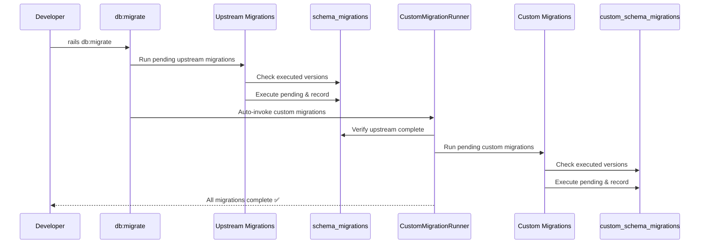

# Custom Migrations System

**Version:** 1.0.0
**Last Updated:** 2025-11-04
**Status:** Active

---

## Table of Contents

1. [Overview](#overview)
2. [Architecture](#architecture)
3. [Workflow](#workflow)
4. [Creating Custom Migrations](#creating-custom-migrations)
5. [Common Commands](#common-commands)
6. [Troubleshooting](#troubleshooting)
7. [Implementation Details](#implementation-details)
8. [Best Practices](#best-practices)

---

## Overview

This document describes the **dual migration system** used to maintain separation between upstream Chatwoot migrations and custom business migrations.

### Problem Solved

Before this system, custom migrations were mixed with upstream Chatwoot migrations in `db/migrate/`, causing:
- **Merge conflicts** on every upstream sync
- **Timestamp collisions** between custom and upstream migrations
- **Schema conflicts** in `db/schema.rb`
- **Maintenance overhead** resolving conflicts manually

### Solution

The dual migration system maintains two completely separate migration tracks:

| Aspect | Upstream | Custom |
|--------|----------|--------|
| **Directory** | `db/migrate/` | `db/migrate_custom/` |
| **Versioning** | Timestamps (e.g., 20251022152158) | Timestamp-based (e.g., 20251104120000_migration_name.rb) |
| **Tracking Table** | `schema_migrations` | `custom_schema_migrations` |
| **Schema File** | `db/schema.rb` | `db/schema_custom.rb` |
| **Execution** | Runs first | Runs second (automatic) |

---

## Architecture

### Components

#### 1. CustomMigrationRunner (`lib/custom_migration_runner.rb`)

Core migration execution engine that:
- Creates `custom_schema_migrations` tracking table
- Discovers pending custom migrations
- Ensures upstream migrations complete before running custom ones
- Executes migrations with transaction wrapping
- Provides rollback functionality
- Dumps/loads custom schema

#### 2. Custom Rake Tasks (`lib/tasks/custom_migrations.rake`)

Provides commands for managing custom migrations:
- `db:migrate:custom` - Run pending custom migrations
- `db:migrate:custom:status` - Show migration status
- `db:rollback:custom` - Rollback custom migrations
- `db:schema:dump:custom` - Dump custom schema
- `db:schema:load:custom` - Load custom schema

#### 3. Integration Hooks (`lib/tasks/db_enhancements.rake`)

Auto-integrates custom migrations with standard Rails tasks:
- `db:migrate` → automatically runs custom migrations after
- `db:schema:dump` → automatically dumps custom schema after
- `db:setup/db:reset` → automatically loads custom schema

#### 4. Configuration (`config/application.rb`)

Configures Rails to ignore custom tables in standard schema dumps:
```ruby
config.active_record.schema_dump_ignore_tables = [
  'account_prompts',
  'knowledge_bases',
  'custom_schema_migrations'
]
```

### Directory Structure

```
db/
├── migrate/                    # Upstream only (pristine, never touch)
│   ├── 20230426130150_init_schema.rb
│   ├── 20251022152158_add_index_to_conversations_identifier.rb
│   └── ... (95+ upstream migrations)
├── migrate_custom/             # Custom migrations (timestamps)
│   ├── 20250621210000_create_account_prompts.rb
│   ├── 20250701233536_create_knowledge_bases.rb
│   └── 20251104XXXXXX_* (future)
├── schema.rb                   # Upstream tables only (tracked in git)
└── schema_custom.rb            # Custom tables only (tracked in git)
```

### Migration Tracking

**Two independent tracking tables in the same database:**

```sql
-- Upstream tracking (standard Rails)
CREATE TABLE schema_migrations (
  version VARCHAR NOT NULL PRIMARY KEY
);

-- Example data: '20251022152158'

-- Custom tracking (our system)
CREATE TABLE custom_schema_migrations (
  version VARCHAR NOT NULL PRIMARY KEY
);

-- Example data: '1', '2', '3'
```

---

## Workflow

### Daily Development

**Running migrations** (runs both automatically):
```bash
rails db:migrate
```

Output:
```
== Running upstream migrations ==
== 3 migration(s) pending ==
...
== Running custom migrations ==
✅ No pending custom migrations
```

### Upstream Sync (The Magic!)

**Before (with conflicts):**
```bash
git pull upstream main
# Conflicts:
#   db/migrate/20250720000000_some_upstream_migration.rb
#   db/schema.rb
# Manual resolution required 😞
```

**After (no conflicts):**
```bash
git pull upstream main
# Auto-merge successful! ✅
#   db/migrate/20250720000000_some_upstream_migration.rb (added)
#   db/schema.rb (merged cleanly)
# No conflicts! db/migrate_custom/ and db/schema_custom.rb untouched

rails db:migrate
# Upstream migrations run first, then custom migrations (automatic)
```

### Fresh Database Setup

**Developer onboarding:**
```bash
# Clone repo
git clone <repo>
cd chatwoot

# Standard Rails setup
bundle install
rails db:setup

# Done! Both upstream and custom tables are loaded automatically
```

---

## Creating Custom Migrations

### Step-by-Step Guide

#### Step 1: Generate Migration File

```bash
rails generate custom_migration AddMetadataToKnowledgeBases
# Creates: db/migrate_custom/20251104120000_add_metadata_to_knowledge_bases.rb
```

**Naming convention:** Use PascalCase for the migration name
- The generator automatically creates the file with a timestamp prefix
- Use descriptive names that indicate what the migration does
- Examples: `AddMetadataToKnowledgeBases`, `CreateCustomFeature`, `RemoveOldColumn`

#### Step 2: Write Migration Code

Edit the generated file and add your migration logic:

```ruby
# db/migrate_custom/20251104120000_add_metadata_to_knowledge_bases.rb
class AddMetadataToKnowledgeBases < ActiveRecord::Migration[7.1]
  def change
    add_column :knowledge_bases, :metadata, :jsonb, default: {}, if_not_exists: true
    add_index :knowledge_bases, :metadata, using: :gin, if_not_exists: true
  end
end
```

**Migration best practices:**
- Use `if_not_exists: true` for idempotency
- Class name is automatically generated in PascalCase
- Timestamp prefix is automatically added by the generator

#### Step 3: Run Migration

```bash
rails db:migrate
```

Output:
```
== Running upstream migrations ==
✅ No pending upstream migrations

🔄 Running 1 custom migration(s)...
== Running custom migration 20251104120000: Add Metadata To Knowledge Bases ==
== Custom migration 20251104120000 complete ==

✅ All custom migrations complete
```

#### Step 4: Verify

```bash
# Check migration status
rails db:migrate:custom:status

# Output:
# Custom Migration Status:
# ----------------------------------------------------------------------
# Status   Version        Migration Name
# ----------------------------------------------------------------------
#   ✓      20250621210000  Create Account Prompts
#   ✓      20250701233536  Create Knowledge Bases
#   ✓      20251104120000  Add Metadata To Knowledge Bases
# ----------------------------------------------------------------------
# Executed: 3 | Pending: 0 | Total: 3
```

---

## Common Commands

### Migration Execution

```bash
# Run all migrations (upstream + custom) - USE THIS NORMALLY
rails db:migrate

# Run only custom migrations (rarely needed)
rails db:migrate:custom

# Run with verbose output
VERBOSE=true rails db:migrate:custom
```

### Migration Status

```bash
# Check upstream migration status
rails db:migrate:status

# Check custom migration status
rails db:migrate:custom:status
```

### Rollback

```bash
# Rollback last custom migration
rails db:rollback:custom

# Rollback last 2 custom migrations
rails db:rollback:custom STEP=2

# Re-run after fixing
rails db:migrate:custom
```

### Schema Management

```bash
# Dump both schemas (both are auto-dumped)
rails db:schema:dump

# Dump only custom schema
rails db:schema:dump:custom

# Load custom schema (automatically included in db:setup)
rails db:schema:load:custom
```

### Database Setup

```bash
# Fresh database setup (includes both schemas)
rails db:create
rails db:setup

# Reset database (includes both schemas)
rails db:reset

# Chatwoot-specific prepare task (includes both schemas)
rails db:chatwoot_prepare
```

---

## Troubleshooting

### Common Issues

#### Issue 1: "Cannot run custom migrations: X upstream migrations pending"

**Symptom:**
```bash
rails db:migrate:custom
# ❌ Custom migration failed: Cannot run custom migrations: 2 upstream migration(s) pending.
```

**Cause:** Upstream migrations must run first before custom migrations

**Solution:**
```bash
# Run standard migrate (runs both)
rails db:migrate
```

#### Issue 2: Custom tables missing after `db:setup`

**Symptom:**
```bash
rails console
> KnowledgeBase.first
# ❌ ActiveRecord::StatementInvalid: PG::UndefinedTable: ERROR: relation "knowledge_bases" does not exist
```

**Cause:** `db/schema_custom.rb` not loaded

**Solution:**
```bash
# Ensure schema file exists
ls -lh db/schema_custom.rb

# Load custom schema manually
rails db:schema:load:custom

# Or reset database
rails db:reset
```

#### Issue 3: Merge conflict in `db/migrate/` or `db/schema.rb`

**Symptom:** Git reports conflicts in upstream directories after sync

**Cause:** Custom migration was accidentally created in wrong directory

**Solution:**
```bash
# 1. Check if custom migration was added to db/migrate/
ls db/migrate/ | grep -i "account_prompts\|knowledge_bases\|<your_feature>"

# 2. If found, move to correct directory (keeping the timestamp)
git mv db/migrate/20251104120000_your_migration.rb db/migrate_custom/20251104120000_your_migration.rb

# 3. Regenerate schemas
rails db:schema:dump

# 4. Complete the merge
git add .
git commit
```

#### Issue 4: Schema dump includes custom tables

**Symptom:** `db/schema.rb` contains `account_prompts` or `knowledge_bases`

**Cause:** `schema_dump_ignore_tables` configuration not working

**Solution:**
```bash
# 1. Check configuration
grep -A 5 "schema_dump_ignore_tables" config/application.rb

# 2. Manually remove custom tables from schema.rb
# Edit db/schema.rb and remove:
#   - account_prompts table definition
#   - knowledge_bases table definition
#   - Foreign keys for these tables

# 3. Verify custom schema exists
cat db/schema_custom.rb
```

#### Issue 5: Custom migration fails with foreign key error

**Symptom:**
```bash
rails db:migrate:custom
# ❌ PG::ForeignKeyViolation: ERROR: insert or update on table "account_prompts" violates foreign key constraint
```

**Cause:** Referenced table doesn't exist (upstream migrations not run)

**Solution:**
```bash
# Ensure upstream migrations are complete
rails db:migrate:status | grep "down"

# If any upstream migrations are down, run them
rails db:migrate
```

---

## Implementation Details

### How It Works

#### Migration Execution Flow



#### Key Features

**1. Guaranteed Execution Order**
- Custom migrations only run after ALL upstream migrations complete
- Enforced by `ensure_upstream_migrations_complete!` check

**2. Transaction Safety**
- Each custom migration runs in a transaction
- Rollback on error (version not recorded)
- Database stays consistent

**3. Idempotency**
- Safe to run `rails db:migrate` multiple times
- No-op when no pending migrations
- Use `if_not_exists: true` in migrations for extra safety

**4. Independent Rollback**
- Can rollback custom migrations without affecting upstream
- Upstream migrations untouched by custom rollback

### File Reference

#### Created Files
- `lib/custom_migration_runner.rb` - Core migration engine
- `lib/tasks/custom_migrations.rake` - Rake tasks for custom migrations
- `lib/generators/custom_migration/custom_migration_generator.rb` - Migration generator
- `lib/generators/custom_migration/templates/migration.rb.erb` - Generator template
- `db/migrate_custom/20250621210000_create_account_prompts.rb` - Custom migration example
- `db/migrate_custom/20250701233536_create_knowledge_bases.rb` - Custom migration example
- `db/schema_custom.rb` - Custom schema documentation

#### Modified Files
- `lib/tasks/db_enhancements.rake` - Added integration hooks
- `config/application.rb` - Added schema_dump_ignore_tables config
- `db/schema.rb` - Removed custom tables (upstream only)

---

## Best Practices

### DO ✅

1. **Use `rails generate custom_migration`** to create new migrations
2. **Run `rails db:migrate`** for normal workflow (auto-runs both)
3. **Commit both schema files** (`schema.rb` and `schema_custom.rb`)
4. **Use descriptive migration names** (e.g., `AddMetadataToKnowledgeBases`)
5. **Test rollback** before deploying (ensure `down` method works)
6. **Use `if_not_exists: true`** for idempotent migrations
7. **Document complex migrations** with comments in the migration file
8. **Keep custom migrations additive** (don't modify upstream tables destructively)

### DON'T ❌

1. **Never edit files in `db/migrate/`** - These are upstream Chatwoot migrations
2. **Never delete `db/schema_custom.rb`** - It's required for database setup
3. **Never manually create migration files** - Always use the generator
4. **Never run `db:migrate:custom` directly** unless debugging (use `db:migrate`)
5. **Never modify upstream migrations** to fix conflicts (move to `migrate_custom/` instead)
6. **Never commit custom tables to `db/schema.rb`** (they belong in `schema_custom.rb`)

### Migration Guidelines

**Creating Tables:**
```ruby
def change
  create_table :my_custom_table, id: :uuid, if_not_exists: true do |t|
    t.references :account, null: false, foreign_key: true
    t.string :name
    t.timestamps
  end

  add_index :my_custom_table, :name, if_not_exists: true
end
```

**Adding Columns:**
```ruby
def change
  add_column :knowledge_bases, :metadata, :jsonb, default: {}, if_not_exists: true
  add_index :knowledge_bases, :metadata, using: :gin, if_not_exists: true
end
```

**Reversible Operations:**
```ruby
def change
  # Automatically reversible
  add_column :knowledge_bases, :status, :integer
end

# If not automatically reversible, use up/down:
def up
  execute "CREATE INDEX CONCURRENTLY idx_name ON knowledge_bases (name)"
end

def down
  execute "DROP INDEX IF EXISTS idx_name"
end
```

---

## Related Documentation

- [CLAUDE.md](../CLAUDE.md) - Development guidelines (includes custom migration quick reference)
- [Development Process](../docs/processes/development/development_process.md) - Full development workflow
- [Design Document](../docs/ignored/feature_dual_migration/dual_migration_system_design.md) - Technical design details
- [Research Document](../docs/ignored/feature_dual_migration/dual_migration_system_research.md) - Problem analysis and solution exploration

---

## Changelog

### Version 1.0.0 (2025-11-04)
- Initial implementation of dual migration system
- Created `CustomMigrationRunner` class
- Added custom rake tasks
- Integrated with standard Rails tasks
- Moved 2 existing custom migrations to new system
- Created separate schema files

---

**Maintained By:** Development Team
**Questions?** Check troubleshooting section or review design docs in `/docs/ignored/feature_dual_migration/`
