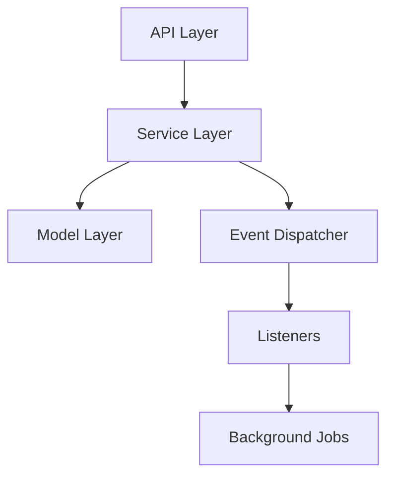
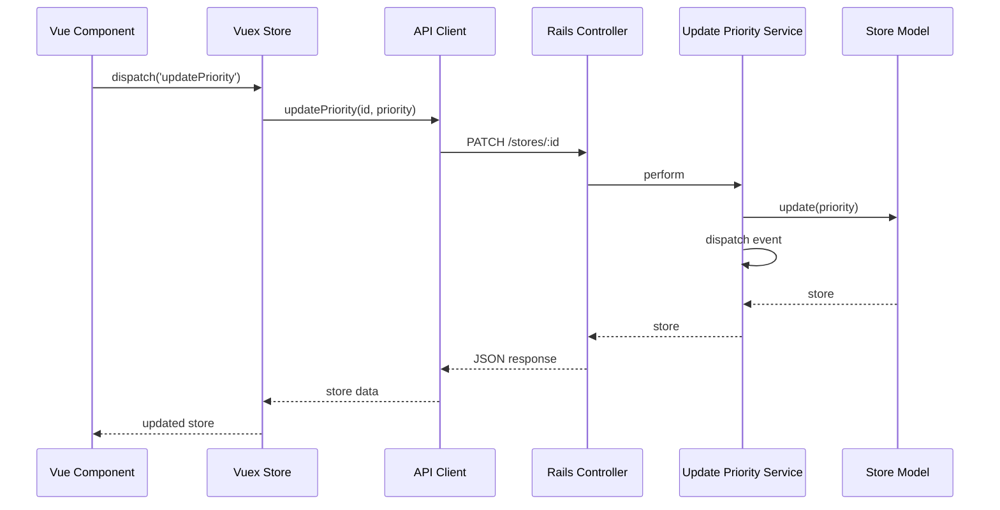

# Research Process Guide

**Version**: 2.0.0
**Last Updated**: 2025-10-06
**Status**: Active
**Document Type**: Process Guide
**Project**: Chatwoot (Ruby on Rails + Vue.js)

---

## Table of Contents

1. [Overview](#overview)
2. [Research Agent Responsibilities](#research-agent-responsibilities)
3. [Research Process Workflow](#research-process-workflow)
4. [Phase 1: Request Understanding](#phase-1-request-understanding)
5. [Phase 2: Repository Analysis](#phase-2-repository-analysis)
6. [Phase 3: Solution Exploration](#phase-3-solution-exploration)
7. [Phase 4: Recommendation & Decision](#phase-4-recommendation--decision)
8. [Conversation Guidelines](#conversation-guidelines)
9. [Research Checklist](#research-checklist)
10. [Research Report Template](#research-report-template)
11. [Integration with Development Process](#integration-with-development-process)
12. [Examples](#examples)
13. [Best Practices](#best-practices)
14. [Troubleshooting](#troubleshooting)
15. [Quick Reference](#quick-reference)
16. [Changelog](#changelog)

---

## Overview

The Research Process is the **critical first phase** before creating a design document. It ensures that:
1. The user's request is fully understood
2. The codebase and architecture are deeply analyzed
3. Multiple solution approaches are considered
4. The best approach is collaboratively selected
5. A solid foundation exists for the design phase

### Key Principles

1. **Conversation First**: Research is collaborative, not automated
2. **Deep Understanding**: Use `@ultrathink` - read ALL relevant code
3. **Question Everything**: Challenge assumptions, ask clarifying questions
4. **Explore Alternatives**: Always present multiple approaches
5. **Align with Patterns**: Follow existing codebase conventions (Rails MVC + Services, Vue.js Composition API)
6. **Document Findings**: Create clear, actionable research reports
7. **Full-Stack Thinking**: Consider both backend and frontend implications
8. **Enterprise Compatibility**: Check Enterprise overlay compatibility

### Process Flow

```
User Request
    ↓
Phase 1: Request Understanding (Conversational)
    ├─ Parse request
    ├─ Ask clarifying questions
    └─ Define success criteria
    ↓
Phase 2: Repository Analysis (Deep Dive)
    ├─ Study Rails MVC + Services architecture
    ├─ Study Vue.js components and Vuex store
    ├─ Identify patterns
    ├─ Map dependencies (backend + frontend)
    ├─ Check Enterprise compatibility
    └─ Assess impact
    ↓
Phase 3: Solution Exploration (Creative)
    ├─ Generate alternatives
    ├─ Analyze pros/cons (full-stack)
    ├─ Discuss with user
    └─ Refine approaches
    ↓
Phase 4: Recommendation & Decision (Collaborative)
    ├─ Present recommendation
    ├─ Justify choice
    ├─ Get user approval
    └─ Create research report
    ↓
Proceed to Design Document
```

---

## Research Agent Responsibilities

### The Research Agent Must:

1. **Act as a Consultant** - Not just execute, but advise and guide
2. **Be Thorough** - Read ALL relevant code, don't make assumptions
3. **Be Conversational** - Engage the user, ask questions, discuss
4. **Be Critical** - Question the request if better approaches exist
5. **Be Comprehensive** - Consider all components (Models, Services, Controllers, Jobs, Frontend, i18n, Tests)
6. **Be Pattern-Aware** - Identify and follow Rails and Vue.js patterns
7. **Be Full-Stack** - Think about both backend and frontend implications
8. **Be Honest** - Admit uncertainty, ask for help when needed
9. **Document Everything** - Findings, conversations, decisions

### The Research Agent Should NOT:

1. **Jump to Implementation** - No code changes during research
2. **Make Unilateral Decisions** - Always collaborate with the user
3. **Skip Analysis** - Every request deserves deep investigation
4. **Ignore Alternatives** - Always present multiple options
5. **Assume Understanding** - Ask clarifying questions liberally
6. **Violate Architecture** - Respect Rails MVC + Services patterns
7. **Forget Frontend** - Backend changes often need frontend updates
8. **Skip Enterprise Checks** - Always verify Enterprise compatibility

---

## Research Process Workflow

### Duration: 30-90 minutes

### Input:
- User's feature request or problem statement
- Access to codebase

### Output:
- Research report with findings and recommendation
- User approval to proceed to design phase

---

## Phase 1: Request Understanding

**Goal**: Fully understand what the user wants to achieve

**Duration**: 10-20 minutes

### Step 1.1: Initial Request Parsing

**Actions**:
1. Read the user's request carefully
2. Identify the core objective
3. Note any mentioned constraints
4. Flag ambiguous or unclear points

**Example Questions to Ask Yourself**:
- What is the user trying to achieve?
- Is this a new feature, bug fix, refactoring, or optimization?
- Are there explicit requirements?
- Are there implicit requirements I should clarify?
- What is the scope? (API only? Full-stack? Database changes? Frontend UI?)

### Step 1.2: Clarification Questions

**Always Ask**:
- Scope clarification (backend only? frontend too? both?)
- Success criteria
- Constraints (timeline, backward compatibility, Enterprise compatibility, etc.)
- Context (why is this needed? what problem does it solve?)
- i18n requirements (UI labels? translations needed?)

**Example Conversation**:
```
User: "I want to add a priority field to the stores"

Agent: "I'd like to understand your request better:

1. What is the purpose of the priority field?
2. What values should it have? (numeric? enum like low/medium/high?)
3. Should it be exposed via the API?
4. Should it be optional or required?
5. Do we need to migrate existing stores (default value)?
6. Should it be visible in the UI? If so, where?
7. Do we need filtering/sorting by priority?
8. Are there any validation rules?
9. Should this work with the Enterprise edition?

Understanding these details will help me propose the best implementation approach."
```

### Step 1.3: Define Success Criteria

**Collaborate with User to Define**:
- What "done" looks like
- Acceptance criteria
- Performance requirements (if applicable)
- Testing expectations (RSpec + Vitest)
- Documentation needs
- i18n requirements (en.json + es.json)

**Document**:
```markdown
### Success Criteria
- [ ] Priority field added to Store model
- [ ] API returns priority in store responses
- [ ] UI displays priority badge
- [ ] Users can filter stores by priority
- [ ] All tests pass (backend + frontend)
- [ ] i18n translations added (en + es)
```

### Deliverable:
- Clear, unambiguous understanding of the request
- Documented success criteria
- User confirmation that you understand correctly

---

## Phase 2: Repository Analysis

**Goal**: Deeply understand the current codebase and architecture

**Duration**: 20-40 minutes

### Step 2.1: Identify Relevant Code

**Use Tools Extensively**:
```bash
# Find relevant files - Backend
Glob: "app/models/**/*store*.rb"
Glob: "app/services/**/*store*.rb"
Glob: "app/controllers/api/**/*store*.rb"

# Find relevant files - Frontend
Glob: "app/javascript/dashboard/components/**/*store*.vue"
Glob: "app/javascript/dashboard/store/modules/*store*.js"

# Search for patterns
Grep: "class Store"
Grep: "def create_store"
Grep: "store.priority"

# Read all relevant files
Read: /path/to/identified/file.rb
Read: /path/to/identified/file.vue
```

**Questions to Answer**:
- Where is the relevant code?
- What components are involved? (Models, Services, Controllers, Jobs, Listeners, Frontend, Vuex, i18n)
- What patterns are used?
- Are there similar features I can learn from?
- Is there Enterprise overlay code I need to check?

### Step 2.2: Study Architecture Patterns

**Read**:
1. CLAUDE.md - Project guidelines
2. ARCHITECTURE.md - System architecture
3. Related model files
4. Related service files
5. Related controller files
6. Related Vue component files
7. Related Vuex store files
8. Related i18n files (en.json, es.json)
9. Related test files (RSpec + Vitest)
10. Enterprise directory (if applicable)

**Analyze**:
- How are similar features implemented?
- What design patterns are used?
- How are models structured? (associations, validations, scopes, enums)
- How are service objects structured? (initialize + perform pattern)
- How are controllers structured? (strong parameters, error handling)
- How are Vue components structured? (Composition API, Tailwind CSS)
- How is Vuex store organized? (actions, mutations, getters)
- How is i18n managed? (en.json and es.json)
- How is event dispatching used? (dispatcher pattern)

**Example Analysis Notes**:
```markdown
### Current Architecture Analysis

#### Models (ActiveRecord)
- Store models inherit from ApplicationRecord
- Use ActiveRecord validations (validates presence, uniqueness)
- Field naming: snake_case in Ruby, camelCase in API (Jbuilder)
- Enums for status fields (e.g., `enum status: { active: 0, inactive: 1 }`)
- Associations: belongs_to, has_many
- Scopes for common queries

#### Services
- Services in app/services/<domain>/<action>_service.rb
- Pattern: initialize(account:, params:) + perform method
- Use dependency injection
- Dispatch events using Rails.configuration.dispatcher
- Return domain objects, not JSON

#### Controllers
- Controllers in app/controllers/api/v1/accounts/
- Inherit from Api::V1::Accounts::BaseController
- Use strong parameters (params.permit)
- Use service objects for business logic
- Error handling with rescue blocks
- Return Jbuilder views (camelCase JSON)

#### Frontend (Vue.js)
- Components in app/javascript/dashboard/components/
- Use Composition API with <script setup>
- Use Tailwind CSS only (no custom CSS)
- Use i18n for all labels ({{ t('KEY') }})
- Integrate with Vuex store for state management

#### Vuex Store
- Store modules in app/javascript/dashboard/store/modules/
- Namespaced modules
- Actions for async operations (API calls)
- Mutations for state changes
- Getters for computed state

#### i18n
- Backend: config/locales/en.yml, config/locales/es.yml
- Frontend: app/javascript/dashboard/i18n/locale/en.json, es.json
- BOTH en and es must be updated
```

### Step 2.3: Identify Dependencies & Impact

**Map Out**:
1. **Direct Dependencies**
   - What files import/use the affected code?
   - What files will need changes?

2. **Indirect Dependencies**
   - What features depend on this?
   - What workflows will be affected?

3. **Database Impact**
   - Are schema changes needed? (Rails migration)
   - Is data migration needed?
   - What's the rollback strategy? (reversible migrations)

4. **API Impact**
   - Are API contracts changing? (Jbuilder views)
   - Is this a breaking change?
   - How do we version this?

5. **Frontend Impact**
   - Do Vue components need updates?
   - Does Vuex store need updates?
   - Do API clients need updates?
   - Do i18n files need updates?

6. **Test Impact**
   - What test files need updates? (RSpec + Vitest)
   - What new tests are needed?
   - Are there existing test patterns to follow?

7. **Enterprise Impact**
   - Are there Enterprise overrides to check?
   - Will this work with Enterprise edition?

**Use Tools**:
```bash
# Find all references
Grep: "Store" -n --output-mode files_with_matches
Grep: "create_store" --output-mode files_with_matches

# Check test files
Glob: "spec/**/*store*.rb"
Glob: "app/javascript/dashboard/components/__tests__/*store*.spec.js"

# Check Enterprise
Glob: "enterprise/app/**/*store*.rb"
```

### Step 2.4: Review Similar Implementations

**Find Examples**:
- Look for similar features in the codebase
- Study how they were implemented
- Note patterns and conventions
- Learn from their design decisions

**Example**:
```markdown
### Similar Implementation: Conversation Priority

I found a similar implementation in the Conversation model:

1. Model: app/models/conversation.rb
   - `enum priority: { low: 0, medium: 1, high: 2, urgent: 3 }`
   - `scope :high_priority, -> { where(priority: :high) }`
   - `validates :priority, presence: true`

2. Service: app/services/conversations/update_priority_service.rb
   - Handles priority updates
   - Dispatches CONVERSATION_PRIORITY_UPDATED event

3. Controller: app/controllers/api/v1/accounts/conversations_controller.rb
   - Strong params include :priority
   - Uses service object

4. Jbuilder: app/views/api/v1/accounts/conversations/show.json.jbuilder
   - `json.priority @conversation.priority`
   - `json.priorityLabel @conversation.priority.humanize`

5. Frontend: app/javascript/dashboard/components/ConversationCard.vue
   - Displays priority badge with Tailwind classes
   - Color-coded based on priority level

6. Vuex: app/javascript/dashboard/store/modules/conversations.js
   - Action: updateConversationPriority
   - Mutation: SET_CONVERSATION_PRIORITY

7. i18n: app/javascript/dashboard/i18n/locale/en.json
   - CONVERSATIONS.PRIORITY.LOW, MEDIUM, HIGH, URGENT

8. Tests:
   - spec/models/conversation_spec.rb
   - spec/services/conversations/update_priority_service_spec.rb
   - app/javascript/dashboard/components/__tests__/ConversationCard.spec.js

Key Patterns:
- Use enum for priority (0, 1, 2)
- Provide scope for filtering
- Use service object for updates
- Dispatch event on change
- Return camelCase in API (Jbuilder)
- Use Tailwind for UI (no custom CSS)
- i18n for all labels
```

### Deliverable:
- Comprehensive understanding of current architecture
- List of affected files (backend + frontend)
- Identified patterns and conventions
- Impact assessment (database, API, frontend, tests, Enterprise)
- Examples of similar implementations

---

## Phase 3: Solution Exploration

**Goal**: Generate and evaluate multiple solution approaches

**Duration**: 15-30 minutes

### Step 3.1: Generate Alternative Approaches

**Always Create At Least 3 Alternatives**:

**Example**:
```markdown
### Approach 1: Minimal Change (Simplest)
**Description**: Add priority field to existing structures with minimal refactoring

**Changes Required**:
- **Backend** (5 files):
  - Add migration: `db/migrate/YYYYMMDDHHMMSS_add_priority_to_stores.rb`
  - Update model: `app/models/store.rb` (add enum)
  - Update Jbuilder view: `app/views/api/v1/accounts/stores/show.json.jbuilder`
  - Update controller: `app/controllers/api/v1/accounts/stores_controller.rb` (strong params)
  - Add model spec: `spec/models/store_spec.rb`

- **Frontend** (2 files):
  - Update component: `app/javascript/dashboard/components/StoreDetails.vue`
  - Update i18n: `app/javascript/dashboard/i18n/locale/{en,es}.json`

**Pros**:
- Quick to implement (1-2 days)
- Low risk
- Backward compatible
- Minimal files touched

**Cons**:
- No filtering/sorting capability
- No service object (logic in controller)
- No event dispatching
- Limited UI improvements

**Effort**: 1-2 days
**Risk**: Low

---

### Approach 2: Proper Integration (Recommended)
**Description**: Add priority field with proper service object, event dispatching, filtering, and complete UI

**Changes Required**:
- **Backend** (10 files):
  - Migration: `db/migrate/YYYYMMDDHHMMSS_add_priority_to_stores.rb`
  - Model: `app/models/store.rb` (enum, scope, validations)
  - Service: `app/services/stores/update_priority_service.rb`
  - Controller: `app/controllers/api/v1/accounts/stores_controller.rb`
  - Listener: `app/listeners/store_listener.rb` (handle STORE_PRIORITY_UPDATED)
  - Jbuilder: `app/views/api/v1/accounts/stores/show.json.jbuilder`
  - Model spec: `spec/models/store_spec.rb`
  - Service spec: `spec/services/stores/update_priority_service_spec.rb`
  - Request spec: `spec/requests/api/v1/accounts/stores_spec.rb`
  - Listener spec: `spec/listeners/store_listener_spec.rb`

- **Frontend** (8 files):
  - Component: `app/javascript/dashboard/components/StoreDetails.vue`
  - Component: `app/javascript/dashboard/components/StorePriorityBadge.vue` (new)
  - Vuex store: `app/javascript/dashboard/store/modules/stores.js`
  - API client: `app/javascript/dashboard/api/stores.js`
  - i18n: `app/javascript/dashboard/i18n/locale/{en,es}.json`
  - Component spec: `app/javascript/dashboard/components/__tests__/StoreDetails.spec.js`
  - Component spec: `app/javascript/dashboard/components/__tests__/StorePriorityBadge.spec.js`
  - Store spec: `app/javascript/dashboard/store/modules/__tests__/stores.spec.js`

**Pros**:
- Follows best practices (service object pattern)
- Event-driven architecture
- Complete UI with filtering
- Proper test coverage
- Extensible for future changes
- i18n support

**Cons**:
- More work upfront (3-4 days)
- Touches more files

**Effort**: 3-4 days
**Risk**: Medium

---

### Approach 3: Complete Priority System (Thorough)
**Description**: Full priority management system with auto-prioritization, SLA tracking, notifications

**Changes Required**:
- **Backend** (20+ files):
  - All from Approach 2
  - Job: `app/jobs/stores/auto_prioritize_job.rb`
  - Service: `app/services/stores/auto_prioritize_service.rb`
  - Service: `app/services/stores/priority_analytics_service.rb`
  - Multiple additional specs

- **Frontend** (15+ files):
  - All from Approach 2
  - Dashboard widget for priority analytics
  - Settings page for priority rules
  - Notifications for priority changes

**Pros**:
- Comprehensive solution
- Automation included
- Analytics dashboard
- Notification system

**Cons**:
- Very high effort (2-3 weeks)
- High risk
- Complex implementation
- Many dependencies

**Effort**: 2-3 weeks
**Risk**: High
```

### Step 3.2: Analyze Trade-offs

**For Each Approach, Document**:

1. **Alignment with Architecture**
   - Does it follow Rails MVC + Services?
   - Does it use proper patterns?
   - Does it match existing conventions?
   - Does it maintain Enterprise compatibility?

2. **Complexity**
   - How complex is the implementation?
   - How many files are affected?
   - How risky is it?
   - Backend vs frontend complexity?

3. **Maintainability**
   - How easy to understand?
   - How easy to extend?
   - Does it add technical debt?
   - Test coverage adequate?

4. **Performance**
   - Any performance implications?
   - Database query impact?
   - API response time impact?
   - Frontend rendering impact?

5. **Testing**
   - How testable is it?
   - What test coverage is needed? (RSpec + Vitest)
   - Are there edge cases?

6. **Migration**
   - How complex is the Rails migration?
   - Can it be rolled back?
   - Is there a backward compatibility strategy?
   - Data migration needed?

7. **i18n**
   - Are translations needed?
   - Both en and es covered?

### Step 3.3: Discuss with User

**Present Alternatives**:
```markdown
I've analyzed your request and generated 3 potential approaches:

**Approach 1: Minimal Change**
- Quickest (1-2 days)
- Low risk
- But basic functionality only (no filtering, no events)

**Approach 2: Proper Integration (My Recommendation)**
- Balanced effort (3-4 days)
- Follows Rails/Vue.js best practices
- Service objects + event dispatching
- Complete UI with filtering
- Full test coverage
- Extensible

**Approach 3: Complete Priority System**
- Most thorough (2-3 weeks)
- Auto-prioritization + analytics
- But very high effort and risk

**My Recommendation**: Approach 2

**Rationale**:
1. Balances speed with quality
2. Follows existing patterns in the codebase (similar to Conversation priority)
3. Won't create technical debt
4. Manageable scope (18 files total)
5. Provides complete functionality users need
6. Good test coverage (RSpec + Vitest)

What do you think? Do you have timeline constraints or other considerations I should factor in?
```

**Be Open to Feedback**:
- User may prefer different approach
- User may have constraints you didn't know about
- User may suggest hybrid approach
- User may ask for clarification

### Step 3.4: Refine Based on Feedback

**Iterate**:
1. Listen to user's concerns
2. Adjust approaches based on feedback
3. Explore hybrid options if needed
4. Re-evaluate trade-offs
5. Converge on best approach

**Example Iteration**:
```
User: "Approach 2 looks good, but 3-4 days is too long. Can we do something in 2 days that still has good quality?"

Agent: "Good point. Let me propose a hybrid:

**Approach 2.5: Focused Integration**
- Add the field with enum and validations (like Approach 2)
- Update all layers: model, controller, Jbuilder, Vue component (like Approach 2)
- Add basic filtering in API and UI
- Add i18n (en + es)
- BUT defer the service object and event dispatching to a future task
- Keep changes focused on this specific field
- Still maintain good test coverage

This should take 2 days and still give us most of the benefits of Approach 2, with proper architecture we can enhance later.

Would this work for your timeline?"
```

### Deliverable:
- 3+ alternative approaches documented
- Trade-off analysis for each (full-stack)
- User feedback incorporated
- Converged on preferred approach

---

## Phase 4: Recommendation & Decision

**Goal**: Make final recommendation and get user approval

**Duration**: 5-10 minutes

### Step 4.1: Present Final Recommendation

**Structure**:
```markdown
## Final Recommendation

### Chosen Approach: Proper Integration (Approach 2)

### Summary
Add priority field to Store model with full Rails/Vue.js integration: enum-based priority, service object for updates, event dispatching, complete UI with filtering, Vuex store integration, and full i18n support.

### Why This Approach
1. **Alignment with Architecture** - Follows Rails MVC + Services pattern used throughout Chatwoot
2. **Balances Effort/Quality** - 3-4 days provides complete, maintainable solution
3. **Follows Existing Patterns** - Mirrors Conversation priority implementation
4. **Full-Stack Solution** - Backend + Frontend + i18n + Tests
5. **Extensible** - Event-driven design allows future enhancements

### What Will Be Changed

#### Backend (10 files)
**Models**:
- `app/models/store.rb` - Add `enum priority`, scopes, validations

**Services**:
- `app/services/stores/update_priority_service.rb` (new) - Handle priority updates with event dispatching

**Controllers**:
- `app/controllers/api/v1/accounts/stores_controller.rb` - Add priority to strong params, use service object

**Listeners**:
- `app/listeners/store_listener.rb` - Handle STORE_PRIORITY_UPDATED event

**Views**:
- `app/views/api/v1/accounts/stores/show.json.jbuilder` - Add priority and priorityLabel

**Migrations**:
- `db/migrate/YYYYMMDDHHMMSS_add_priority_to_stores.rb` (new) - Add priority column with default

**Tests (RSpec)**:
- `spec/models/store_spec.rb` - Test enum, validations, scopes
- `spec/services/stores/update_priority_service_spec.rb` (new) - Test service logic + events
- `spec/requests/api/v1/accounts/stores_spec.rb` - Test API endpoints
- `spec/listeners/store_listener_spec.rb` - Test event handling

#### Frontend (8 files)
**Components**:
- `app/javascript/dashboard/components/StoreDetails.vue` - Display priority badge
- `app/javascript/dashboard/components/StorePriorityBadge.vue` (new) - Reusable priority badge with Tailwind CSS

**Vuex Store**:
- `app/javascript/dashboard/store/modules/stores.js` - Add updateStorePriority action

**API Client**:
- `app/javascript/dashboard/api/stores.js` - Add updatePriority method

**i18n**:
- `app/javascript/dashboard/i18n/locale/en.json` - Add STORES.PRIORITY.* keys
- `app/javascript/dashboard/i18n/locale/es.json` - Add Spanish translations

**Tests (Vitest)**:
- `app/javascript/dashboard/components/__tests__/StoreDetails.spec.js` - Test priority display
- `app/javascript/dashboard/components/__tests__/StorePriorityBadge.spec.js` (new) - Test badge component
- `app/javascript/dashboard/store/modules/__tests__/stores.spec.js` - Test Vuex actions

**Total Files**: 18 files (10 backend + 8 frontend)

### Estimated Effort
- **Duration**: 3-4 days
- **Complexity**: Medium
- **Risk**: Medium

### Next Steps
1. Get your approval on this approach
2. Create detailed design document
3. Create execution plan
4. Begin implementation

### Risks & Mitigations

#### Risk 1: Event Listener Integration
**Impact**: If event listener fails, priority changes may not trigger downstream actions
**Mitigation**:
- Comprehensive listener specs
- Test event dispatching in service specs
- Monitor logs during deployment

#### Risk 2: Frontend State Synchronization
**Impact**: Vuex store may get out of sync with API after priority updates
**Mitigation**:
- Re-fetch store data after successful update
- Use optimistic UI updates with rollback on error
- Add Vuex store tests to verify state management

#### Risk 3: Migration on Large Dataset
**Impact**: Migration may take time if many stores exist
**Mitigation**:
- Use default value in migration (priority: 1 = medium)
- Migration is reversible
- Test on staging environment first
```

### Step 4.2: Get User Approval

**Ask**:
```markdown
Does this approach look good to you?

- [ ] Yes, proceed to design document
- [ ] I have questions/concerns (please share)
- [ ] I prefer a different approach (which one?)
```

**Be Ready For**:
- More questions
- Request for clarifications
- Request for adjustments
- Approval to proceed

### Step 4.3: Create Research Report

**Once Approved, Document**:

Create file: `/docs/ignored/design/<feature_name>_research.md`

**Note**: Research reports are created in `/docs/ignored/` to keep active work separate from committed templates and process documentation.

**Use Template**: [Research Report Template](#research-report-template)

**Include**:
1. Original request
2. Clarifications and assumptions
3. Architecture analysis findings (Rails + Vue.js)
4. Alternative approaches considered
5. Final recommendation
6. Trade-off justification
7. User approval timestamp
8. Next steps

### Deliverable:
- Final recommendation presented
- User approval obtained
- Research report created
- Ready to proceed to design phase

---

## Conversation Guidelines

### Communication Style

**DO**:
- ✅ Be conversational and friendly
- ✅ Use clear, plain language
- ✅ Ask questions liberally
- ✅ Explain your reasoning
- ✅ Show your work (code examples, file paths with line numbers)
- ✅ Admit when you're unsure
- ✅ Be patient with clarifications
- ✅ Present options, not just answers
- ✅ Think full-stack (backend + frontend)

**DON'T**:
- ❌ Be overly formal or robotic
- ❌ Make assumptions without asking
- ❌ Jump to conclusions
- ❌ Overwhelm with technical jargon
- ❌ Present only one option
- ❌ Make unilateral decisions
- ❌ Skip the conversation phase
- ❌ Forget frontend implications

### Asking Good Questions

**Types of Questions**:

1. **Clarifying Questions**
   - "What do you mean by...?"
   - "Can you help me understand...?"
   - "Is this correct: [your understanding]?"

2. **Scoping Questions**
   - "Should this also include frontend UI changes?"
   - "What about i18n translations?"
   - "How important is...?"

3. **Constraint Questions**
   - "Do you have a timeline?"
   - "Are there backward compatibility requirements?"
   - "Does this need to work with Enterprise edition?"

4. **Validation Questions**
   - "Does this align with what you're thinking?"
   - "Am I on the right track?"
   - "Is this what you expected?"

### Presenting Information

**Use Structured Formats**:

```markdown
### Current Implementation
[Description]
```ruby
# Backend code example - app/models/store.rb:15
class Store < ApplicationRecord
  belongs_to :account
end
```

```vue
<!-- Frontend code example - app/javascript/dashboard/components/StoreDetails.vue:10 -->
<script setup>
import { computed } from 'vue';
const store = useStore();
</script>
```

### Proposed Change
[Description]
```ruby
# Proposed backend change
class Store < ApplicationRecord
  belongs_to :account
  enum priority: { low: 0, medium: 1, high: 2 }
end
```

### Why This Is Better
1. Reason 1 - Follows Rails conventions
2. Reason 2 - Event-driven architecture
```

**Use Comparisons**:
```markdown
| Aspect | Current | Proposed |
|--------|---------|----------|
| Files Changed | 5 | 18 |
| Test Coverage | 60% | 90% |
| Frontend | None | Complete UI |
```

**Use Visual Progress**:
```markdown
Research Progress:
[✅✅✅░░] 3/5 phases complete
```

**Use Diagrams (Mermaid)**:
- **Preferred format**: Simple mermaid diagrams for visualizing architecture, flows, and relationships
- Keep diagrams minimal and focused on key concepts
- Use for: architecture layers, data flows, sequence diagrams, decision trees

```markdown
### Current Architecture


### Proposed Data Flow

```

### Handling Uncertainty

**When You Don't Know**:
```markdown
I'm not entirely sure about how Enterprise edition handles store priorities. Let me investigate this further.

[Performs investigation using Grep to search enterprise/ directory]

After investigating, I found that Enterprise edition doesn't override store priority logic. This means our changes will work without additional Enterprise-specific code.
```

**When You Need More Info**:
```markdown
To answer this properly, I need to understand:
1. Should priority affect conversation assignment?
2. Should we notify agents when high-priority stores contact us?

Once I know these, I can provide a concrete recommendation.
```

---

## Research Checklist

### Phase 1: Request Understanding ✅

- [ ] Read user request thoroughly
- [ ] Identified core objective
- [ ] Asked clarifying questions
- [ ] Defined success criteria (backend + frontend)
- [ ] Documented assumptions
- [ ] Confirmed i18n requirements
- [ ] Got user confirmation of understanding

### Phase 2: Repository Analysis ✅

- [ ] Used Glob to find relevant files (backend + frontend)
- [ ] Used Grep to search for patterns
- [ ] Read all relevant model files
- [ ] Read all relevant service files
- [ ] Read all relevant controller files
- [ ] Read all relevant Jbuilder view files
- [ ] Read all relevant Vue component files
- [ ] Read all relevant Vuex store files
- [ ] Read all relevant i18n files (en + es)
- [ ] Read all relevant test files (RSpec + Vitest)
- [ ] Read CLAUDE.md for project guidelines
- [ ] Read ARCHITECTURE.md for system overview
- [ ] Identified existing patterns (Rails + Vue.js)
- [ ] Mapped dependencies and impacts
- [ ] Assessed database impact (Rails migrations)
- [ ] Assessed API impact (Jbuilder, controllers)
- [ ] Assessed frontend impact (components, Vuex, i18n)
- [ ] Checked Enterprise compatibility
- [ ] Found similar implementations for reference

### Phase 3: Solution Exploration ✅

- [ ] Generated at least 3 alternative approaches
- [ ] Documented pros/cons for each approach (full-stack)
- [ ] Analyzed alignment with Rails MVC + Services architecture
- [ ] Estimated effort for each approach (backend + frontend)
- [ ] Assessed risk for each approach
- [ ] Presented alternatives to user
- [ ] Discussed trade-offs
- [ ] Incorporated user feedback
- [ ] Refined approaches based on feedback
- [ ] Converged on preferred approach

### Phase 4: Recommendation & Decision ✅

- [ ] Presented final recommendation
- [ ] Justified why this approach
- [ ] Documented what will change (backend + frontend)
- [ ] Estimated effort and risk
- [ ] Identified potential risks
- [ ] Defined mitigation strategies
- [ ] Got user approval
- [ ] Created research report
- [ ] Documented next steps

---

## Research Report Template

**Template Location**: See `/docs/processes/design/RESEARCH_TEMPLATE.md`

**Runtime Documents**: Created in `/docs/ignored/design/<feature_name>_research.md`

**Key Sections**:

1. **Request Understanding**: Original request, clarifications/assumptions, success criteria
2. **Repository Analysis**:
   - Files analyzed by component (Models, Services, Controllers, Jobs, Listeners, Vue Components, Vuex Store, i18n, Tests)
   - Current patterns (Rails + Vue.js)
   - Similar implementations
   - Dependency/impact assessment (backend + frontend + Enterprise)
3. **Alternative Approaches** (3+): For each:
   - Description
   - Changes required (backend + frontend)
   - Code examples (Ruby + Vue.js)
   - Pros/cons
   - Effort estimate
   - Architecture alignment
4. **Trade-off Analysis**: Comparison table of all approaches
5. **Final Recommendation**:
   - Chosen approach with justification
   - Why alternatives rejected
   - Implementation summary
   - Effort/risk
6. **User Approval**: Approval status, date, comments
7. **Next Steps**: Design document creation, timeline
8. **Research Artifacts**: Search queries used, files read, key findings

**Usage**: Copy template and complete all sections. Get user approval before proceeding to design phase.

---

## Integration with Development Process

### How Research Phase Fits

```
┌─────────────────────────────────────────────────────┐
│  DEVELOPMENT PROCESS (development_process.md)       │
└─────────────────────────────────────────────────────┘
                          │
                          ▼
┌─────────────────────────────────────────────────────┐
│  Phase 0: RESEARCH (this document)                  │
│  ├─ Request Understanding                           │
│  ├─ Repository Analysis (Rails + Vue.js)            │
│  ├─ Solution Exploration (Full-Stack)               │
│  └─ Recommendation & Decision                       │
│                                                      │
│  Output: Research Report + User Approval            │
└─────────────────────────────────────────────────────┘
                          │
                          ▼
┌─────────────────────────────────────────────────────┐
│  Phase 1: Study & Analysis (development_process.md) │
│  [Simplified - most work done in Research Phase]    │
└─────────────────────────────────────────────────────┘
                          │
                          ▼
┌─────────────────────────────────────────────────────┐
│  Phase 2: Design Document                           │
│  [Uses findings from Research Report]               │
└─────────────────────────────────────────────────────┘
                          │
                          ▼
                    [Continue with existing process]
```

### When to Use Research Phase

**ALWAYS Use Research Phase For**:
- New features (backend + frontend)
- Complex refactorings
- Architectural changes
- Breaking changes
- Anything affecting multiple components (Models, Services, Controllers, Frontend, i18n)
- Changes requiring database migrations

**SKIP Research Phase For**:
- Simple bug fixes (obvious solution)
- Trivial changes (typos, minor updates)
- Changes with explicit implementation instructions
- i18n translation updates only

### Transitioning to Design Phase

**After Research Phase Approval**:

1. **Create Design Document**
   - Use research report findings
   - Follow design document template
   - Reference research report in design doc
   - Expand on chosen approach with technical details (Rails + Vue.js)

2. **Simplified Study Phase**
   - Most analysis already done in research
   - Focus on technical implementation details
   - Validate assumptions from research

3. **Design Review**
   - User already approved approach
   - Focus on implementation details
   - Faster iteration

---

## Examples

### Example 1: Simple Field Addition

**Request**: Add 'priority' field to Store entity

**Key Research Steps**:
1. Clarified: Enum field (low/medium/high), required, exposed in API, visible in UI with filtering
2. Found similar pattern in Conversation model (priority enum)
3. Proposed 3 approaches:
   - Minimal (1-2d, no events, basic UI)
   - Proper Integration (3-4d, service object, events, complete UI, i18n)
   - Full System (2-3w, automation, analytics)
4. Recommended: Proper Integration - balances quality and effort, follows existing patterns
5. User approved approach

**Files Analyzed**: 25 files (12 backend, 8 frontend, 5 tests)

**Outcome**: Research report created, proceeded to design phase

---

### Example 2: Complex Refactoring

**Request**: Extract store configuration logic into separate service

**Key Research Steps**:
1. Clarified: Need to centralize config management, maintain backward compatibility, update frontend
2. Deep analysis revealed 30 affected files across models, services, controllers, Vue components
3. Proposed 3 approaches:
   - Phased Extraction (2w, incremental, low risk)
   - Big Bang Refactor (1w, all at once, high risk)
   - Hybrid (2w, backend first, then frontend)
4. Recommended: Phased Extraction - lowest risk, testable increments, maintains backward compatibility
5. User approved approach

**Files Analyzed**: 45 files (20 backend, 15 frontend, 10 tests)
**Enterprise Impact**: 5 Enterprise overrides identified

**Outcome**: Comprehensive research report with phased implementation plan created

---

## Best Practices

### For Research Agents

1. **Always Use Tools**
   - Don't rely on memory or assumptions
   - Read files, don't guess content
   - Search thoroughly before concluding
   - Use Glob for file discovery
   - Use Grep for pattern search

2. **Be Systematic**
   - Follow the phases in order
   - Complete each checklist
   - Document everything
   - Think full-stack (backend + frontend)

3. **Communicate Clearly**
   - Use plain language
   - Show code examples (Ruby + Vue.js)
   - Explain reasoning
   - Reference file paths with line numbers

4. **Present Options**
   - Always generate multiple approaches
   - Be honest about trade-offs
   - Don't push a single solution
   - Consider both backend and frontend

5. **Respect the User**
   - Their time is valuable
   - Their input is essential
   - Their constraints are real

6. **Stay in Research Mode**
   - Don't start implementing
   - Don't write design docs yet
   - Focus on understanding and exploring

7. **Check Enterprise Compatibility**
   - Always search `enterprise/` directory
   - Document Enterprise impact
   - Verify compatibility

8. **Don't Forget i18n**
   - Always consider translation needs
   - Plan for both en.json and es.json
   - Check existing i18n patterns

### For Human Engineers

1. **Engage in the Conversation**
   - Answer questions thoroughly
   - Share constraints and context
   - Challenge assumptions if needed

2. **Be Clear About Requirements**
   - Define success criteria
   - Share timeline constraints
   - Mention any non-negotiables
   - Clarify if Enterprise compatibility needed

3. **Review Thoroughly**
   - Check the analysis for accuracy
   - Verify proposed approaches
   - Ask questions if unclear

4. **Make Decisions**
   - Approve an approach
   - Provide clear direction
   - Share rationale for choices

---

## Troubleshooting

### Issue 1: User Not Responding to Clarifying Questions

**Symptoms**:
- Agent asks questions but user doesn't provide detailed answers
- Assumptions being made without validation
- Ambiguous requirements

**Solutions**:
- Rephrase questions more specifically
- Provide example answers to guide user
- Ask one question at a time instead of a list
- Use concrete examples from codebase to frame questions
- Show code snippets to illustrate options
- Offer to schedule synchronous discussion for complex topics

**Prevention**:
- Start with simple, concrete questions
- Build up to more complex questions
- Explain why the information is needed
- Show how answers will inform the solution

---

### Issue 2: Too Many Alternatives Overwhelming User

**Symptoms**:
- User confused by too many options
- Analysis paralysis
- Difficulty choosing between approaches

**Solutions**:
- Reduce to 2-3 most viable alternatives
- Clearly mark recommended approach
- Simplify trade-off descriptions
- Create comparison table for easy scanning
- Offer to eliminate clearly inferior options

**Prevention**:
- Focus on significantly different approaches
- Filter out variations of same approach
- Lead with recommendation, then show alternatives
- Use visual comparisons (tables, pros/cons lists)

---

### Issue 3: Research Taking Too Long

**Symptoms**:
- Research phase exceeding 90 minutes
- Agent reading too many files
- Deep diving into irrelevant code
- User waiting for results

**Solutions**:
- Set time limit (use timer)
- Focus on files directly related to request
- Skim code first, then deep dive only if needed
- Skip files that clearly aren't relevant
- Prioritize understanding over completeness

**Prevention**:
- Define scope clearly in Phase 1
- Use targeted Grep/Glob searches
- Read file summaries before full content
- Stop when you have enough information to recommend
- Remember: Research is input to design, not design itself

---

### Issue 4: Missing Critical Information in Research Report

**Symptoms**:
- Design phase reveals gaps in research
- Questions arise that should have been answered in research
- Need to revisit research phase

**Solutions**:
- Use research report template checklist
- Review all required sections before finalizing
- Validate that user approved the recommendation
- Ensure all files analyzed are documented
- Check that alternatives section is complete

**Prevention**:
- Follow research checklist systematically
- Don't skip sections of research report template
- Have user review research report before proceeding
- Include "Questions for Later" section for items to explore in design

---

### Issue 5: Forgetting Frontend Impact

**Symptoms**:
- Research focuses only on backend
- Frontend changes discovered late in design phase
- i18n translations forgotten

**Solutions**:
- Always analyze Vue components
- Always check Vuex store
- Always review i18n files (en + es)
- Use full-stack checklist

**Prevention**:
- Add "Frontend Impact?" to every analysis
- Search for related Vue components early
- Check i18n patterns in similar features
- Think API → Frontend → i18n flow

---

### Issue 6: Missing Enterprise Compatibility Check

**Symptoms**:
- Enterprise compatibility discovered late
- Enterprise overrides break with changes
- Need additional Enterprise-specific code

**Solutions**:
- Search `enterprise/` directory for related files
- Use `rg -n "ClassName" app enterprise` pattern
- Document Enterprise impact in research report

**Prevention**:
- Always include Enterprise check in Phase 2
- Add "Enterprise Compatible?" to checklist
- Review Enterprise development guide
- Search for Enterprise overrides early

---

## Quick Reference

### Research Phase Timeline

| Phase | Duration | Focus |
|-------|----------|-------|
| 1. Request Understanding | 10-20 min | Clarify requirements (backend + frontend) |
| 2. Repository Analysis | 20-40 min | Understand codebase (Rails + Vue.js) |
| 3. Solution Exploration | 15-30 min | Generate alternatives (full-stack) |
| 4. Recommendation | 5-10 min | Document & approve |
| **Total** | **50-90 min** | **Research complete** |

### Common Search Patterns

```bash
# Find models
Glob: "app/models/**/*{entity_name}*.rb"
Grep: "class {EntityName}"

# Find services
Glob: "app/services/**/*{feature}*.rb"
Grep: "class {Feature}Service"

# Find controllers
Glob: "app/controllers/api/**/*{resource}*.rb"
Grep: "class Api::V1::Accounts::{Resource}Controller"

# Find Vue components
Glob: "app/javascript/dashboard/components/**/*{feature}*.vue"
Grep: "export default.*{Feature}"

# Find Vuex stores
Glob: "app/javascript/dashboard/store/modules/*{resource}*.js"
Grep: "namespaced: true"

# Find i18n
Glob: "app/javascript/dashboard/i18n/locale/{en,es}.json"
Grep: "{RESOURCE}\\." --output-mode content

# Find tests - Backend
Glob: "spec/**/*{entity}*.rb"
Grep: "RSpec.describe {Entity}"

# Find tests - Frontend
Glob: "app/javascript/dashboard/**/__tests__/**/*{component}*.spec.js"
Grep: "describe.*{Component}"

# Check Enterprise
Glob: "enterprise/app/**/*{entity}*.rb"
Grep: "prepend_mod_with"
```

### Questions to Always Ask

**Scope Questions**:
- "What is the purpose of this change?"
- "Should this be exposed via the API?"
- "Should this have a UI component?"
- "Are there backward compatibility requirements?"

**Technical Questions**:
- "Should this be optional or required?"
- "What validation rules apply?"
- "Do we need to migrate existing data?"
- "Should this dispatch events?"

**Frontend Questions**:
- "Where in the UI should this appear?"
- "Do we need filtering/sorting?"
- "What i18n translations are needed?"
- "Should this update Vuex store?"

**Timeline Questions**:
- "What is the timeline/urgency?"
- "Are there any constraints I should know about?"

**Enterprise Questions**:
- "Does this need to work with Enterprise edition?"
- "Are there Enterprise overrides to check?"

### Decision Criteria

**Choose Minimal Approach When**:
- Timeline is very tight (< 2 days)
- Low complexity request
- Temporary solution acceptable
- Low risk of technical debt
- No frontend UI needed

**Choose Proper Integration Approach When**:
- Moderate timeline (2-5 days available)
- Medium complexity
- Quality improvement opportunity
- Frontend UI required
- Reasonable effort/benefit ratio
- Follows existing patterns

**Choose Redesign/Complete Approach When**:
- Ample timeline (> 1 week)
- High complexity
- Existing design fundamentally flawed
- Long-term benefits justify cost
- Major architectural improvement

### Research Report Checklist

Before finalizing research report:
- [ ] Original request documented
- [ ] Clarifications and assumptions recorded
- [ ] All relevant files analyzed and listed (backend + frontend)
- [ ] Enterprise compatibility checked
- [ ] At least 3 alternatives explored
- [ ] Trade-offs analyzed for each approach (full-stack)
- [ ] i18n requirements documented
- [ ] Final recommendation with justification
- [ ] User approval obtained
- [ ] Next steps clearly defined

---

## Changelog

### Version 2.0.0 (2025-10-06)
- **Major Update**: Adapted for Chatwoot (Rails + Vue.js) from Python/FastAPI
- Updated all references from Clean Architecture to Rails MVC + Services
- Added full-stack analysis requirements (backend + frontend)
- Updated search patterns for Rails and Vue.js files
- Added Enterprise compatibility checks throughout
- Updated code examples to Ruby and Vue.js
- Added i18n requirements (en.json + es.json)
- Updated testing sections (RSpec + Vitest)
- Added Vuex store and frontend component considerations
- Updated troubleshooting for full-stack issues

### Version 1.0.0 (2025-10-04)
- Initial version (Python/FastAPI)
- Defined 4-phase research process
- Created conversation guidelines
- Established research checklist
- Created research report template
- Defined integration with development process
- Added troubleshooting section
- Added quick reference section

---

## Document Metadata

**Document Owner**: Development Team
**Maintained By**: Claude Code + Human Engineers
**Review Cycle**: Quarterly or as needed
**Last Reviewed**: 2025-10-06
**Next Review Due**: 2026-01-06
**Technology Stack**: Ruby on Rails 7.1+ | Vue.js 3 | PostgreSQL | Redis | Tailwind CSS
